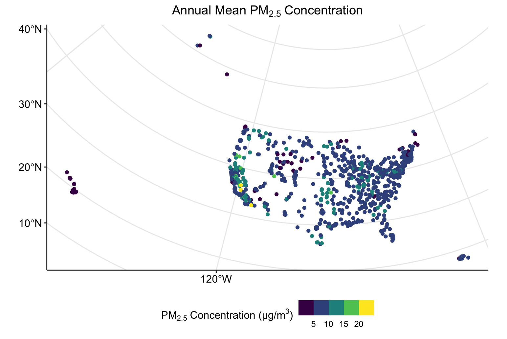
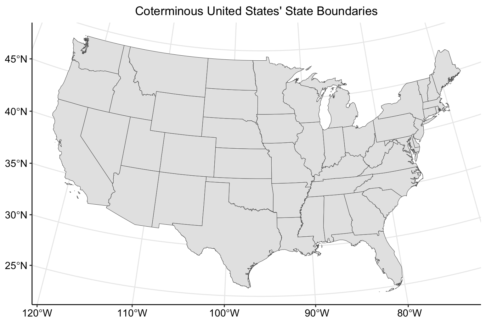
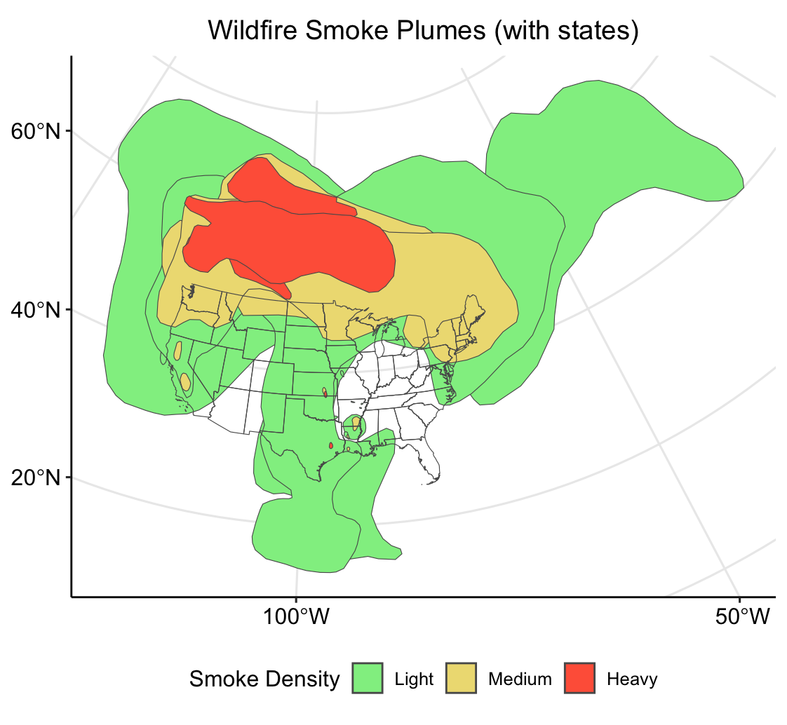
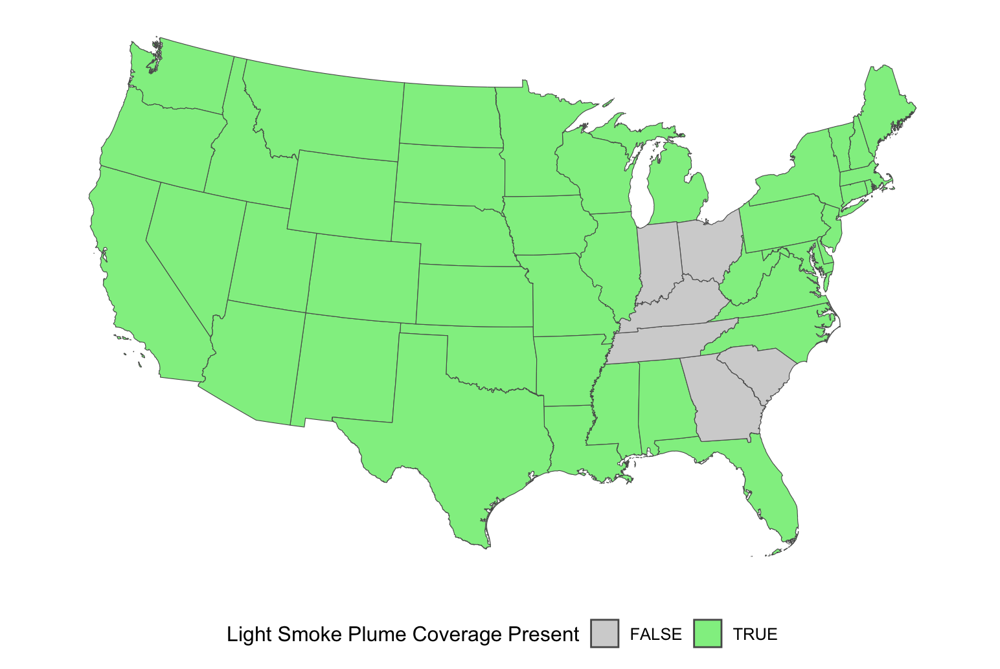
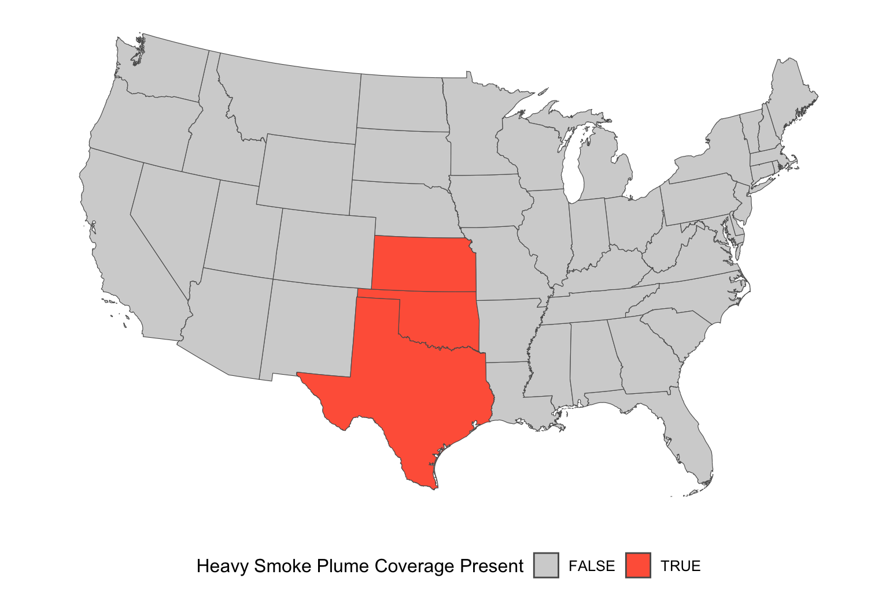
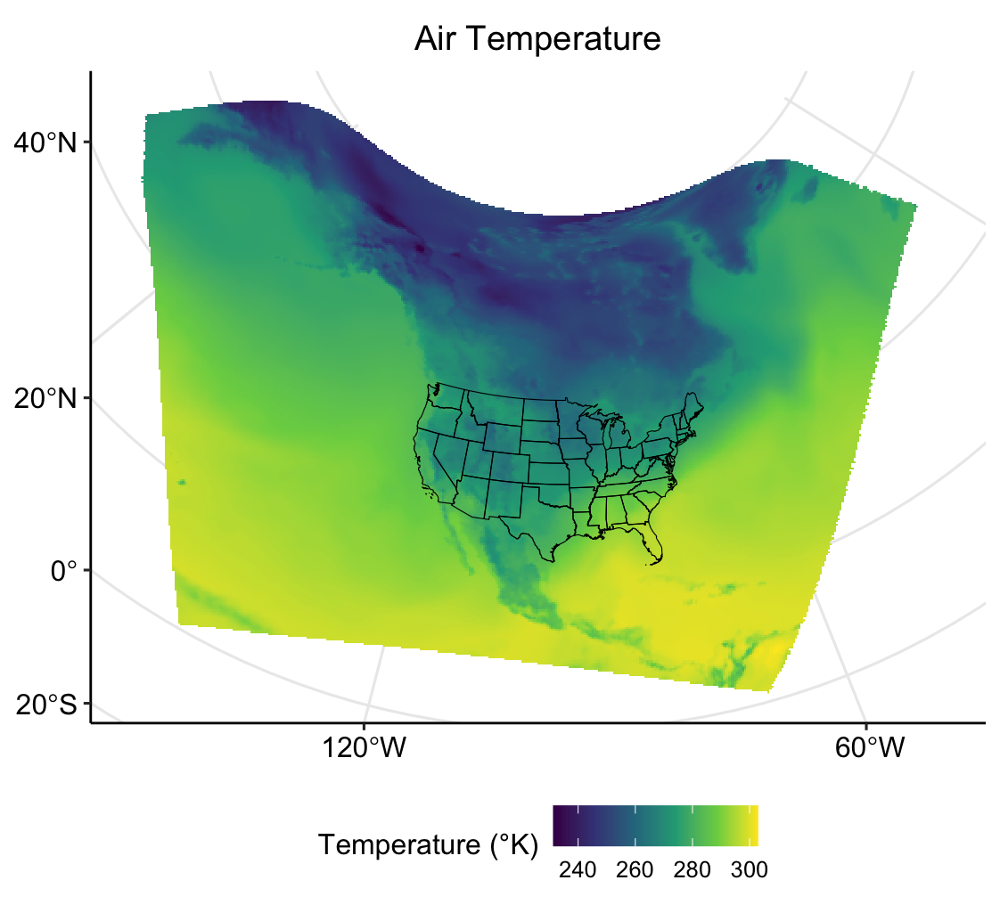
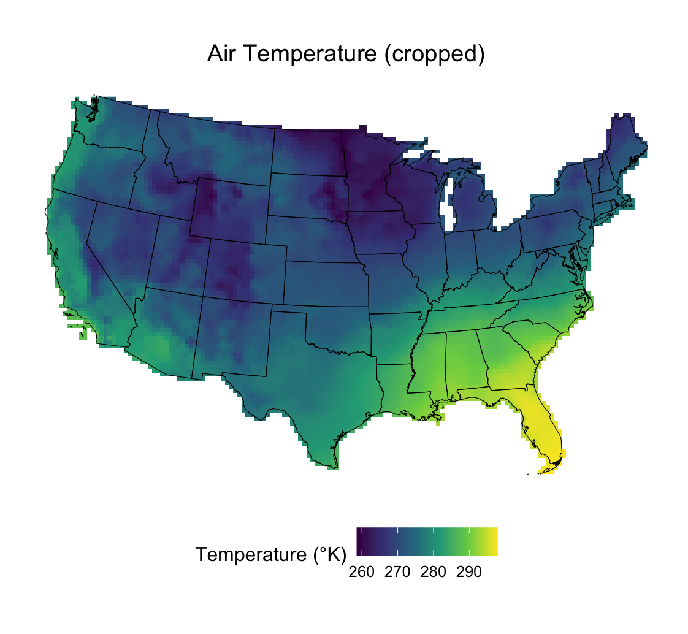

# Spatial Data Analysis {#chapter-intro-spatial-data-analysis}

[](#profilecmp)
[](#profilesbs)
[](#profilestu)

### Access, Import, and Primary Analyses with Environmental Data in R {-}

**Date Modified:** February 1, 2024

**Authors:** Mitchell Manware [{width=10}](https://orcid.org/0009-0003-6440-6106), Kyle P Messier [{width=10}](https://orcid.org/0000-0001-9508-9623)

**Key Terms:** [Geospatial Data](#def-geospatial-data)

**Programming Language:** R

## Introduction

### Motivation

Environmental health research relies on various types of data to accurately measure, model, and predict exposures. Environmental data are often spatial (related to the surface of the Earth), temporal (related to specific time/period of time), or spatio-temporal (related to the surface of the Earth for a specific time/period of time). These data are at the core of environmental health research, but the steps between identifying a spatial data set or variable and using it to help answer a research question can be challenging.

This vignette is designed to introduce the necessary steps for conducting analyses with spatial data in R. It will introduce R packages that are equipped to handle spatial data, and will demonstrate how to access, import, and analyze three different types of spatial data. The vignette will focus primarily on spatial data, but some aspects of temporal and spatio-temporal data will also be discussed.

### Objectives

Users will learn about the following topics related to spatial data in R:

-   Point, polygon, and raster data types
-   Downloading data from a URL
-   Importing data
-   Checking data type, structure, and class
-   Reclassifying data
-   Computing summary and zonal statistics
-   Plotting individual and multiple data sets

### Data Types

This vignette will cover how to access, import, and analyze point, polygon, and raster spatial data types. The details of what constitutes each unique spatial data type, however, will not be covered.

For detailed descriptions of each type of spatial data, please see [Simple Features for R](https://r-spatial.github.io/sf/articles/sf1.html) for point and polygon data types, and [Introduction to Raster Data](https://datacarpentry.org/organization-geospatial/01-intro-raster-data) for raster data.

### Data Sources

The exploratory analyses performed in this vignette utilize free and publicly available environmental data. The code chunks are designed to access each specific file used for the exploratory analyses, but a description of each data source and data set is available below.

| Data                                | Data Type | Producer                                               | Link                                                                                        |
|------------------|------------------|------------------|------------------|
| PM~2.5~ Daily Observations          | Point     | Environmental Protection Agency (EPA)                  | <https://aqs.epa.gov/aqsweb/airdata/download_files.html>                                    |
| Wildfire Smoke Plumes               | Polygon   | National Oceanic and Atmospheric Administration (NOAA) | <https://www.ospo.noaa.gov/Products/land/hms.html>                                          |
| United States Cartographic Boundary | Polygon   | United States Census Bureau                            | <https://www.census.gov/geographies/mapping-files/time-series/geo/carto-boundary-file.html> |
| Land Surface Temperature            | Raster    | National Oceanic and Atmospheric Administration (NOAA) | <https://psl.noaa.gov/data/gridded/data.narr.html>                                          |

: Exploratory analyses data sources

### Packages

Various R packages can be used to create, import, analyze, and export spatial data. If you have not used these packages previously, they may not be installed on your machine. The following chunk of code installs and imports the packages required to conduct the exploratory analyses in this vignette.

::: {.note}
Installing and importing new packages may required R to restart.
:::
  
```{r, eval = FALSE}
vignette_packages <- c(
  "dplyr", "ggplot2", "ggpubr", "sf",
  "terra", "tidyterra", "utils"
)

for (v in seq_along(vignette_packages)) {
  if (vignette_packages[v] %in% installed.packages() == FALSE) {
    install.packages(vignette_packages[v])
  }
}

library(dplyr)
library(ggplot2)
library(ggpubr)
library(sf)
library(terra)
library(tidyterra)
library(utils)
```

#### `ggplot2` and `ggpubr` {-}

The `ggplot2` and `ggpubr` packages will be used throughout the vignette for creating publication quality plots. Please see [ggplot2: Elegant Graphics for Data Analysis (3e)](https://ggplot2-book.org/introduction) and [ggpubr: 'ggplot2' Based Publication Ready Plots](https://rpkgs.datanovia.com/ggpubr/) for in depth descriptions of the syntax and functionality utilized by these packages.

::: {.important}
The exploratory analyses performed in this vignette are designed for educational purposes only. The results of the following analyses are not peer-reviewed findings, nor are they based on any hypotheses.
:::

## Point Data with `sf`

Air pollution monitoring data from the United States Environmental Protection Agency (EPA) will be used to demonstrate using point data with the `sf` package.

### Access, download, and unzip

To download data with the `utils::download.file()` function, define two variables. One variable to store the website URL where the data exists and a second to store the file path for where the file should be saved.

::: {.note}
Multiple chunks of code in this vignette will contain `/   YOUR FILE PATH   /`. To run the code on your machine, substitute `/   YOUR FILE PATH   /` with the file path where you would like to store the vignette data.
:::

```{r, eval = FALSE}
url_epa <- "https://aqs.epa.gov/aqsweb/airdata/daily_88101_2021.zip"

destination_epa <- "/   YOUR FILE PATH   /epa_data.zip"

download.file(
  url_epa,
  destination_epa
)
```

The file downloaded from the EPA website is a zip file. Zip files need to be unzipped (decompressed) in order to access the data within. Unzip the EPA air pollution file with `utils::unzip()`.

::: {.warning}
Unzipping a `.zip` file will decompress the contents within. Spatial data sets can be very large (ie. \> 1GB ), so check the size of the data before unzipping on your machine.
:::

The numeric value size of the file is listed under `Length`.

```{r, eval = FALSE}
unzip("/   YOUR FILE PATH   /epa_data.zip",
  list = TRUE
)
```

After inspecting the file size, unzip `epa_data.zip`.

```{r, eval = FALSE}
unzip("/   YOUR FILE PATH   /epa_data.zip")
```

Inspecting the file with `utils::unzip(list = TRUE)` returned the size of the file, but also the name of the data file of interest. The desired data file can also be identified with `list.files()`.

::: {.note}
Other file names may be returned if `/   YOUR FILE PATH   /` is a directory with other contents (ie. Desktop or Documents).
:::

```{r, eval = FALSE}
list.files("/   YOUR FILE PATH   /")
```

### Import

Now that the contents of the zip file have been saved on your machine and the data file of interest has been identified, import the data with `sf::st_read()`.

```{r, eval = FALSE}
pm <- st_read("/   YOUR FILE PATH   /daily_88101_2021.csv")
```

The previous chunk of code returned a `Warning:` message. This warning informs the user that the imported data does not have native spatial features, so the data was imported as a `data.frame`.

### Inspect structure

Inspect the structure of `pm` to see its class, column names, column classes, and the first two (specified by `vec.len = 2`) data points from each column.

```{r, eval = FALSE}
str(pm,
  vec.len = 2
)
```

### Subset

Checking the data's structure shows that `pm` is a very large data set. Each of the variables convey important information related to air pollution monitoring, but not all will be utilized in these exploratory analyses.

The data set can be reduced to include only the variables of interest with the `subset()` function. The `select =` argument indicates which variables to be retained in the new data set.

```{r, eval = FALSE}
pm <- subset(pm, select = c(
  State.Code,
  County.Code,
  Site.Num,
  Latitude,
  Longitude,
  State.Name,
  Date.Local,
  Arithmetic.Mean
))
```

Re-running `str(pm)` after subsetting the data set shows that all all observations (n = 590208) of the variables of interest (n = 8) have been retained.

```{r, eval = FALSE}
str(pm,
  vec.len = 2
)
```

### Reclassify

The `str()` function showed the class of each variable within the data set. All of the retained variables are of class character, indicated by `: chr` and the quotations around each observation (`"01" "01" ...`).

The class of a variable depends on the information conveyed by the data stored within that variable. For example, character is an appropriate class for the `pm$State.Name` variable because each observation is a character string labeling in which state the monitor was located. Alternatively, character is not appropriate for the `pm$Arithmetic.Mean` or `pm$Date.Local` variables because each observation is a numeric decimal or time-referenced date, respectively.

The `as.` functions can be used for reclassifying data. Reclassify `pm$Arithmetic.Mean` as a number, and `pm$Date.Local` as a date.

```{r, eval = FALSE}
pm$Arithmetic.Mean <- as.numeric(pm$Arithmetic.Mean)
pm$Date.Local <- as.Date(pm$Date.Local)
```

After running the `as.` functions, ensure that the two variables have been reclassified to the desired classes.

```{r, eval = FALSE}
class(pm$Arithmetic.Mean)
class(pm$Date.Local)
```

### Convert to `sf` object

With the variables of interest selected and reclassified, `pm` can be converted to spatially defined `sf` object. The `sf::st_as_sf()` function creates a `$geometry` field based on the latitude and longitude coordinates contained within `pm`. The `coords = c()` argument specifies the column names which contain the coordinate values.

::: {.note}
The columns containing coordinate values will not always be "Latitude" and "Longitude". Use `str()` to see column names and identify which contain the coordinate values.
:::

```{r, eval = FALSE}
pm_sf <- st_as_sf(pm,
  coords = c("Longitude", "Latitude")
)
```

Inspect the classes of `pm_sf` and `pm_sf$geometry` to see their differences, and how each are different than `class(pm)`.

```{r, eval = FALSE}
class(pm_sf)
class(pm_sf$geometry)
```

`class(pm_sf)` returned both `"sf"` and `"data.frame"`, indicating that it contains both spatial and non-spatial data.

### Coordinate reference system and projection

The coordinate reference system of an `sf` object can be checked with `sf::st_crs()`.

```{r, eval = FALSE}
st_crs(pm_sf)
```

The previous chunk of code shows that `pm_sf` does not have a native coordinate reference system. The same function, `sf::st_crs()`, can be used to assign a coordinate reference system to an `sf` object. For this example, the World Geodesic System 1984 (WGS 84) will be used (EPSG code: 4326).

```{r, eval = FALSE}
st_crs(pm_sf) <- 4326
st_crs(pm_sf)
```

An `sf` object with a coordinate reference system can be transformed (projected) into a different coordinate reference system with `sf::st_transform()`. The area of interest for these exploratory analyses is the coterminous United States, so the Albers Equal Area projected coordinate system will be used (EPSG code: 5070). For a detailed description of coordinate reference systems, and how to select the best system for your analyses, see [Coordinate Reference Systems](#chapter-coordinate-reference-systems).

::: {.note}
An `sf` object without an assigned coordinate reference system cannot be transformed. `sf::st_crs()` must be used to assign a coordinate reference system to an `sf` object that does not have one.
:::

```{r, eval = FALSE}
pm_sf <- st_transform(
  pm_sf,
  5070
)
```

### Plot

Plotting spatial data is important for visualizing and analyzing patterns in the data. Initialize a plot for the locations of each air pollution monitoring station with `ggplot2::ggplot()`. Identifying the data set to be plotted within the `geom_sf()` argument informs the function that the data is an `sf` object.

```{r, eval = FALSE}
ggplot() +
  geom_sf(data = pm_sf) +
  ggtitle("Air Pollution Monitor Locations") +
  theme_pubr() +
  theme(plot.title = element_text(hjust = 0.5)) +
  grids()
```


The plot shows the distribution of monitoring locations, and roughly depicts the outline of the United States due to the large number of monitors. The plot does not, however, convey any information about the concentration of PM~2.5~ measured by each monitor. Inspect the summary statistics of the PM~2.5~ measurements before creating any plots to visualize the data.

```{r, eval = FALSE}
summary(pm_sf$Arithmetic.Mean)
sd(pm_sf$Arithmetic.Mean)
```

After inspecting the summary statistics, create a histogram of the PM~2.5~ concentration measurements to visualize the distribution of the data.

::: {.note}
The histogram is not a spatially defined plot, so the data set to be plotted is identified within `ggplot()`.
:::

```{r, eval = FALSE}
ggplot(
  data = pm_sf,
  aes(Arithmetic.Mean)
) +
  geom_histogram(
    fill = "blue",
    binwidth = 5
  ) +
  ggtitle(
    expression("PM"[2.5] * " Concentration Measurements")
  ) +
  xlab(expression("PM"[2.5] * " Concentration (µg/m"^3 * ")")) +
  ylab("Number of Measurements") +
  theme_pubr() +
  theme(plot.title = element_text(hjust = 0.5)) +
  grids()
```


### Calculate annual mean

A common summary statistic of interest to researchers is the mean over a certain period of time. For this example, we will calculate the mean PM~2.5~ concentration for each monitoring location for the year 2021. To do this, a unique identification code must be created for each monitoring location.

The `pm_sf$Monitor.ID` variable can be created by concatenating each monitor's state code, county code, and site number together into a single character string.

```{r, eval = FALSE}
pm_sf$Monitor.ID <- paste0(
  pm_sf$State.Code,
  pm_sf$County.Code,
  pm_sf$Site.Num
)
```

Each unique monitor identification code should be matched with a unique monitor location geometry. To ensure that each monitor location has a unique identification code, check that there are an equal number of unique geometries and identification codes.

```{r, eval = FALSE}
length(unique(pm_sf$Monitor.ID)) == length(unique(pm_sf$geometry))
```

Now that each monitor location as a unique identification code, we can calculate the mean PM~2.5~ concentration measured at each monitoring location. Functions and syntax from the `dplyr` package will be used to do this. For more on the `dplyr` package, please see [Introduction to dplyr](https://dplyr.tidyverse.org/articles/dplyr.html).

The `group_by(Monitor.ID, )` argument specifies that an annual mean should be calculated for each unique `Monitor.ID`. Including `State.Name` in this argument retains the column in the new `pm_mean` data set, but does not influence the calculation of the annual mean.

```{r, eval = FALSE}
pm_mean <-
  pm_sf %>%
  group_by(Monitor.ID, State.Name) %>%
  summarise(Annual.Mean = mean(Arithmetic.Mean))
```

Inspect the summary statistics of `pm_mean`.

```{r, eval = FALSE}
summary(pm_mean$Annual.Mean)
sd(pm_mean$Annual.Mean)
```

Create a plot which shows the distribution of monitoring locations, and color each point according to the monitor's annual mean concentration of PM~2.5~.

```{r, eval = FALSE}
ggplot() +
  geom_sf(
    data = pm_mean,
    aes(color = Annual.Mean)
  ) +
  scale_color_viridis_b(
    expression("PM"[2.5] * " Concentration (µg/m"^3 * ")")
  ) +
  ggtitle(
    expression("Annual Mean PM"[2.5] * " Concentration")
  ) +
  theme_pubr(legend = "bottom") +
  theme(plot.title = element_text(hjust = 0.5)) +
  grids()
```



Now the plot depicts both spatial and non-spatial data.

### Compare highest annual means

A close visual inspection of the previous plot shows a few monitoring locations in the southwestern region of the United States with very high (\> 20 µm/m^3^) annual mean concentrations of PM~2.5~. To investigate the differences between the monitors with the highest and lowest annual mean concentrations, create a subset of `pm_sf` with only the three highest and lowest monitors.

To do this, first identify the monitors with the highest and lowest annual mean concentrations.

```{r, eval = FALSE}
min_monitors <-
  pm_mean %>%
  arrange(Annual.Mean) %>%
  head(n = 3)

max_monitors <-
  pm_mean %>%
  arrange(Annual.Mean) %>%
  tail(n = 3)
```

Next, create a variable storing only the unique identification codes of these six monitors.

```{r, eval = FALSE}
min_max_monitors_id <- c(
  min_monitors$Monitor.ID,
  max_monitors$Monitor.ID
)
```

Finally, subset the `pm_sf` data set according to the monitor identification codes stored in `min_max_monitors_id`.

```{r, eval = FALSE}
pm_min_max <- subset(pm_sf,
  subset = Monitor.ID == min_max_monitors_id
)
```

The resulting `pm_min_max` data set contains data for only six monitoring locations. Check the unique monitor identification codes that constitute the new data set.

```{r, eval = FALSE}
unique(pm_min_max$Monitor.ID)
```

The temporal trend of PM~2.5~ concentrations measured at each of these locations in 2021 can be depicted with `ggplot::geom_line()`.

```{r, eval = FALSE}
ggplot(
  data = pm_min_max,
  aes(
    x = Date.Local,
    y = Arithmetic.Mean,
    group = Monitor.ID,
    color = Monitor.ID
  )
) +
  geom_line() +
  ggtitle("Minimum and Maximum Monitors") +
  xlab("Date") +
  ylab(expression("PM"[2.5] * " Concentrations (µg/m"^3 * ")")) +
  theme_pubr(legend = "bottom") +
  theme(plot.title = element_text(hjust = 0.5))
```


Alternatively, the `ggplot2::geom_boxplot()` function compares the median, interquartile range, and outliers of the monitors' measurements.

```{r, eval = FALSE}
ggplot(
  data = pm_min_max,
  aes(
    x = Monitor.ID,
    y = Arithmetic.Mean,
    fill = Monitor.ID
  )
) +
  geom_boxplot() +
  xlab("Monitor ID") +
  ylab(expression("PM"[2.5] * " Concentrations (µg/m"^3 * ")")) +
  theme_pubr(legend = "none")
```


## Polygon Data

Wildfire smoke plume coverage data from the United States National Oceanic and Atmospheric Administration (NOAA) will be used to demonstrate using polygon data. This section will cover polygon data with both the `sf` and `terra` packages separately, but the steps for accessing, downloading, and unzipping the data is the same for both packages.

### Access, download, and unzip

The website URL where the NOAA wildfire smoke plume data exists is date-specific, meaning there is a unique URL for each daily data set. For the purpose of these exploratory analyses, wildfire smoke plume data from September 1, 2023 will be used.

Define three variables for `day`, `month`, and `year` according to the date of interest.

```{r, eval = FALSE}
day <- "01"
month <- "09"
year <- "2023"
```

The `utils::download.file()` function downloads the file according to the defined URL and destination file.

```{r, eval = FALSE}
url_noaa <- paste0(
  "https://satepsanone.nesdis.noaa.gov/pub/FIRE/web/HMS/Smoke_Polygons",
  "/Shapefile/",
  year,
  "/",
  month,
  "/hms_smoke",
  year,
  month,
  day,
  ".zip"
)

destination_noaa <- paste0(
  "/   YOUR FILE PATH   /noaa_smoke",
  year,
  month,
  day,
  ".zip"
)

download.file(
  url_noaa,
  destination_noaa
)
```

The file downloaded from the NOAA website is a `.zip` file. Zip files need to be unzipped (decompressed) in order to access the data within. Unzip the NOAA wildfire smoke plume coverage file with `utils::unzip()`.

::: {.warning}
Unzipping a `.zip` file will decompress the contents within. Spatial data sets can be very large (ie. \> 1GB), so check the size of the data before unzipping on your machine.
:::

The numeric value size of each file is listed under `Length`.

```{r, eval = FALSE}
unzip("/   YOUR FILE PATH   /noaa_smoke20230901.zip",
  list = TRUE
)
```

After inspecting the file sizes, unzip `noaa_smoke20230901.zip`.

```{r, eval = FALSE}
unzip("/   YOUR FILE PATH   /noaa_smoke20230901.zip")
```

Inspecting the file with `utils::unzip(list = TRUE)` returned the size of the file, but also the name of the data file of interest. The desired data file can also be identified with `list.files()`.

```{r, eval = FALSE}
list.files("/   YOUR FILE PATH   /")
```

Listing the contents of the unzipped file reveals four individual files. The data to be imported is stored in the `hms_smoke20230901.shp`, but the other files contain important information for the `.shp` file.

::: {.warning}
Deleting any of the supporting files (ie. `*.dbf`, `*.prj`, or `*.shx`) will disrupt the data import.
:::

### Polygon Data with `sf`

This section will focus on exploratory analyses with polygon data using the `sf` package.

#### Import {-}

Now that the contents of the zip file have been saved on your machine and the data file of interest has been identified, import the data with `sf::st_read()`.

::: {.note}
Although the supporting files are required to import a shapefile, only the file ending in `.shp` needs to be imported
:::

```{r, eval = FALSE}
smoke_sf <- st_read("/   YOUR FILE PATH   /hms_smoke20230901.shp")
```

Importing `hms_smoke20230901.shp` does not return a `Warning:` message because the data set has native spatial features, and is therefore imported as an `sf` object.

#### Inspect structure {-}

Inspect the structure of `smoke_sf` to see its class, column names, column classes, and the first two (specified by `vec.len = 2`) data points.

```{r, eval = FALSE}
str(smoke_sf,
  vec.len = 2
)
```

As mentioned previously, the `smoke_sf` data set has native spatial features. These are reflected by the data set having classes of `sf` and `data.frame`, and the `$geometry` feature.

```{r, eval = FALSE}
class(smoke_sf)
```

#### Reclassify {-}

The main parameter of interest in this data set is `$Density`, which discretely categorizes each wildfire smoke plume as "Light", "Medium", or "Heavy". Checking its class shows that `$Density` is class character.

```{r, eval = FALSE}
class(smoke_sf$Density)
```

Nominal data, data without fixed order or rank system, can be stored as class character (ie. State names). However, it is best to store ordinal data as class factor for conducting analyses in R.

Converting data from class character to class factor can be done with `factor()`. The `levels = c()` argument in the function specifies both the level names and the ranked order of the levels.

```{r, eval = FALSE}
smoke_sf$Density <- factor(smoke_sf$Density,
  levels = c("Light", "Medium", "Heavy")
)
```

Check the class of `$Density` again to ensure proper reclassification.

```{r, eval = FALSE}
class(smoke_sf$Density)
```

#### Coordinate reference system and projection {-}

Check the coordinate reference system of an `sf` object with `sf::st_crs()`.

```{r, eval = FALSE}
st_crs(smoke_sf)
```

`smoke_sf` has a native coordinate reference system which was imported during the `sf::st_read()` step. The area of interest for these exploratory analyses is the coterminous United States, so we can transform `smoke_sf` to the Albers Equal Area projected coordinate system (EPSG code: 5070).

```{r, eval = FALSE}
smoke_sf <- st_transform(
  smoke_sf,
  5070
)
```

#### Plot (single) {-}

With the data prepared, plot the wildfire smoke plume polygons with `ggplot2::ggplot()`.

Now that the parameters of interest and coordinate reference system have been prepared, create a plot with `ggplot2::ggplot()`. Identifying the data set to be plotted within the `geom_sf()` arguement informs the function that the data is an `sf` object.

```{r, eval = FALSE}
ggplot() +
  geom_sf(
    data = smoke_sf,
    aes(fill = Density)
  ) +
  scale_fill_manual("Smoke Density",
    values = c("lightgreen", "lightgoldenrod", "tomato")
  ) +
  ggtitle("Wildfire Smoke Plumes") +
  theme_pubr(legend = "bottom") +
  theme(plot.title = element_text(hjust = 0.5)) +
  grids()
```


The wildfire smoke plume polygons are clearly visible and colored according to their individual smoke density classification. This plot, however, is difficult to interpret for two reasons. First, there are multiple polygons for each smoke density classification. Multiple borders and overlapping polygons with the same smoke density type can be confusing. To make the polygons more clear, individual polygons for each smoke density classification can be combined.

::: {.warning}
For the purposes of these exploratory analyses, the satellite travelling direction and time of collection will be ignored.
:::

#### Union {-}

Individual polygons can be unioned (combined) into one multi-part polygon with `sf::st_union`. The `group_by(Density)` argument specifies that the polygons should be combined based on the value stored in `$Density`. Adding the `Date = paste0(...` argument within the `dplyr::summarise()` function creates a parameter to store the date based on the year, month, and day of the data (defined in 2.0 Access, download, and unzip).

```{r, eval = FALSE}
smoke_sf_density <-
  smoke_sf %>%
  group_by(Density) %>%
  summarise(
    geometry = st_union(geometry),
    Date = paste0(
      year,
      month,
      day
    )
  )
```

The resulting data set contains three multi-polygons, a column for the smoke plume classification, and a column for the date.

```{r, eval = FALSE}
smoke_sf_density
```

Creating a new plot with `smoke_sf_density`.

```{r, eval = FALSE}
ggplot() +
  geom_sf(
    data = smoke_sf_density,
    aes(fill = Density)
  ) +
  scale_fill_manual("Smoke Density",
    values = c("lightgreen", "lightgoldenrod", "tomato")
  ) +
  ggtitle("Wildfire Smoke Plumes (unioned)") +
  theme_pubr(legend = "bottom") +
  theme(plot.title = element_text(hjust = 0.5)) +
  grids()
```


The plot is still difficult to interpret because it lacks geospatial context. The grid lines provide latitude and longitude references, but physical or geopolitical boundaries can help show where the wildfire smoke plumes are relative to the study area of interest. To provide geospatial context to the wildfire smoke plume polygons, we can add the United States' state boundary polygons to the plot.

#### Plot (multiple) {-}

The steps taken to access, download, unzip, and import the United States' state boundary data are the same as those taken for the wildfire smoke plume coverage data. Refer to sections 2.0 Access, download, and unzip, and 2.1.1 Import for detailed descriptions.

```{r, eval = FALSE}
url_states <-
  "https://www2.census.gov/geo/tiger/GENZ2018/shp/cb_2018_us_state_500k.zip"

destination_states <- "/   YOUR FILE PATH   /states.zip"

download.file(
  url_states,
  destination_states
)
```

```{r, eval = FALSE}
unzip("/   YOUR FILE PATH   /states.zip",
  list = TRUE
)
```

```{r, eval = FALSE}
unzip("/   YOUR FILE PATH   /states.zip")
```

```{r, eval = FALSE}
list.files("/   YOUR FILE PATH   /")
```

```{r, eval = FALSE}
states <- st_read("/   YOUR FILE PATH   /cb_2018_us_state.shp")
```

Inspect the structure of `states_sf`.

```{r, eval = FALSE}
str(states_sf,
  vec.len = 2
)
```

For the purpose of these exploratory analyses, only the coterminous (CONUS) United States will be used. Subset `states_sf` to remove Alaska, Hawaii, and the United States' territories.

```{r, eval = FALSE}
remove <- c(
  "Alaska",
  "Hawaii",
  "Puerto Rico",
  "United States Virgin Islands",
  "Commonwealth of the Northern Mariana Islands",
  "Guam",
  "American Samoa"
)

conus_sf <- subset(
  states_sf,
  !NAME %in% remove
)
```

Check the coordinate reference system.

```{r, eval = FALSE}
st_crs(conus_sf)
```

::: {.important}
When analyzing multiple spatial data sets together, all data sets must have the same coordinate reference system or projected coordinate system.
:::

Transform `conus_sf` to match the projected coordinate system of the `smoke_sf_density` data set.

```{r, eval = FALSE}
conus_sf <- st_transform(
  conus_sf,
  st_crs(smoke_sf_density)
)
```

Plot the coterminous United States's state boundaries.

```{r, eval = FALSE}
ggplot() +
  geom_sf(data = conus_sf) +
  ggtitle("Coterminous United States' State Boundaries") +
  theme_pubr() +
  theme(plot.title = element_text(hjust = 0.5)) +
  grids()
```



With the wildfire smoke plume and coterminous United States polygons imported and prepared, ensure that they have the same coordinate reference system.

```{r, eval = FALSE}
st_crs(smoke_sf_density) == st_crs(conus_sf)
```

Create a plot which shows the distribution of wildfire smoke plumes over the coterminous United States' state boundaries.

```{r, eval = FALSE}
ggplot() +
  geom_sf(
    data = smoke_sf_density,
    aes(fill = Density)
  ) +
  scale_fill_manual("Smoke Density",
    values = c("lightgreen", "lightgoldenrod", "tomato")
  ) +
  geom_sf(
    data = conus_sf,
    fill = "transparent"
  ) +
  ggtitle("Wildfire Smoke Plumes (with states)") +
  theme_pubr(legend = "bottom") +
  theme(plot.title = element_text(hjust = 0.5)) +
  grids()
```


This plot provides important geospatial context for understanding where the wildfire smoke plumes are in relation to the study area of interest.

#### Crop {-}

The `sf::st_crop()` function can be used to reduce the extent of a set of polygons to a specific rectangle, typically the bounding box of another spatial data set. In this example we can crop the `smoke_sf_density` polygons to the bounding box surrounding the coterminous United States.

```{r, eval = FALSE}
smoke_sf_crop <- st_crop(
  smoke_sf_density,
  conus_sf
)
```

Plot the cropped wildfire smoke plume polygons and the coterminous United States' state boundaries.

```{r, eval = FALSE}
ggplot() +
  geom_sf(
    data = smoke_sf_crop,
    aes(fill = Density)
  ) +
  scale_fill_manual("Smoke Density",
    values = c("lightgreen", "lightgoldenrod", "tomato")
  ) +
  geom_sf(
    data = conus_sf,
    fill = "transparent"
  ) +
  ggtitle("Wildfire Smoke Plumes (cropped)") +
  theme_pubr(legend = "bottom") +
  theme(plot.title = element_text(hjust = 0.5)) +
  grids()
```


### Polygon Data with `terra`

This section will focus on exploratory analyses with polygon data using the `terra` package.

#### Import {-}

Now that the contents of the zip files have been saved on your machine and the data files of interest have been identified, import both the wildfire smoke plume coverage data and the United States' state boundary data with `terra::vect()`.

::: {.note}
See sections 2.0 Access, download, and unzip and 2.1.7 Plot (multiple) for obtaining the wildfire smoke plume coverage and United States' state boundary data sets, respectively.
:::

```{r, eval = FALSE}
smoke_t <- vect("/   YOUR FILE PATH   /hms_smoke20230901.shp")
states_t <- vect("/   YOUR FILE PATH   /cb_2018_us_state_500k.shp")
```

#### Inspect structure {-}

Inspect the structures of `smoke_t` and `states_t` to see their classes, column names, column classes.

```{r, eval = FALSE}
smoke_t
states_t
```

Both `smoke_t` and `states_t` have native spatial features. These are reflected by the type of spatial data in `geometry:`, and the spatial attributes `extent:` and `coord. ref.:`

#### Reclassify {-}

The main parameter of interest in this data set is `$Density`, which discretely categorizes each wildfire smoke plume as "Light", "Medium", or "Heavy". Checking its class shows that `$Density` is class character.

```{r, eval = FALSE}
class(smoke_t$Density)
```

Nominal data, data without fixed order or rank system, can be stored as class character (ie. State names). However, it is best to store ordinal data as class factor for conducting analyses in R.

Converting data from class character to class factor can be done with `factor()`. The `levels = c()` argument in the function specifies both the level names and the ranked order of the levels.

```{r, eval = FALSE}
smoke_t$Density <- factor(smoke_t$Density,
  levels = c("Light", "Medium", "Heavy")
)
```

Check the class of `$Density` again to ensure proper reclassification.

```{r, eval = FALSE}
class(smoke_t$Density)
```

For the purpose of these exploratory analyses, only the coterminous (CONUS) United States will be used. Subset `states_t` to remove Alaska, Hawaii, and the United States' territories.

```{r, eval = FALSE}
remove <- c(
  "Alaska",
  "Hawaii",
  "Puerto Rico",
  "United States Virgin Islands",
  "Commonwealth of the Northern Mariana Islands",
  "Guam",
  "American Samoa"
)

conus_t <- subset(
  states_t,
  !states_t$NAME %in% remove
)
```

#### Coordinate reference system and projection {-}

Check the coordinate reference systems of `SpatVector` objects with `terra::crs()`.

```{r, eval = FALSE}
crs(smoke_t,
  describe = TRUE
)
crs(conus_t,
  describe = TRUE
)
```

Both data sets have native coordinate reference systems which were imported during the `terra::vect()` step. The two data sets, however, have different coordinate reference systems from each other. The area of interest for these exploratory analyses is the coterminous United States, so we can project `smoke_t` and `conus_t` to the Albers Equal Area projected coordinate system (EPSG code: 5070).

```{r, eval = FALSE}
smoke_t <- project(
  smoke_t,
  "EPSG:5070"
)
conus_t <- project(
  conus_t,
  "EPSG:5070"
)
```

Although both data sets were transformed to the same projected coordinate system, it is important to ensure that all data sets have the same coordinate reference system or projected coordinate system.

```{r, eval = FALSE}
crs(smoke_t) == crs(conus_t)
```

#### Plot (multiple) {-}

Plot both data sets together in one plot with `ggplot2::ggplot()`.

Now that the parameters of interest and coordinate reference systems have been prepared, create a plot with `ggplot2::ggplot()`. Identifying the data sets to be plotted within the `geom_spatvector()` arguments informs the function that the data are `SpatVector` objects.

```{r, eval = FALSE}
ggplot() +
  geom_spatvector(
    data = smoke_t,
    aes(fill = Density)
  ) +
  scale_fill_manual("Smoke Density",
    values = c("lightgreen", "lightgoldenrod", "tomato")
  ) +
  geom_spatvector(
    data = conus_t,
    fill = "transparent"
  ) +
  ggtitle("Wildfire Smoke Plumes (with states)") +
  theme_pubr(legend = "bottom") +
  theme(plot.title = element_text(hjust = 0.5)) +
  grids()
```



The wildfire smoke plume polygons are clearly visible and colored according to their individual smoke density classification. The plot, however, is difficult to interpret because there are multiple polygons for each smoke density classification. Multiple borders and overlapping polygons with the same smoke density type can be confusing. To make the polygons more clear, individual polygons for each smoke density classification can be combined.

::: {.warning}
For the purposes of these exploratory analyses, the satellite travelling direction and time of collection will be ignored.
:::

#### Aggregate {-}

Individual polygons an be aggregated (combined) into one multi-part polygon with `terra::aggregate()`. The `by = "Density"` argument specifies that the polygons should be combined based on the value stored in `$Density`.

```{r, eval = FALSE}
smoke_t_density <- terra::aggregate(smoke_t,
  by = "Density",
  dissolve = TRUE
)
```

Aggregating the polygons based on the values stored in the `$Density` column can result in the other columns containing `NA` values. To remove these columns, subset `smoke_t_density` to remove `$Satellite`, `$Start`, and `$End`.

```{r, eval = FALSE}
smoke_t_density <- smoke_t_density[
  seq_len(nrow(smoke_t_density)),
  c("Density", "agg_n")
]
```

The resulting data set contains three multi-polygons, a column for the smoke plume classification, and a count of the number of individual polygons that were aggregated to create the multi-polygon. This last column, `$agg_n` is automatically calculated by the `terra::aggregate()` function.

```{r, eval = FALSE}
smoke_t_density
```

Create a new plot with `smoke_t_density`.

```{r, eval = FALSE}
ggplot() +
  geom_spatvector(
    data = smoke_t_density,
    aes(fill = Density)
  ) +
  scale_fill_manual("Smoke Density",
    values = c("lightgreen", "lightgoldenrod", "tomato")
  ) +
  geom_spatvector(
    data = conus_t,
    fill = "transparent"
  ) +
  ggtitle("Wildfire Smoke Plumes (aggregated)") +
  theme_pubr(legend = "bottom") +
  theme(plot.title = element_text(hjust = 0.5)) +
  grids()
```


#### Crop {-}

The `terra::crop()` function can be used to reduce `SpatVector` to an area determined by another `SpatVector`. In this example, we can crop the `smoke_t_density` polygons to the coterminous United States' state boundaries.

```{r, eval = FALSE}
smoke_t_crop <- terra::crop(
  smoke_t_density,
  conus_t
)
```

Plot the cropped wildfire smoke plume polygons and the coterminous United States' state boundaries.

```{r, eval = FALSE}
ggplot() +
  geom_spatvector(
    data = smoke_t_crop,
    aes(fill = Density)
  ) +
  scale_fill_manual("Smoke Density",
    values = c("lightgreen", "lightgoldenrod", "tomato")
  ) +
  geom_spatvector(
    data = conus_t,
    fill = "transparent"
  ) +
  ggtitle("Wildfire Smoke Plumes (cropped)") +
  theme_pubr(legend = "bottom") +
  theme(
    plot.title = element_text(hjust = 0.5),
    axis.line = element_blank(),
    axis.ticks = element_blank(),
    axis.text = element_blank()
  )
```


#### Zonal statistics {-}

Looking closely at the previous plot, it is clear that wildfire smoke plumes cover each state differently. The `terra` package can be used to identify which states are covered by each classification of wildfire smoke plumes.

The `terra::relate()` function can be used to identify spatial relationships between two `SpatVector` objects. The `relation = "intersects"` argument logically identifies if any portion of each state is or is not covered by each of the three wildfire smoke plume classification multi-polygons.

The output of `terra::relate()` is a wide matrix. The nested `data.frame()` and `t()` wrappers convert the output from a wide matrix to a long data frame, which is required to combine the results with the `conus_t` data set.

```{r, eval = FALSE}
conus_smoke <- data.frame(
  t(
    relate(smoke_t_density,
      conus_t,
      relation = "intersects"
    )
  )
)
```

Set the column names of `conus_smoke` to match the smoke density classifications.

::: {.note}
The order of the columns in `conus_smoke` are based on the ordered factor levels in `smoke_t_density$Density` (see 2.2.3 Reclassify).
:::

```{r, eval = FALSE}
colnames(conus_smoke) <- c("Light", "Medium", "Heavy")
```

Combine the wildfire smoke plume indicator data frame with the the coterminous United States' state boundaries data.

```{r, eval = FALSE}
conus_t <- cbind(
  conus_t,
  conus_smoke
)
```

The `conus_t` data set now contains separate columns indicating the presence or absence of "Light", "Medium", and "Heavy" wildfire smoke plumes for each coterminous state.

```{r, eval = FALSE}
names(conus_t)
```

#### Plot (`for` Loop) {-}

A `for` loop can be used to create indicator plots for each wildfire smoke plume classification. The layout of a `for` loop can look complicated, but it simply applies the same set of functions to a given list of inputs.

The list of inputs must first be created. As the goal is to plot each of the wildfire smoke plume density classifications, create a character vector of the three classification names.

This "list of inputs" must first be created. Store the three wildfire smoke plume classifications in a vector of class character.

```{r, eval = FALSE}
dens_c <- c("Light", "Medium", "Heavy")
```

Create a `for` loop that creates a plot for each wildfire smoke plume density stored within `dens_c`.

Code line 1 tells the `for` loop to apply the following functions to each observation in `dens_c`.

Code lines 3 through 9 define the plotting colors based on the wildfire smoke plume classification (`dens_c[d]`). As in previous plots, "Light" smoke plumes will be colored green, "Medium" smoke plumes will be covered yellow, and "Heavy" smoke plumes will be colored red.

Code lines 12 through 32 create the plot based on the wildfire smoke plume classification (`dens_c[d]`), and previously defined plotting colors (`color_values`).

```{r, eval = FALSE}
for (d in seq_along(dens_c)) {
  # define color palette based on smoke density
  if (dens_c[d] == "Light") {
    color_values <- c("lightgrey", "lightgreen")
  } else if (dens_c[d] == "Medium") {
    color_values <- c("lightgrey", "lightgoldenrod")
  } else if (dens_c[d] == "Heavy") {
    color_values <- c("lightgrey", "tomato")
  }

  # create plot
  print(
    ggplot() +
      geom_spatvector(
        data = conus_t,
        aes_string(fill = dens_c[d])
      ) +
      scale_fill_manual(
        paste0(
          dens_c[d],
          " Smoke Plume Coverage Present"
        ),
        values = color_values
      ) +
      theme_pubr(legend = "bottom") +
      theme(
        plot.title = element_text(hjust = 0.5),
        axis.line = element_blank(),
        axis.ticks = element_blank(),
        axis.text = element_blank()
      )
  )
}
```






## Raster Data with `terra`

Air temperature data from the United States National Oceanic and Atmospheric Administration's (NOAA) North American Regional Reanalysis (NARR) data set will be used to demonstrate using raster data with the `terra` package.

### Access and download

The website URL where the NOAA NARR exists is year-specific, meaning there is a unique URL for each annual data set. For the purpose of these exploratory analyses, air temperature data from the year 2021 will be used

Define the variable `year` according to the year of interest.

```{r, eval = FALSE}
year <- "2021"
```

The `utils::download.file()` function downloads the file according to the defined URL and destination file.

```{r, eval = FALSE}
# specify the URL where data is stored based on year variable of interest
url_narr <- paste0(
  "https://downloads.psl.noaa.gov//Datasets/NARR/Dailies/monolevel/air.2m.",
  year,
  ".nc"
)

# specify where to save downloaded data
destination_narr <- paste0(
  "/   YOUR FILE PATH   /narr_air2m_",
  year,
  ".nc"
)

# download the data
download.file(
  url_narr,
  destination_narr
)
```

Identify the desired data file with `utils::list.files()`

```{r, eval = FALSE}
list.files("/   YOUR FILE PATH   /")
```

The file downloaded from NOAA's NARR data set is an `.nc`, or netCDF, file. NetCDF files are common for raster data, and do not need to be unzipped.

### Import

Now that the data file of interest has been downloaded and identified, import the data with `terra::rast()`.

```{r, eval = FALSE}
narr <- rast(paste0(
  "/   YOUR FILE PATH   /narr_air2m_",
  year,
  ".nc"
))
```

### Inspect structure

Inspect the structure of `narr` to see its class, dimensions, variables, and layer names.

```{r, eval = FALSE}
narr
```

When working with raster data, the dimensions of the raster refer to the number of rows (`nrow`) and columns (`ncol`) of grid cells that make up the raster. Similarly, the number of layers in the raster object (`nlyr`) represents the number of observations of the data. These can also be inspected individually with `nrow()`, `ncol()`, and `nlyr()`, respectively.

```{r, eval = FALSE}
nrow(narr)
ncol(narr)
nlyr(narr)
```

### Rename

The `narr` data set contains 365 layers, one for each daily observation of air temperature in 2021. When working with raster data that contains multiple layers, it is important to know and recognize the naming structure of each layer. In this case, the layer names are `air_` followed by the day of the year (ie. January 1 = `air_1`).

```{r, eval = FALSE}
names(narr)[1:5]
```

Renaming raster layers can be useful for calculating summary statistics or when combining rasters with potentially identical layer names. Using the `time()` and `gsub()` functions, the layers can be renamed according to their date.

```{r, eval = FALSE}
names(narr) <- paste0(
  "air_",
  gsub(
    "-",
    "",
    as.character(time(narr))
  )
)
```

Check the layer names again to ensure proper renaming.

```{r, eval = FALSE}
names(narr)[1:5]
```

### Coordinate reference system and projection

Check the coordinate reference system of a `SpatRaster` object with `terra::crs()`.

```{r, eval = FALSE}
crs(narr,
  describe = TRUE
)
```

`narr` has a native coordinate reference system, but it is unnamed and was not identifiable by `terra::rast()`. The area of interest for these exploratory analyses is the coterminous United States, so we can project `narr` to the Albers Equal Area projected coordinate system (EPSG code: 5070).

```{r, eval = FALSE}
narr <- project(
  narr,
  "EPSG:5070"
)
```

We want to create plots with and analyze the air temperature data as it relates to the coterminous United States' state boundaries. Subset `states_t` to remove Alaska, Hawaii, and the United States' territories.

::: {.note}
See sections 2.0 Access, download, and unzip and 2.2.1 Import for obtaining the `states_t` data set.
:::

```{r, eval = FALSE}
remove <- c(
  "Alaska",
  "Hawaii",
  "Puerto Rico",
  "United States Virgin Islands",
  "Commonwealth of the Northern Mariana Islands",
  "Guam",
  "American Samoa"
)

conus_t <- subset(
  states_t,
  !states_t$NAME %in% remove
)
```

Project `conus_t` to the Albers Equal Area projected coordinate system (EPSG code: 5070).

```{r, eval = FALSE}
conus_t <- project(
  conus_t,
  "EPSG:5070"
)
```

Ensure that both data sets have the same coordinate reference system.

```{r, eval = FALSE}
crs(conus_t) == crs(narr)
```

### Plot (multiple)

Now that the data sets and coordinate reference systems have been prepared, create a plot with `ggplot2::gglot()`. Identifying the data sets to be plotted within the `geom_spatraster()` and `geom_spatvector()` argument informs the function that the `narr` and `conus_t` data sets are `SpatRaster` and `SpatVector` objects, respectively.

Only the first layer of the `narr` data set will be plotted.

```{r, eval = FALSE}
ggplot() +
  geom_spatraster(data = narr$air_20210101) +
  scale_fill_continuous(
    type = "viridis",
    na.value = NA,
    "Temperature (°K)"
  ) +
  ggtitle("Air Temperature") +
  geom_spatvector(
    data = conus_t,
    fill = "transparent",
    color = "black"
  ) +
  theme_pubr(legend = "bottom") +
  theme(plot.title = element_text(hjust = 0.5)) +
  grids()
```



### Crop

The `terra::crop()` function can be used to reduce a `SpatRaster` to an area determined by `SpatVector` polygons. The `mask = TRUE` argument crops to the border of the polygons, whereas `mask = FALSE` crops to the bounding box surrounding the polygons. In this example, crop the `narr` data to the coterminous United States' state boundaries.

```{r, eval = FALSE}
narr_crop <- crop(narr,
  conus_t,
  mask = TRUE
)
```

Plot the cropped temperature data and the coterminous United States' state boundaries.

Only the first layer of the `narr` data set will be plotted.

```{r, eval = FALSE}
ggplot() +
  geom_spatraster(data = narr_crop$air_20210101) +
  scale_fill_continuous(
    type = "viridis",
    na.value = NA,
    "Temperature (°K)"
  ) +
  ggtitle("Air Temperature (cropped)") +
  geom_spatvector(
    data = conus_t,
    fill = "transparent",
    color = "black"
  ) +
  theme_pubr(legend = "bottom") +
  theme(
    plot.title = element_text(hjust = 0.5),
    axis.line = element_blank(),
    axis.ticks = element_blank(),
    axis.text = element_blank()
  )
```



### Units

The previous plot depicts the 2m air temperature data in Kelvin. To convert the units to degrees Celsius, simply subtract the values in `narr_crop` by 273.15. This subtraction will be applied to every grid cell within every layer of `narr_crop`.

```{r, eval = FALSE}
narr_crop_c <- narr_crop - 273.15
```

### Summary statistics

Similar to mathematical operations, calculating summary statistics is very straight forward with raster data. For this example, calculate the annual mean 2m air temperature and range of 2m air temperatures at each grid cell, and save these as a new layer in `narr_crop_c`

```{r, eval = FALSE}
narr_crop_c$mean <- mean(narr_crop_c)
narr_crop_c$range <- max(narr_crop_c) - min(narr_crop_c)
```

Inspect the results of the mean and range calculations.

```{r, eval = FALSE}
summary(narr_crop_c$mean)
summary(narr_crop_c$range)
```

With the summary statistic layers prepared, create a plot with `ggplot2::ggplot()`. Identifying the data sets to be plotted within the `geom_spatraster()` and `geom_spatvector()` argument informs the function that the `narr_crop_c` and `conus_t` data sets are `SpatRaster` and `SpatVector` objects, respectively. Additionally, the `facet_wrap(~lyr)` argument creates a plot for each layer specified in `geom_spatraster(data = narr_crop_c[[c("mean", "range")]])`.

```{r, eval = FALSE}
ggplot() +
  geom_spatraster(data = narr_crop_c[[c("mean", "range")]]) +
  scale_fill_continuous(
    type = "viridis",
    na.value = NA,
    "Temperature (°C)"
  ) +
  facet_wrap(~lyr) +
  ggtitle("Air Temperature") +
  geom_spatvector(
    data = conus_t,
    fill = "transparent",
    color = "black"
  ) +
  theme_pubr(legend = "bottom") +
  theme(
    plot.title = element_text(hjust = 0.5),
    axis.line = element_blank(),
    axis.ticks = element_blank(),
    axis.text = element_blank()
  )
```


### Zonal statistics

Looking closely at the previous plot, it is clear that the annual mean and range of temperatures differ between states. The `terra` package can be used to calculate zonal statistics of a `SpatRaster` object based on `SpatVector` polygons.

The `terra::zonal()` function can be used to calculate the average annual temperature in each state based on the annual grid cell temperatures stored in `narr_crop_c$mean`.

```{r, eval = FALSE}
conus_t$MEAN <- zonal(narr_crop_c$mean,
  conus_t,
  fun = "mean"
)
```

Plot the state-specific annual mean temperatures with `ggplot2::ggplot()`. Identifying the data set to be plotted within `geom_spatvector()` argument informs the function that the data is a `SpatVector` object.

```{r, eval = FALSE}
ggplot() +
  geom_spatvector(
    data = conus_t,
    aes(fill = MEAN)
  ) +
  scale_fill_continuous(
    type = "viridis",
    na.value = NA,
    "Temperature (°C)"
  ) +
  ggtitle("Air Temperature (state mean)") +
  theme_pubr(legend = "bottom") +
  theme(
    plot.title = element_text(hjust = 0.5),
    axis.line = element_blank(),
    axis.ticks = element_blank(),
    axis.text = element_blank()
  )
```


### Reclassify

Raster data is most often continuous numeric data. Sometimes, however, it is important to classify the continuous numeric raster data into discrete classes. For this example, we will reclassify the annual mean temperature data into three discrete classes: \<10°C, 10°C - 20°C, \>20°C.

The first step in the reclassification process is to create a matrix storing the "from", "to", and "becomes" values. As the names imply, the "from" and "to" values identify the discrete ranges to be reclassified, and "becomes" is the new value that data within this range will take (ie. "from" 0 "to" 5 "becomes" 1 means that values ranging from 0 to 5 will be reclassified as 1).

Create the reclassification matrix.

```{r, eval = FALSE}
from <- c(
  -Inf,
  10,
  20
)
to <- c(
  10,
  20,
  Inf
)
becomes <- 1:3
reclass <- matrix(
  c(
    from,
    to,
    becomes
  ),
  ncol = 3
)
```

Now that the reclassification matrix has been prepared, reclassify the annual mean temperatures. The `right = TRUE` argument indicates that intervals are open on the left and closed on the right (ie. (0,10] becomes 1).

```{r, eval = FALSE}
narr_reclass <- classify(narr_crop_c$mean,
  rcl = reclass,
  right = TRUE
)
```

Although `narr_reclass` contains the reclassified mean air temperature data, the data is still continuously numeric. The following chunk of code converts the `narr_reclass$mean` layer from numeric to character based on the defined levels.

`narr_reclass` contains the reclassified mean air temperature data, but the data is still numeric. The `terra::set.cats()` function assigns categories to numeric data based on values stored in a data frame.

```{r, eval = FALSE}
level_values <- data.frame(
  c(1:3),
  c("1", "2", "3")
)
colnames(level_values) <- c("mean_continuous", "mean_discrete")
set.cats(narr_reclass,
  layer = "mean",
  value = level_values
)
```

Plot the discretely reclassified mean temperature data.

```{r, eval = FALSE}
ggplot() +
  geom_spatraster(data = narr_reclass$mean_discrete) +
  scale_fill_viridis_d("",
    labels = c(
      "≤10°",
      "10°< & ≤20°",
      "20°<",
      ""
    ),
    na.value = NA
  ) +
  ggtitle("Air Temperature (reclassified)") +
  geom_spatvector(
    data = conus_t,
    fill = "transparent",
    color = "black"
  ) +
  theme_pubr(legend = "bottom") +
  theme(
    plot.title = element_text(hjust = 0.5),
    axis.line = element_blank(),
    axis.ticks = element_blank(),
    axis.text = element_blank()
  )
```


## Additional Resources

For additional resources pertaining to the packages used in this vignette, please see the following:

-   [Package 'sf'](https://cran.r-project.org/web/packages/sf/sf.pdf)

-   [Package 'terra'](https://cran.r-project.org/web/packages/terra/terra.pdf)

-   [Description of the methods in the terra package](https://search.r-project.org/CRAN/refmans/terra/html/terra-package.html)

-   [Package 'dplyr'](https://cran.r-project.org/web/packages/dplyr/dplyr.pdf)

-   [Package 'ggplot2'](https://cran.r-project.org/web/packages/ggplot2/ggplot2.pdf)

-   [Package 'ggpubr'](https://cran.r-project.org/web/packages/ggpubr/ggpubr.pdf)

## References

H. Wickham. ggplot2: Elegant Graphics for Data Analysis. Springer-Verlag New York, 2016.

Hernangomez D (2023). tidyterra: tidyverse Methods and ggplot2 Helpers for terra Objects. <https://doi.org/10.5281/zenodo.6572471>, <https://dieghernan.github.io/tidyterra/>

Hijmans R (2023). *terra: Spatial Data Analysis*. R package version 1.7-39, <https://CRAN.R-project.org/package=terra>.

Kassambara A (2023). *ggpubr: 'ggplot2' Based Publication Ready Plots*. R package version 0.6.0, <https://CRAN.R-project.org/package=ggpubr>.

Pebesma, E., & Bivand, R. (2023). Spatial Data Science: With Applications in R. Chapman and Hall/CRC. <https://doi.org/10.1201/9780429459016>

Pebesma, E., 2018. Simple Features for R: Standardized Support for Spatial Vector Data. The R Journal 10 (1), 439-446, <https://doi.org/10.32614/RJ-2018-009>

R Core Team (2023). *R: A Language and Environment for Statistical Computing*. R Foundation for Statistical Computing, Vienna, Austria. <https://www.R-project.org/>.

Wickham H, François R, Henry L, Müller K, Vaughan D (2023). *dplyr: A Grammar of Data Manipulation*. R package version 1.1.2, <https://CRAN.R-project.org/package=dplyr>.
