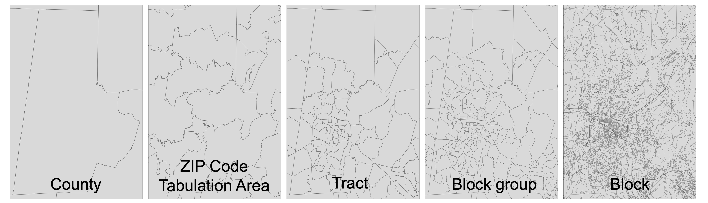
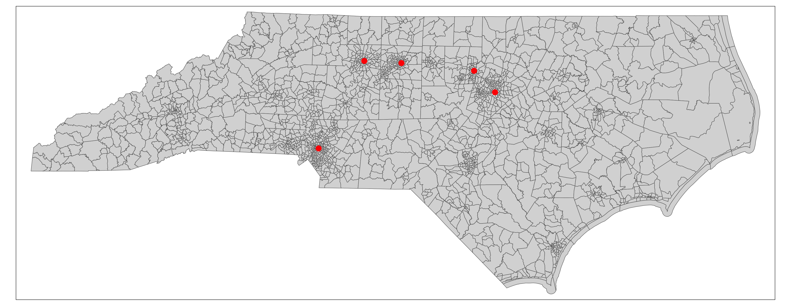
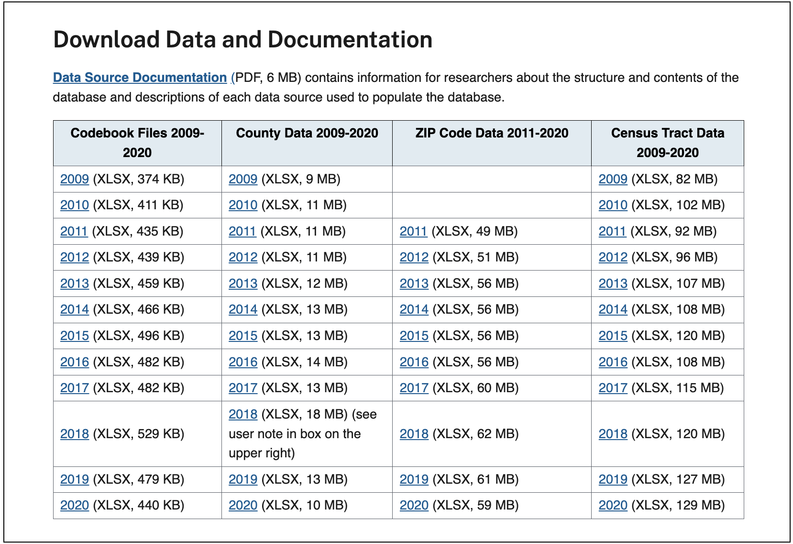
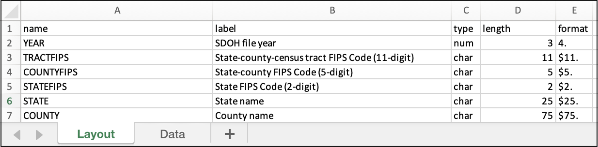
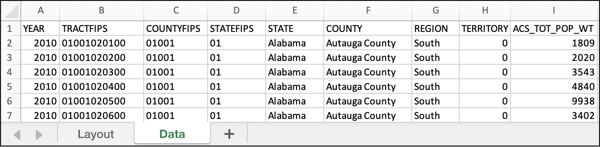

# Linkage to Census Units {#chapter-link-to-census}

[](#profilestu)
[](#profilecmp)
[](#profilecdm)

### Linking Geocoded Addresses to Census Units and Social Determinants of Health Data in R {-}

**Date Modified**: September 13, 2023

**Author**: Lara P. Clark [{width=10}](https://orcid.org/0000-0001-6940-5442)

**Key Terms**: [Data Integration](https://tools.niehs.nih.gov/cchhglossary/?keyword=data+integration&termOnlySearch=true&exactSearch=true), [Social Determinants of Health](https://tools.niehs.nih.gov/cchhglossary/?keyword=social+determinants+of+health+(sdoh)&termOnlySearch=true&exactSearch=true), [Geocoded Address](#def-geocoded-address), [Geographic Unit](#def-geographic-unit), [Geoid](#def-geoid)

**Programming Language**: R

## Introduction

This tutorial provides example code in `R`:

1.  To link geocoded addresses (i.e., geographic coordinates) to the specific US Census geographic units (e.g., tract) in which they are located.

2.  To link data from the Agency for Healthcare Research and Quality (AHRQ) Social Determinants of Health Database [@ahrq-sdoh-database] to those geocoded addresses.

### Motivation

Linking geocoded addresses to US Census geographic units is a common step in environmental health data integration workflows. First, using geographic information systems (GIS) software, the geocoded addresses are mapped to the specific Census geographic units (e.g., Census tracts) in which they are located. Second, the Census geographic unit identifying code (or, [geoid](https://www.census.gov/programs-surveys/geography/guidance/geo-identifiers.html)) is matched to each geocoded address. The result is a table of geocoded addresses and their corresponding Census geoids.

The Census geoids can then serve as the basis for linking additional data to each geocoded address. Many types of data with importance for environmental health applications are available by Census geoid. Specifically, the Census collects and provides data by Census geoid for various social determinants of health (SDOH). Such Census SDOH data describe poverty, race/ethnicity, language, housing, and other socioeconomic characteristics. Increasingly, other data providers (e.g., other government agencies, research institutions, community science groups) are making their data available by Census geoid to help facilitate linkages with SDOH data. Such data cover various environment, climate, health, and built environment characteristics.

Example environmental health data sources readily available by Census geoid from US federal agencies include the following:

| Data source                                                                                           | Geographic units        | Example topics                                                                                                   |
|-----------------------|-------------------------|------------------------|
| [AHRQ Social Detrminants of Health Database](https://www.ahrq.gov/sdoh/data-analytics/sdoh-data.html) | County, ZIP code, tract | Demographic characteristics, housing and transportation characteristics, food access, healthcare characteristics |
| [EPA Environmental Justice Screening and Mapping Tool](https://www.epa.gov/ejscreen)                  | Block group             | Air pollution, hazardous waste, flood risk, wildfire risk, environmental justice indices                         |
| [CDC National Environmental Public Health Tracking Network](https://ephtracking.cdc.gov)              | State, county           | Heat, sunlight and ultraviolet exposure, built environment characteristics, asthma, heat-related illnesses       |

### Background {#intro-census-geoids}

The Census defines [geographic boundaries](https://www.census.gov/newsroom/blogs/random-samplings/2014/07/understanding-geographic-relationships-counties-places-tracts-and-more.html) at various spatial scales. Common examples in environmental health workflows include (from coarsest to finest spatial scale): states, counties, tracts, block groups, and blocks. These boundaries are completely non-overlapping, such that block boundaries are nested within block groups, which are nested within tracts, which are nested within counties, which are nested within states.

The Census defines the boundaries of tracts, block groups, and blocks to scale with local population: that is, in areas with higher population density (e.g., urban cores), these geographic units have finer spatial scale (i.e., smaller land area per unit) and in areas with lower population density (e.g., rural areas), the geographic units have coarser spatial scale (i.e., larger land area per unit). As a result, the spatial scale of geographic units varies substantially across the US. The shape of geographic units also varies substantially: the Census defines these boundaries to follow political boundaries (e.g., state boundaries) as well as physical features (e.g., roads, rivers), which often have irregular shapes.

::: {.note}
The variable shape and spatial scale of Census geographic units is in contrast with spatial grids-- in which each geographic unit (i.e., grid cell) has the same shape and spatial resolution. Such spatial grids are common for environment and climate data.
:::

[ZIP Code Tabulation Areas (ZCTAs)](https://www.census.gov/programs-surveys/geography/guidance/geo-areas/zctas.html), which represent the geographic areas used by the US Postal Service for ZIP codes, are another common boundary used in environmental health workflows. ZCTAs have no spatial relationship with block groups, tracts, counties, or states: that is, ZCTAs can cross or overlap those other geographic boundaries. Like other Census geographic boundaries, ZCTAs vary in spatial resolution and shape across the US. The spatial scale of ZCTAs is, on average, finer than counties but coarser than tracts.

The following figure illustrates the variable spatial scale and shape of each type of geographic boundary:

<center>


</center>
  
  
The Census assigns a unique identifying code, or [geoid](https://www.census.gov/programs-surveys/geography/guidance/geo-identifiers.html), to each geographic unit. This Census geoid is also referred to as a FIPS (Federal Information Processing Series) code.

The following table describes common types of Census geographic units and the structure of their geoids:

| Geographic unit                 | Total units[^09-tutorial-link-point-to-census-geoid-1] | Geoid desciption and structure                                                                                                                                                                | Example unit geoid | Example unit name                                     |
|---------------|---------------|---------------|---------------|---------------|
| State                           | 50                                                     | 2-digit state (S) code = SS                                                                                                                                                                   | 09                 | Connecticut (CT)                                      |
| County                          | 3143                                                   | 5-digit code = 2-digit state (S) code + 3-digit county (C) code = SSCCC                                                                                                                       | 09007              | Middlesex County, CT                                  |
| Zip Code Tabulation Area (ZCTA) | 33,642                                                 | 5-digit ZCTA (Z) code = ZZZZZ                                                                                                                                                                 | 06480              | ZCTA for Portland, CT                                 |
| Tract                           | 84,414                                                 | 11-digit code = 2-digit state (S) code + 3 digit county (C) code + 6-digit tract (T) code = SSCCCTTTTTT                                                                                       | 09007560100        | Tract 560100 in Middlesex County, CT                  |
| Block group                     | 239,780                                                | 12-digit code = 2-digit state (S) code + 3 digit county (C) code + 6-digit tract (T) code + 1-digit block group (G) code = SSCCCTTTTTTG                                                       | 090075601001       | Block group 1 in Tract 560100 in Middlesex County, CT |
| Block                           | 8,132,968                                              | 15-digit code = 2-digit state (S) code + 3 digit county (C) code + 6-digit tract (T) code + 4-digit block (B) code (which contains the block group code as its first digit) = SSCCCTTTTTTGBBB | 090075601001004    | Block 1004 in Tract 560100 in Middlesex County, CT    |

[^09-tutorial-link-point-to-census-geoid-1]: Total number of geographic units in the US in 2020 (Source: [Census Bureau](https://www.census.gov/geographies/reference-files/time-series/geo/tallies.html))

::: {.note}
For states, counties, tracts, block groups, and blocks: the geoids for the finer spatial scale units are constructed from the geoids for the coarser spatial scale units in which they are located. This makes it possible to extract, for example, the tract geoid from the block geoid based on digit number.
:::

### Considerations

The following are important considerations for linking geocoded addresses to Census geographic boundaries for environmental health applications.

1.  **Temporal Considerations**: The Census [periodically updates its geographic boundaries](https://www.census.gov/content/dam/Census/library/publications/2020/acs/acs_geography_handbook_2020_ch02.pdf), such as tracts, block groups, and blocks. For example, the Census may add, remove, or modify specific geographic units (and associated geoids) as the population changes over time. Thus, it is important to select the correct years (or, [vintages](https://www.census.gov/content/dam/Census/library/publications/2020/acs/acs_geography_handbook_2020_ch02.pdf)) of Census geographic boundaries needed for linking each data source of interest. For example, linking SDOH data provided for year-2010 vintage Census tract boundaries would require the year-2010 vintage of Census tract geoids for each geocoded address.

2.  **Spatial Scale Considerations**: The spatial scale of tracts, block groups, and blocks varies substantially across the US, with finer spatial scale in urban areas and coarser scale in rural areas. Thus, it is important to select the Census geographic boundary with appropriate spatial resolution for the specific environmental health application.

3.  **Privacy Considerations**: Various web-based geocoding tools support look-up of Census geoids by street addresses or geographic coordinates. However, such web-based tools require sending geolocation information over the internet, which can risk exposing private geolocation information. To meet data protection guidelines for environmental health applications, this tutorial instead uses a fully offline approach for handling geolocation information.

### Outline

This tutorial includes the following steps:

1.   [Install R packages](#link-to-census-step-0)

2.   [Prepare geocoded addresses](#link-to-census-step-1)

3.   [Access Census geographic boundaries](#link-to-census-step-2)

4.   [Link geocoded addresses to Census geographic boundaries](#link-to-census-step-3)

5.   [Link AHRQ SDOH data to geocoded addresses](#link-to-census-step-4)

## Tutorial

### Install R Packages {#link-to-census-step-0}

This tutorial uses the `R` packages `sf` [@r-sf-1; @r-sf-2], `tidyverse` [@r-tidyverse], `tigris` [@r-tigris], and `tmap` [@r-tmap]. The following code installs and loads these packages:

```{r eval = FALSE}
# install required packages
install.packages(c("sf", "tidyverse", "tigris", "tmap"))

# load required packages
library(sf)
library(tidyverse)
library(tigris)
library(tmap)
```

### Prepare Geocoded Addresses {#link-to-census-step-1}

The first step is to prepare the geocoded addresses (i.e., geographic coordinates or latitude/longitude) for mapping in `R`.

For this tutorial, we will use sample public data to represent geocoded addresses of, for example, participants in a health cohort study. This sample public data will be the coordinates for the city halls of the five largest cities in North Carolina. The following code reads these coordinates into a table in `R` with columns for `id`, `latitude`, and `longitude`:

```{r eval = FALSE}
# create a table of sample public geocoded addresses
geo_addresses_tbl <- tibble(
  id = c(
    "01-charlotte",
    "02-raleigh",
    "03-greensboro",
    "04-durham",
    "05-winston-salem"
  ),
  latitude = c(
    35.21599030178876,
    35.78019493350421,
    36.07391214865624,
    35.99607916214782,
    36.09512361249636
  ),
  longitude = c(
    -80.80170873958926,
    -78.64278743612566,
    -79.7883534467845,
    -78.89907326845271,
    -80.24283630316438
  )
)

# view the table
print(geo_addresses_tbl)
```

Here is the table produced by the code above:

```{r eval = FALSE}
# A tibble: 5 × 3
#   id               latitude longitude
#   <chr>               <dbl>     <dbl>
# 1 01-charlotte         35.2     -80.8
# 2 02-raleigh           35.8     -78.6
# 3 03-greensboro        36.1     -79.8
# 4 04-durham            36.0     -78.9
# 5 05-winston-salem     36.1     -80.2
```

Next, we'll transform this table to an explicitly spatial data type: [simple features (sf)](https://r-spatial.github.io/sf/articles/sf1.html). This will allow us to use the point locations for spatial analysis using the `sf` package in `R`.

To do this, we will need to specify the [coordinate reference system (CRS)](https://www.nceas.ucsb.edu/sites/default/files/2020-04/OverviewCoordinateReferenceSystems.pdf) used for the city hall coordinates. For this example, we retrieved the city hall coordinates from Google Maps, which uses the [World Geodetic System 1984](https://developers.google.com/maps/documentation/javascript/coordinates) (`WGS84`) CRS.

::: {.note}
If you need to find the coordinate reference system information for your geolocation data, here are a few places to look:

-   Metadata for geolocation data

-   Documentation for geocoding method (e.g., geocoding software) or geolocation data collection method (e.g., GPS device)

-   General documentation for data provider
:::

There are multiple formats available in `R` for [specifying the CRS](https://www.earthdatascience.org/courses/earth-analytics/spatial-data-r/understand-epsg-wkt-and-other-crs-definition-file-types/) : `proj4`, well known text (`wkt`), and European Petroleum Survey Group (`EPSG`) format. Here, we will specify the `WGS84` CRS using the `EPSG` format, which is a 4-digit numeric identifying code. We can look up the `EPSG` code for `WGS84` by searching a [spatial reference catalog](https://spatialreference.org/ref/epsg/). There, we find that the `EPSG` code is`4326`.

The following code transforms the table of city hall locations to a simple features object:

```{r eval = FALSE}
# transform table to simple features
geo_addresses_sf <- sf::st_as_sf(geo_addresses_tbl,
  coords = c("longitude", "latitude"),
  crs = "EPSG:4326"
)

# view simple features
print(geo_addresses_sf)
```

Here is the description of the simple features object produced by the code above:

```{r eval = FALSE}
# Simple feature collection with 5 features and 1 field
# Geometry type: POINT
# Dimension:     XY
# Bounding box:  xmin: -80.80171 ymin: 35.21599 xmax: -78.64279 ymax: 36.09512
# Geodetic CRS:  WGS 84
# # A tibble: 5 × 2
#   id                           geometry
# * <chr>                     <POINT [°]>
# 1 01-charlotte     (-80.80171 35.21599)
# 2 02-raleigh       (-78.64279 35.78019)
# 3 03-greensboro    (-79.78835 36.07391)
# 4 04-durham        (-78.89907 35.99608)
# 5 05-winston-salem (-80.24284 36.09512)
```

Now, we can see that each city hall has associated `geometry` in point format. We can also confirm that the correct CRS (`WGS84`) is now associated with the city hall locations.

### Access Census Geographic Boundaries {#link-to-census-step-2}

The second step is to prepare the Census geographic boundaries for mapping in `R`. For this tutorial, we'll use the `tigris` package to load the Census tract boundaries for North Carolina in year-2010 (i.e., year-2010 vintage). Using an `R` package like `tigris` to load the Census geographic boundaries will help keep the workflow reproducible by documenting all of the steps in `R`. The following code reads the North Carolina 2010 Census tract boundaries into `R` as simple features:

```{r eval = FALSE}
# download Census tracts in North Carolina in 2010 as simple features
nc_tracts_2010_sf <- tigris::tracts(state = "NC", year = 2010)

# view the first several rows of the Census tracts simple features
head(nc_tracts_2010_sf)
```

Here is the description of the simple features object produced by the code above:

```{r eval = FALSE}
# Simple feature collection with 6 features and 14 fields
# Geometry type: MULTIPOLYGON
# Dimension:     XY
# Bounding box:  xmin: -80.07571 ymin: 34.80499 xmax: -79.45918 ymax: 35.18342
# Geodetic CRS:  NAD83
#   STATEFP10 COUNTYFP10 TRACTCE10     GEOID10 NAME10        NAMELSAD10 MTFCC10
# 1        37        153    970100 37153970100   9701 Census Tract 9701   G5020
# 2        37        153    970200 37153970200   9702 Census Tract 9702   G5020
# 3        37        153    970800 37153970800   9708 Census Tract 9708   G5020
# 4        37        153    970900 37153970900   9709 Census Tract 9709   G5020
# 5        37        153    971000 37153971000   9710 Census Tract 9710   G5020
# 6        37        153    971100 37153971100   9711 Census Tract 9711   G5020
#
#   FUNCSTAT10   ALAND10 AWATER10  INTPTLAT10   INTPTLON10
# 1          S 246281647  2106825 +35.0503203 -079.6180454
# 2          S 457736198  7835811 +35.0967892 -079.8225512
# 3          S 139358521  2752112 +34.8508484 -079.8201950
# 4          S  23311020    78240 +34.8785679 -079.7346295
# 5          S  49233222   188190 +34.9395795 -079.6628977
# 6.         S 161136716   948938 +34.8751742 -079.6567146
#                         geometry COUNTYFP STATEFP
# 1 MULTIPOLYGON (((-79.56729 3...      153      37
# 2 MULTIPOLYGON (((-79.71753 3...      153      37
# 3 MULTIPOLYGON (((-79.76773 3...      153      37
# 4 MULTIPOLYGON (((-79.76773 3...      153      37
# 5 MULTIPOLYGON (((-79.69038 3...      153      37
# 6 MULTIPOLYGON (((-79.5684 34...      153      37
```

Each tract has associated `geometry` in polygon format plus 14 additional attributes (i.e., variables, columns). Importantly, the Census tract geoid (i.e., [11-digit identifying code](#intro-census-geoids)) for year-2010 is stored in the column `GEOID10`.

We can see that the CRS listed above for the Census tract boundaries (`NAD83`) is different from the CRS for the city hall locations (`WGS84`). This will be important for the [linkage step](#link-to-census-step-3).

Next, we can view the geometry of the tracts by creating a map:

```{r eval = FALSE}
# create a map of the Census tracts
nc_tracts_2010_map <- tmap::tm_shape(nc_tracts_2010_sf) +
  tmap::tm_polygons(lwd = 0.5)

# view the map
print(nc_tracts_2010_map)
```

<center>


</center>

Other [types and vintages of Census geographic boundaries](https://github.com/walkerke/tigris) are available through `tigris` and the related `tidycensus` package [@r-tidycensus]. In most cases, these boundaries are available for recent years (i.e., 1990 to present) and are accessed by state (i.e., users can download geographic boundaries for one state at a time, in separate files).

Census geographic boundaries are also available to download by state for years 2007 to present via the Census TIGER/Lines website [@census-tiger-line-shapefiles].

Historic Census geographic boundaries (i.e., 1910 to present) are available through [IPUMS NHGIS](https://www.nhgis.org) [@ipums-nhgis]. Additionally, IPUMS NHGIS provides many boundaries at the national scale (i.e., such that users can download geographic boundaries for the entire US in a single file). Here is an [example workflow](https://walker-data.com/census-r/other-census-and-government-data-resources.html#mapping-historical-geographies-of-new-york-city-with-nhgis) for accessing historic Census geographic boundaries via IPUMS NHGIS in `R` [@walker2023analyzing].

### Link Geocoded Addresses to Census Geographic Boundaries {#link-to-census-step-3}

The third step is to link each geocoded addresses to the geoid of the Census geographic unit that contains it. To do this, we'll first need to prepare the geocoded addresses and Census geographic boundaries in the same CRS. The following code transforms the CRS of the geocoded addresses to match the the CRS of the Census geographic boundaries (`NAD83`) and then maps them together:

```{r eval = FALSE}
# transform city hall locations to match CRS of Census tracts
geo_addresses_crs_sf <- sf::st_transform(geo_addresses_sf,
  crs = sf::st_crs(nc_tracts_2010_sf)
)

# create a map of the Census tracts with the city hall locations
linkage_map <- tmap::tm_shape(nc_tracts_2010_sf) +
  tmap::tm_polygons(lwd = 0.5) +
  tmap::tm_shape(geo_addresses_crs_sf) +
  tmap::tm_dots(
    col = "red",
    size = 0.25
  )

# view the map
print(linkage_map)
```

<center>



</center>

Now that the geocoded addresses and Census tracts are in the same CRS, we can link each geocoded address to the Census tract that contains it using a spatial join. The following code produces a table of geocoded addresses linked to Census tract geoids:

```{r eval = FALSE}
# link geocoded addresses to the Census tracts that contain them
geo_addresses_linkage_sf <- sf::st_join(geo_addresses_sf,
                                        nc_tracts_2010_sf,
                                        left = TRUE)

# create linked table with geocoded addresses id paired with Census tract geoid
geo_addresses_linkage_tbl <- sf::st_drop_geometry(geo_addresses_linkage_sf) %>%
  dplyr::rename(geoid_tract_2010 = GEOID10) %>%
  dplyr::select(id, geoid_tract_2010)

# write linked table to CSV file
readr::write_csv(geo_addresses_linkage_tbl,
                 "city_hall_census_tract_2010_linkage.csv")

# view the linked table
print(geo_addresses_linkage_tbl)
```

```{r eval = FALSE}
# A tibble: 5 × 2
#   id               geoid_tract_2010
#   <chr>            <chr>
# 1 01-charlotte     37119001100
# 2 02-raleigh       37183050100
# 3 03-greensboro    37081010800
# 4 04-durham        37063002200
# 5 05-winston-salem 37067000100
```

### Link AHRQ SDOH Data to Geocoded Addresses {#link-to-census-step-4}

The fourth step is to link the AHRQ SDOH data to each geocoded address based on the Census geoid.

To start, we'll need to prepare the AHRQ SDOH data for Census tracts. This data is available to download as an Excel (XLSX) spreadsheet on the [AHRQ SDOH website](https://www.ahrq.gov/sdoh/data-analytics/sdoh-data.html) as shown in this screenshot:

<center>



</center>

Before linking, we'll need to check the vintage of Census tracts used in the AHRQ SDOH data. To do this, we can review the AHRQ SDOH [Data Source Documentation](https://www.ahrq.gov/sites/default/files/wysiwyg/sdoh/SDOH-Data-Sources-Documentation-v1-Final.pdf) (accessed through the link shown in the website screenshot above). There we find the following information:

> The SDOH Database 2009 file has census tracts based on the 2000 census tract boundaries. The SDOH Database for 2010-2019 SDOH files uses 2010 census tract boundaries, and the 2020 file uses 2020 census tract boundaries.

Based on this information, we can use the geoids for year-2010 vintage Census tracts we prepared for the geocoded addresses in the previous [step](#link-to-census-step-3) to link the AHRQ SDOH data for years 2010-2019. If we would instead prefer to link the AHRQ SDOH data for year 2009 or 2020, we would first need to repeat the previous [steps](#link-to-census-step-2) to link the geoids for year-2000 vintage or year-2020 vintage Census tracts, respectively, to the geocoded addresses.

For this example, we will link the AHRQ SDOH data for Census tracts in 2010 to our sample geocoded addresses on the basis of the year-2010 Census tract geoid. The SDOH AHRQ data for Census tracts in 2010 is provided as an Excel file. Because Excel files can contain multiple sheets, we'll need to first download and open the Excel file to understand which sheet(s) to read into `R`:

<center>





</center>

We find that the Excel file has two sheets: `Layout` and `Data`. The `Layout` sheet contains the data dictionary. The `Data` sheet contains \>300 columns of SDOH data by geoid for the \>70,000 Census tracts in the US in 2010.

The following code downloads the Excel file and reads its `Data` sheet into a table in `R`:

```{r eval = FALSE}
# download Excel file using the URL provided in the screenshot above
sdoh_tracts_2010_url <-
  "https://www.ahrq.gov/downloads/sdoh/sdoh_2010_tract_1_0.xlsx"
download.file(sdoh_tracts_2010_url, destfile = "sdoh_2010_tract_1_0.xlsx")

# read the "Data" sheet of the Excel file into a table R
# note that you may need to provide a complete filepath for the Excel file
sdoh_tracts_2010_tbl <- readxl::read_xlsx("sdoh_2010_tract_1_0.xlsx",
                                          sheet = "Data")

# view the table
head(sdoh_tracts_2010)
```

```{r eval = FALSE}
# A tibble: 6 × 355
#    YEAR TRACTFIPS   COUNTYFIPS STATEFIPS STATE   COUNTY         REGION
#   <dbl> <chr>       <chr>      <chr>     <chr>   <chr>          <chr>
# 1  2010 01001020100 01001      01        Alabama Autauga County South
# 2  2010 01001020200 01001      01        Alabama Autauga County South
# 3  2010 01001020300 01001      01        Alabama Autauga County South
# 4  2010 01001020400 01001      01        Alabama Autauga County South
# 5  2010 01001020500 01001      01        Alabama Autauga County South
# 6  2010 01001020600 01001      01        Alabama Autauga County South
# ℹ 348 more variables: TERRITORY <dbl>, ACS_TOT_POP_WT <dbl>,
#   ACS_TOT_POP_US_ABOVE1 <dbl>, ACS_TOT_POP_ABOVE5 <dbl>,
#   ACS_TOT_POP_ABOVE15 <dbl>, ACS_TOT_POP_ABOVE16 <dbl>, …
# ℹ Use `colnames()` to see all variable names
```

We can see that the variable `TRACTFIPS` contains the 11-digit geoid for Census tracts in character format, which matches the geoid format we prepared in the previous [step](#link-to-census-step-3) .

::: {.note}
For linkages based on geoid, it is important to check that the geoid is in the same format across data sources. We recommend using character format (rather than numeric format) for Census geoids. This will preserve padded zeroes in geoids (e.g., state geoid for Alabama is `01` rather than `1`) such that each type of geoid has the expected number of digits (e.g., 2-digits for state geoid).
:::

For this example, we can choose to link the following sample of SDOH variables identified by exploring the `Layout` sheet:

-   `ACS_PCT_INC50`: Percentage of population with income to poverty ratio under 0.50

-   `POS_DIST_ED_TRACT`: Distance in miles to the nearest emergency department, calculated using population weighted tract centroids

-   `ACS_PCT_HU_NO_VEH`: Percentage of housing units with no vehicle available

The following code joins those SDOH data variables to the geocoded addresses based on the Census tract geoid:

```{r eval = FALSE}
# rename geoid in SDOH table to match the geoid in the geocoded addresses table
# select the SDOH variables of interest
sdoh_tracts_2010_tbl <- sdoh_tracts_2010_tbl %>%
  dplyr::rename(geoid_tract_2010 = TRACTFIPS) %>%
  dplyr::select(geoid_tract_2010,
                ACS_PCT_INC50,
                POS_DIST_ED_TRACT,
                ACS_PCT_HU_NO_VEH)

# join the SDOH table to the geocoded addresses based on geoid
geo_addresses_sdoh_tbl <- dplyr::left_join(geo_addresses_linkage_tbl,
                                           sdoh_tracts_2010_tbl,
                                           by = "geoid_tract_2010")

# view the resulting linked table
print(geo_addresses_sdoh_tbl)
```

```{r eval = FALSE}
# A tibble: 5 × 5
#   id               geoid_tract_2010 ACS_PCT_INC50 POS_DIST_ED_TRACT
#   <chr>            <chr>                    <dbl>             <dbl>
# 1 01-charlotte     37119001100               3.68              0.85
# 2 02-raleigh       37183050100               6.77              2.8
# 3 03-greensboro    37081010800               6.16              0.99
# 4 04-durham        37063002200              25.9               2.62
# 5 05-winston-salem 37067000100               9.01              3.35
#   ACS_PCT_HU_NO_VEH
#               <dbl>
# 1             7.24
# 2            25.5
# 3            16.4
# 4             7.63
# 5            16.5
```

Now, we have a linked table of geocoded addresses (by individual id) linked to the SDOH data.

## Concluding Remarks

This tutorial demonstrates how to link geocoded addresses for individuals to Census geographic boundaries and then to SDOH data available for those Census geographic boundaries. Additional tabular data available for Census geographic boundaries can then be readily linked to further develop an integrated dataset for individuals. Such integrated datasets can be used to investigate relationships between SDOH and health outcomes for individuals.
