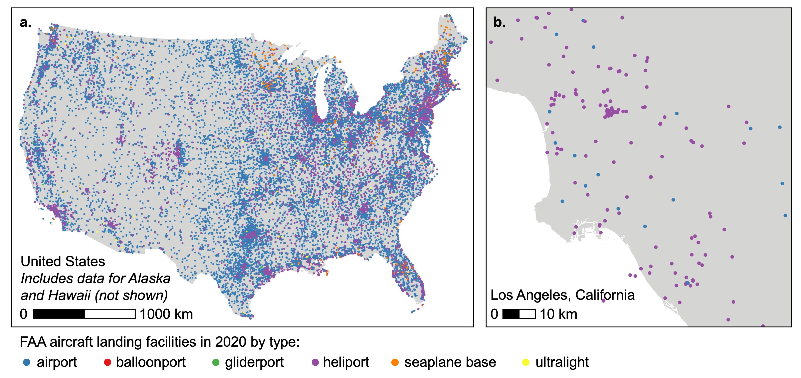

## Airport Proximity {#chapter-geo-exposure-faa}

The following are step-by-step instructions to calculate proximity-based exposure metrics to  aircraft landing facilities in the United States (US) using [Federal Aviation Administration (FAA) aircraft landing facility data](https://adip.faa.gov/agis/public/#/airportSearch/advanced). 

### Description

#### FAA Aircraft Landing Facility Data {-} 
The FAA aircraft landing facility data includes a registry of point locations (i.e., coordinates) of arrival and departure of aircraft in the US. FAA provides the following categorization of aircraft landing facility types:  airports, heliports, seaplane bases, gliderports, ultralights, and balloonports. FAA also provides the activation year for facilities starting in year 1981.

The following figure illustrates the spatial coverage (all US states) and spatial scale (points) of the FAA aircraft landing facility data:

<center>



</center>  

#### Exposure Metrics {-}
This tool calculates proximity-based (i.e., distance-based) exposure metrics for a specified list of receptor point locations (e.g., geocoded home addresses) to aircraft landing facilities in a specified year (during 1981-2020). This tool can be used to calculate the following proximity-based metrics within the US:  

* Distance to nearest aircraft landing facility and identity of nearest aircraft landing facility (i.e., identifying codes, facility type, and activation year)
* Count of aircraft landing facilities within a specified buffer distance of receptor
* Summary metrics of distances to all aircraft landing facilities within a specified buffer distance of receptor (i.e., mean distance, mean of logarithm distance, and 25^th^, 50^th^, and 75^th^ percentile distances)

Proximity metrics can be calculated for all FAA aircraft landing facility types (i.e., airports, heliports, seaplane bases, gliderports, ultralights, and balloonports) or any subset of them. Output includes information about data missingness (e.g., whether a receptor location is near a US border) as well as an optional log file.

#### Recommended Uses {-}
This tool is recommended for the following uses:  

* Applications for which a proximity-based metric is appropriate. *Note: This tool does not provide other relevant exposure information associated with aircraft landing facilities, such as traffic (e.g., annual count of arrivals/departures), noise levels, or air pollution levels.*  
* Applications for which most receptor point locations are not located near to a US border with Mexico or Canada. *Note: Because this tool does not include aircraft landing facility data for Mexico or Canada, the tool may __under predict__ proximity to aircraft landing facilities for receptor point locations in the US near a border with Mexico or Canada with nearby aircraft landing facilities across the border. This tool provides optional output information indicating whether a receptor point is located within a specified distance of a border.*  

#### Steps {-}

1. [Install R and required packages](#step-1-faa)  

2. [Download tool](#step-2-faa)  

3. [Prepare receptor point data](#step-3-faa)  

4. [Run script in R](#step-4-faa)  

5. [Review output](#step-5-faa) 

6. [Cite data and tool](#step-6-faa)


### Install R and Required Packages {#step-1-faa}

[Install R](https://cran.r-project.org/). Optionally, [install RStudio](https://www.rstudio.com/products/rstudio/download/).

Then, install the following R packages: ````logr````, ````tidyverse````, ````sf````.
Follow [R package installation instructions](https://cran.r-project.org/doc/manuals/r-release/R-admin.html#Installing-packages), or run the following code in R:
```{r eval = FALSE}
install.packages(c("logr", "tidyverse", "sf"))
```
    
### Download Tool {#step-2-faa}

Download and save the folder containing input data (````input_source_aircraft_facilities.rds```` and ````input_us_borders.rds````) and script (````script_aircraft_facility_proximity_for_points.R````). To directly run the example scripts provided with these instructions in [Step 4](#step-4-faa), do not change the file names within the folder.   

### Prepare Receptor Point Data {#step-3-faa} 
 
Prepare a comma-separated values (CSV) file that contains a table of the receptor 
point locations (e.g., geocoded addresses, coordinates). Include each receptor as 
a separate row in the table, and include the following **required** columns:  

* ````id````: a unique and anonymous identifying code for each receptor. This can be in character (string) or numeric (double) format  
* ````latitude````: the latitude of the receptor point location in decimal degrees 
format (range: -90 to 90) 
* ````longitude````: the longitude of the receptor point location in decimal 
degrees format (range: -180 to 180)    

The following table provides an example of the receptor point data format:    

|id     |latitude      | longitude      |
|-------|--------------|----------------|
|1011A  |39.00205369   |-77.105578716   |
|1012C  |35.88480215   |-78.877942573   |  
|1013E  |39.43560788   |-77.434847823   |  

To directly run the example scripts provided with these instructions, save the receptor point data as ````input_receptor.csv```` in the folder.  

### Run Script in R  {#step-4-faa}

Run the script ````script_aircraft_facility_proximity_for_points.R```` to load the required functions in R. You can then use the function ````get_aircraft_facility_proximity_for_points()```` to calculate proximity-based exposure metrics for each receptor point location. 

#### Description of Function ````get_aircraft_facility_proximity_for_points()```` {-}

This function takes the receptor point data above and returns a data frame with the receptor identifying code linked to the selected aircraft landing facility proximity metrics for selected aircraft landing facility types and year (during 1981 to 2020) as well as information about data missingness. Optionally, the function also writes a log file in the current R working directory. The function has the following arguments:

**Required Arguments**  

* ````receptor_filepath````: specifies the file path to a CSV file containing the receptor point locations (described in [Step 3](#step-3-faa)). *Note: The format for file paths in R can vary by operating system.*  
* ````source_aircraft_facilities_filepath````: specifies the file path to a RDS file containing a simple features object with the point locations of FAA aircraft landing facilities. This is the file ````input_source_aircraft_facilities.rds````.  
* ````us_borders_filepath````: specifies the file path to a RDS file containing a simple features object with the US borders with Mexico and Canada. This is the file ````input_us_borders.rds````. 
* ````aircraft_year````: specifies a single year (in YYYY format; e.g., 2003) for proximity-based exposure assessment across all pollutants. Default is ````NULL````. Year must be during 1981 to 2020. Aircraft landing facilities activated after ````aircraft_year```` will be excluded from calculation of the proximity metrics.  

**Optional Arguments**  

* ````buffer_distance_km````: a numeric argument that specifies the buffer distance (units: kilometers [km]) to use in calculation of buffer-based proximity metrics. Default is ````10```` km. Must be between 0.001 km and 1000 km. *Note: Larger buffer distance values may result in longer run-times for buffer-based proximity metrics.* 
* ````receptor_crs````: a coordinate reference system object (i.e., [class is ````crs```` object in R](https://www.nceas.ucsb.edu/sites/default/files/2020-04/OverviewCoordinateReferenceSystems.pdf)) for the receptor point locations. Default is ````"EPSG:4269"```` (i.e., NAD83). 
* ````projection_crs````: a projected coordinate reference system object (i.e., [class is ````crs```` object in R](https://www.nceas.ucsb.edu/sites/default/files/2020-04/OverviewCoordinateReferenceSystems.pdf)) for use in exposure assessment. Default is ````"ESRI:102008"```` (i.e., North America Albers Equal Area Conic projection). 
* ````aircraft_facility_type````: list that specifies the subset of FAA aircraft landing facility types to include in the exposure assessment. Default is all types: ````"airport", "heliport", "seaplane base", "gliderport", "ultralight", "balloonport"````.  
* ````proximity_metrics````: list that specifies the subset of proximity-based exposure metrics to calculate. Default is all metrics: ````"distance_to_nearest, "count_in_buffer", "distance_in_buffer"````.  
    + ````"distance_to_nearest"````: returns output with distance to nearest aircraft landing facility (units: km) and identity of nearest aircraft landing facility (i.e., identifying codes, facility type, and activation year) for each receptor   
    + ````"count_in_buffer"````: returns output with count of aircraft landing facilities within a specified buffer distance of each receptor  
    + ````"distance_in_buffer"````: returns output with summary metrics of distances to all aircraft landing facilities within the specified buffer distance of receptor (i.e., mean distance, mean of logarithm distance, and 25^th^, 50^th^, and 75^th^ percentile distances to all aircraft landing facilities for each receptor) 
* ````check_near_us_border````: logical argument that specifies whether the function should identify receptor points that are within the buffer distance (i.e., specified by argument ````buffer_distance_km````) of a US border with Canada or Mexico. ````TRUE```` returns a column with output (````within_border_buffer````) with a binary variable indicating receptor points within the buffer distance of a border. Default is ````TRUE````. *Note: The aircraft landing facility data covers only facilities located within the US. Thus, this tool may under predict proximity to aircraft landing facilities for receptor locations near a US border with Canada or Mexico.*  
* ````add_all_input_to_output````: logical argument that specifies whether the output of the function should include all columns included with the input receptor data frame or not. ````TRUE```` returns all columns (i.e., including latitude and longitude) with output. ````FALSE```` returns only the anonymous receptor identifying code, proximity-based metrics, and data missingness information with output. ````FALSE```` may be useful for meeting data de-identification requirements. Default is ````TRUE````.  
* ````write_log_to_file````: logical argument that specifies whether a log should be written to file. ````TRUE```` will create a log file in the current working directory. Default is ````TRUE````.  
* ````print_log_to_console````: logical argument that specifies whether a log should be printed to the console. ````TRUE```` will print a log to console. Default is ````TRUE````.  

#### Example Use {-}

Below are two example scripts for using the function above to produce a CSV file with the proximiity-based exposure estimates for each receptor to airports in year 2020 (using default options for all other optional arguments). The first example uses only R but requires editing the file paths. The second example requires RStudio and the ````here```` package but does not require editing file paths.  

**Example 1: Base R**  

```{r eval = FALSE}
# Load packages
library(tidyverse)
library(logr)
library(sf)

# Load functions
source("/set/file/path/to/script_aircraft_facility_proximity_for_points.R")

# Get exposures
aircraft_proximity_metrics <-
  get_aircraft_facility_proximity_for_points(
    receptor_filepath = "/set/file/path/to/input_receptor.csv",
    source_aircraft_facilities_filepath =
    "/set/file/path/to/input_source_aircraft_facilities.rds",
    us_borders_filepath =
    "/set/file/path/to/input_us_borders.rds",
    aircraft_year = 2020,
    aircraft_facility_type = "airport"
  )

# Write exposures to CSV
readr::write_csv(aircraft_proximity_metrics,
  file = "/set/file/path/to/output_aircraft_proximity_metrics.csv"
)
```

**Example 2: RStudio with ```here``` Package**  

```{r eval = FALSE}
# Install here package (if needed)
install.packages("here")

# Load packages
library(here)
library(tidyverse)
library(logr)
library(sf)

# Set location
here::i_am("script_aircraft_facility_proximity_for_points.R")

# Load functions
source(here::here("script_aircraft_facility_proximity_for_points.R"))

# Get exposures
aircraft_proximity_metrics <-
  get_aircraft_facility_proximity_for_points(
    receptor_filepath = here("input_receptor.csv"),
    source_aircraft_facilities_filepath =
    here("input_source_aircraft_facilities.rds"),
    us_borders_filepath = here("input_us_borders.rds"),
    aircraft_year = 2020,
    aircraft_facility_type = "airport"
  )

# Write exposures to CSV
readr::write_csv(aircraft_proximity_metrics,
  file = here("output_aircraft_proximity_metrics.csv")
)
```

### Review Output  {#step-5-faa}

#### Log File {-} 
After running the example script above, with the log file option selected, the log
file will be available in the folder ````log```` in the current R working directory.  

#### Output Data {-}
After running the example script above, calculated proximity-based exposure metrics for receptor locations will be available in the file ````output_aircraft_proximity_metrics.csv```` within the folder. This CSV file includes a row for each receptor with the following columns (as applicable):  

**Identifiers**  

* ````id````: the unique and anonymous identifying code for each receptor  

**Calculated Proximity-Based Exposure Metrics**  

**_Nearest Distance Metrics_**

* ````aircraft_nearest_distance_km````: distance (units: km) to the nearest aircraft landing facility      
* ````aircraft_nearest_id_site_num````: the unique identifying FAA site number for the nearest aircraft landing facility. Consists of a numeric code followed by a letter indicating the aircraft landing facility type. For example, the site number for the Los Angeles International Airport is ````01818.*A````. The FAA site number can be used to link additional types of [FAA data](https://adip.faa.gov/agis/public/#/airportSearch/advanced) (e.g., annual operations) for further analyses.  
* ````aircraft_nearest_id_loc````: the unique identifying location code for the nearest aircraft landing facility. Consists of a 3 or 4 character alphanumeric code. For example, the location code for the Los Angeles International Airport is ````LAX````. The location code can be used to link additional types of [FAA data](https://adip.faa.gov/agis/public/#/airportSearch/advanced) (e.g., annual operations) for further analyses.  
* ````aircraft_nearest_fac_type````: the type (i.e., airport, heliport, seaplane base, gliderport, ultralight, and balloonport) of the nearest aircraft landing facility 
* ````aircraft_nearest_year_activation````: the year of activation of the nearest aircraft landing facility. Activation year is available for all facilities starting in 1981. 

**_Count in Buffer Metrics_**  

* ````aircraft_count_in_buffer````: number of aircraft landing facilities within the specified buffer distance of each receptor  

**_Distance in Buffer Metrics_**  

* ````aircraft_mean_distance_in_buffer````: mean of distances (units: km) to all aircraft landing facilities within the specified buffer distance of receptor. ````NA```` indicates that no landing facilities are within the specified buffer distance of the receptor. *Note: In cases with exactly one aircraft landing facility within the specified buffer distance, the value will be the distance to that aircraft landing facility.*
* ````aircraft_log_mean_distance_in_buffer````: mean of logarithm of distances (units: km) to all aircraft landing facilities within the specified buffer distance of receptor. ````NA```` indicates that no landing facilities are within the specified buffer distance of the receptor. *Note: In cases with exactly one aircraft landing facility within the specified buffer distance, the value will be the logarithm of the distance to that aircraft landing facility.*
* ````aircraft_p25_distance_in_buffer````: 25^th^ percentile of distances (units: km) to all aircraft landing facilities within the specified buffer distance of receptor, for cases with at least 10 aircraft landing facilities within the buffer distance. ````NA```` indicates that less than 10 aircraft landing facilities are within the buffer distance.
* ````aircraft_p50_distance_in_buffer````: 50^th^ percentile (i.e., median) of distances (units: km) to all aircraft landing facilities within the specified buffer distance of receptor, for cases with at least 10 aircraft landing facilities within the buffer distance. ````NA```` indicates that less than 10 aircraft landing facilities are within the buffer distance.
* ````aircraft_p75_distance_in_buffer````: 75^th^ percentile of distances (units: km) to all aircraft landing facilities within the specified buffer distance of receptor, for cases with at least 10 aircraft landing facilities within the buffer distance. ````NA```` indicates that less than 10 aircraft landing facilities are within the buffer distance.

**Information on Data Missingness**  

* ````within_border_buffer````: binary variable indicating whether receptor point is located within the buffer distance (i.e., specified by argument ````buffer_distance_km````) of a US border with Canada or  Mexico:  
    + ````1```` indicates that receptor point is located within the buffer distance of a US border with Canada or Mexico. This indicates that the proximity-based metrics calculated by this tool may represent under predictions of the true proximity-based metrics (i.e., the nearest aircraft landing facility may be located in Canada or Mexico, outside the coverage of the US aircraft landing facility dataset).  
    + ````0```` indicates that receptor point is **not** located within the buffer distance of a US border with Canada or Mexico. 


### Cite Data and Tool {#step-6-faa}

Please cite the following in any publications based on this tool:  

**Aircraft Landing Facility Data:**  

US Federal Aviation Administration (FAA). *Airport Data and Information Portal (ADIP)*. [Available: https://adip.faa.gov/agis/public/#/airportSearch/advanced]. Accessed: April 24, 2022. 

Homeland Infrastructure Foundation-Level Data (HIFLD) Geoplatform. *Aircraft landing facilities geospatial data*. [Available: https://hifld-geoplatform.opendata.arcgis.com/datasets/geoplatform::aircraft-landing-facilities/about]. Accessed: June 23, 2022.  


**US Borders:**  

Homeland Infrastructure Foundation-Level Data (HIFLD) Geoplatform. *Canada and US border geospatial data*. [Available: https://hifld-geoplatform.opendata.arcgis.com/datasets/geoplatform::canada-and-us-border/about]. Accessed: June 23, 2022.  

Homeland Infrastructure Foundation-Level Data (HIFLD) Geoplatform. *Mexico and US border geospatial data*. [Available: https://hifld-geoplatform.opendata.arcgis.com/datasets/geoplatform::mexico-and-us-border/about]. Accessed: June 23, 2022.  

**NIEHS Geospatial Toolbox:**  

*Citation to be determined.*  


