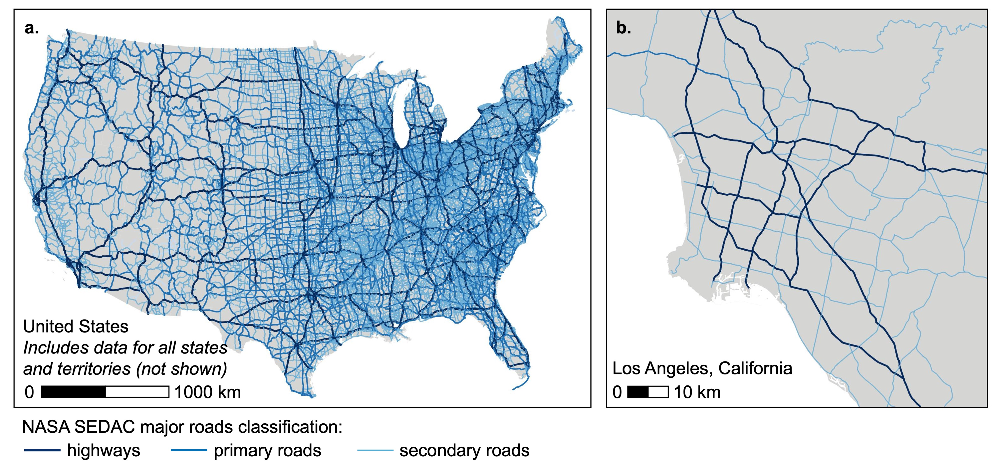
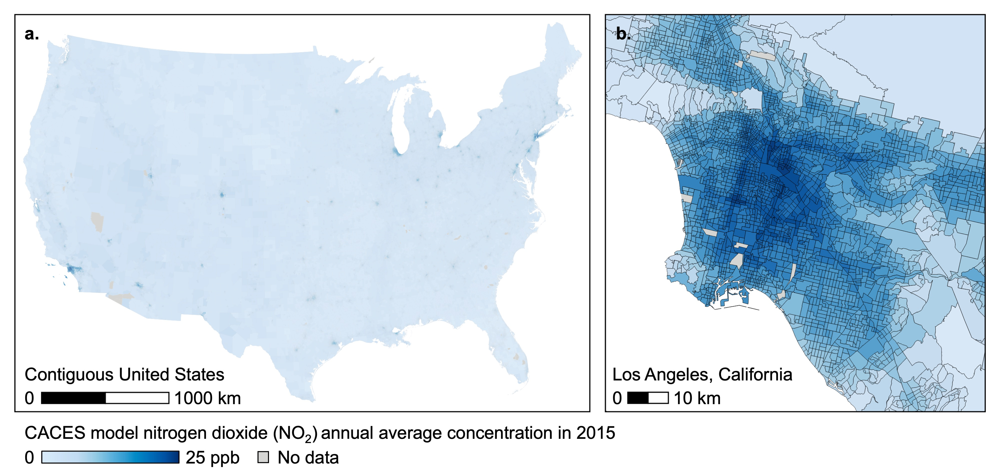

#```{r setup, include=FALSE}
#knitr::opts_chunk$set(echo = TRUE)
#```

# **Major road exposure** {-}

## Major road proximity metrics {-}

The following are step-by-step instructions to calculate proximity-based exposure metrics to  major roadways in the United States (US) using US NASA (National Aeronautics and Space Administration) Socioeconomic Data and Applications Center (SEDAC) [Global Roads Open Access Data Set (Version 1)](https://doi.org/10.7927/H4VD6WCT). 

**NASA SEDAC roads data**  
The NASA SEDAC global data includes the locations of major roads (i.e., lines indicating roadway center lines) for the US in 2005. Major roads are categorized based on social and economic importance as follows:

| Major road classification   | Description                                              | 
|-----------------------------|----------------------------------------------------------|  
| Highways                    | Limited access divided highways connecting major cities. |   
| Primary roads               | Other primary major roads between and into major cities as well as primary arterial roads. |   
| Secondary roads             | Other secondary roads between and into cities as well as secondary arterial roads.           |  
  

Other types of roads, such as tertiary roads, local roads, trails, and private roads, are not included.

The following figure illustrates the spatial coverage (all US states and territories) and spatial scale (lines) of the SEDAC roads data:

<center>



</center>  


**Exposure metrics**  
This tool calculates proximity-based (i.e., distance-based) exposure metrics for a specified list of receptor point locations (e.g., geocoded home addresses) to major roads in year 2005. This tool can be used to calculate the following proximity-based metrics within the US:  

* distance to nearest major road and classification of nearest major road
* length of road within a specified buffer distance of receptor

These proximity-based metrics can be calculated for all available major road classifications (i.e., highways, primary roads, and secondary roads) or any subset of them. Output includes information about data missingness (e.g., whether a receptor location is near a US border) as well as an optional log file.

**Recommended uses**  
This tool is recommended for the following uses:  

* applications for which a proximity-based metric is appropriate. *Note: This tool does __not__ provide other relevant exposure information associated with roads, such as traffic, noise levels, or air pollution levels.*  
* analyses focused on exposures related specifically to major roads. *Note: This tool does __not__ include data for other road classifications, such as local street networks or trails.*  
* applications for which most receptor point locations are *not* located in communities with sections of tunneled or elevated highways. *Note: This tool does __not__ provide information about whether roads are at surface level (e.g., elevated, tunneled, etc.). Exposure implications of roadway proximity may differ depending on whether road is at surface level. Some urban highways have varying tunneled, surface-level, or elevated sections (e.g., tunneled sections of US Interstate 90 in Boston, Massachusetts, and in Seattle, Washington).*  
* applications for which most receptor point locations are *not* located near to a US border with Mexico or Canada. *Note: Because this tool does not include roadway data for Mexico or Canada, the tool may __under predict__ proximity to major roads for receptor point locations in the US near a border with Mexico or Canada with nearby major roads across the border. This tool provides optional output information indicating whether a receptor point is located within a specified distance of a border.*  


**Outline of steps**  

[Step 1. Install R and required packages](#step-1.-install-r-and-required-packages)  

[Step 2. Download tool](#step-2.-download-tool)  

[Step 3. Prepare receptor point data](#step-3.-prepare-receptor-point-data)  

[Step 4. Run script in R](#step-4.-run-script-in-r)  

[Step 5. Review output](#step-5.-review-output)  

&nbsp; 
&nbsp; 

#### Step 1. Install R and required packages
***
[Install R](https://cran.r-project.org/). Optionally, [install RStudio](https://www.rstudio.com/products/rstudio/download/).

Then, install the following R packages: ````logr````, ````tidyverse````, ````sf````.
Follow [R package installation instructions](https://cran.r-project.org/doc/manuals/r-release/R-admin.html#Installing-packages), or run the following code in R:
```{r eval = FALSE}
install.packages(c("logr", "tidyverse", "sf"))
```
&nbsp; 
&nbsp;  
    
#### Step 2. Download tool 
***
Download and save the folder containing input data (````input_source_major_roads.rds```` and ````input_us_borders.rds````) and script (````script_major_road_proximity_for_points.R````). To directly run the example scripts provided with these instructions in [Step 4](#step-4.-run-script-in-r), do not change the file names within the folder.   
&nbsp;  
&nbsp;  

#### Step 3. Prepare receptor point data  
***  
Prepare a comma-separated values (CSV) file that contains a table of the receptor 
point locations (e.g., geocoded addresses, coordinates). Include each receptor as 
a separate row in the table, and include the following **required** columns:  

* ````id````: a unique and anonymous identifying code for each receptor. This can be in character (string) or numeric (double) format  
* ````latitude````: the latitude of the receptor point location in decimal degrees 
format (range: -90 to 90) 
* ````longitude````: the longitude of the receptor point location in decimal 
degrees format (range: -180 to 180)    

The following table provides an example of the receptor point data format:    

|id     |latitude      | longitude      |
|-------|--------------|----------------|
|1011A  |39.00205369   |-77.105578716   |
|1012C  |35.88480215   |-78.877942573   |  
|1013E  |39.43560788   |-77.434847823   |  

To directly run the example scripts provided with these instructions, save the receptor point data as ````input_receptor.csv```` in the folder.  
&nbsp;   
&nbsp;  

#### Step 4. Run script in R  
***
Run the script ````script_major_road_proximity_for_points.R```` to load the required functions in R. You can then use the function ````get_major_road_proximity_for_points()```` to calculate proximity-based exposure metrics for each receptor point location. 
&nbsp;   
&nbsp; 

##### Description of function ````get_major_road_proximity_for_points()````   

This function takes the receptor point data above and returns a data frame with the receptor identifying code linked to the selected major road facility proximity metrics for selected raod class(es) as well as information about data missingness. Optionally, the function also writes a log file in the current R working directory. The function has the following arguments:

**Required arguments**  

* ````receptor_filepath````: specifies the file path to a CSV file containing the receptor point locations (described in [Step 3](#step-3.-prepare-receptor-point-data)). *Note: The format for file paths in R can vary by operating system.*  
* ````source_major_roads_filepath````: specifies the file path to a RDS file containing a simple features object with the line locations of NASA SEDAC major roads in the US. This is the file ````input_source_major_roads.rds````.  
* ````us_borders_filepath````: specifies the file path to a RDS file containing a simple features object with the US borders with Mexico and Canada. This is the file ````input_us_borders.rds````. 

**Optional arguments**  

* ````buffer_distance_km````: a numeric argument that specifies the buffer distance (units: kilometers [km]) to use in calculation of buffer-based proximity metrics. Default is ````1```` km. Must be between 0.001 km and 1000 km. *Note: Larger buffer distance values may result in longer run-times for buffer-based proximity metrics.* 
* ````receptor_crs````: a coordinate reference system object (i.e., [class is ````crs```` object in R](https://www.nceas.ucsb.edu/sites/default/files/2020-04/OverviewCoordinateReferenceSystems.pdf)) for the receptor point locations. Default is ````"EPSG:4269"```` (i.e., NAD83).  
* ````projection_crs````: a projected coordinate reference system object (i.e., [class is ````crs```` object in R](https://www.nceas.ucsb.edu/sites/default/files/2020-04/OverviewCoordinateReferenceSystems.pdf)) for use in exposure assessment. Default is ````"ESRI:102008"```` (i.e., North America Albers Equal Area Conic projection). 
* ````road_class_selection````: list that specifies the subset of major road types to include in the exposure assessment. Default is all types: ````"highway", "primary road", "secondary road", "unspecified"````.  
* ````proximity_metrics````: list that specifies the subset of proximity-based exposure metrics to calculate. Default is all metrics: ````"distance_to_nearest,  "length_in_buffer"````.  
    + ````"distance_to_nearest"````: returns output with distance to nearest major road (units: km) and classification of nearest major road (e.g., highway) for each receptor   
    + ````"length_in_buffer"````: returns output with the length (units: km) of all major roads of the selected class(es) within the specified buffer distance of receptor  
* ````check_near_us_border````: logical argument that specifies whether the function should identify receptor points that are within the buffer distance (i.e., specified by argument ````buffer_distance_km````) of a US border with Canada or Mexico. ````TRUE```` returns a column with output (````within_border_buffer````) with a binary variable indicating receptor points within the buffer distance of a border. Default is ````TRUE````. *Note: This tool includes only road data for US states and territories. Thus, this tool may under predict proximity to major roads for receptor locations near a US border with Canada or Mexico.*  
* ````add_all_input_to_output````: logical argument that specifies whether the output of the function should include all columns included with the input receptor data frame or not. ````TRUE```` returns all columns (i.e., including latitude and longitude) with output. ````FALSE```` returns only the anonymous receptor identifying code, proximity-based metrics, and data missingness information with output. ````FALSE```` may be useful for meeting data de-identification requirements. Default is ````TRUE````.  
* ````write_log_to_file````: logical argument that specifies whether a log should be written to file. ````TRUE```` will create a log file in the current working directory. Default is ````TRUE````.  
* ````print_log_to_console````: logical argument that specifies whether a log should be printed to the console. ````TRUE```` will print a log to console. Default is ````TRUE````.  
&nbsp;   
&nbsp; 

##### Example use 

Below are two example scripts for using the function above to produce a CSV file with the proximity-based exposure estimates for each receptor to highways (using default options for all other optional arguments). The first example uses only R but requires editing the file paths. The second example requires RStudio and the ````here```` package but does not require editing file paths.  

**Example 1: Base R**  

```{r eval = FALSE}
# Load packages
library(tidyverse)
library(logr)
library(sf)

# Load functions
source("/set/file/path/to/script_major_road_proximity_for_points.R")

# Get proximity-based exposures
major_road_proximity_metrics <- 
  get_major_road_proximity_for_points(
    receptor_filepath = "/set/file/path/to/input_receptor.csv", 
    source_major_roads_filepath =
      "/set/file/path/to/input_source_major_roads.rds",
    us_borders_filepath =
      "/set/file/path/to/input_us_borders.rds",
    road_class_selection = "highway")

# Write exposures to CSV
readr::write_csv(major_road_proximity_metrics, 
                 file ="/set/file/path/to/output_major_road_proximity_metrics.csv")
```

**Example 2: RStudio with ```here``` package**  

```{r eval = FALSE}
# Install here package (if needed)
install.packages("here")

# Load packages
library(here)
library(tidyverse)
library(logr)
library(sf)

# Set location
here::i_am("script_major_road_proximity_for_points.R")

# Load functions
source(here::here("script_major_road_proximity_for_points.R"))

# Get exposures
major_road_proximity_metrics <- 
  get_major_road_proximity_for_points(
    receptor_filepath = here("input_receptor.csv"), 
    source_major_roads_filepath = here("input_source_major_roads.rds"),
    us_borders_filepath = here("input_us_borders.rds"),
    road_class_selection = "highway")

# Write exposures to CSV
readr::write_csv(major_road_proximity_metrics, 
                 file = here("output_major_road_proximity_metrics.csv"))
```

&nbsp;   
&nbsp;  

#### Step 5. Review output  
***
##### Log file  
After running the example script above, with the log file option selected, the log
file will be available in the folder ````log```` in the current R working directory.  
&nbsp;   
&nbsp;  

##### Output data  
After running the example script above, calculated proximity-based exposure metrics for receptor locations will be available in the file ````output_major_road_proximity_metrics.csv```` within the folder. This CSV file includes a row for each receptor with the following columns (as applicable):  

**Identifiers**  

* ````id````: the unique and anonymous identifying code for each receptor  

**Calculated proximity-based exposure metrics**  

**_Nearest distance metrics_**

* ````major_road_nearest_distance_km````: distance (units: km) to the nearest major road      
* ````major_road_nearest_road_class````: the classification of the nearest major road segment.   

**_Length in buffer metrics_**  

* ````major_road_length_in_buffer_km````: length (units: km) of all major roads of the specified class(es) within the specified buffer distance of receptor. ````0```` indicates that no major roads are within the specified buffer distance of the receptor. 

**Information on data missingness**  

* ````within_border_buffer````: binary variable indicating whether receptor point is located within the buffer distance (i.e., specified by argument ````buffer_distance_km````) of a US border with Canada or  Mexico:  
    + ````1```` indicates that receptor point is located within the buffer distance of a US border with Canada or Mexico. This indicates that the proximity-based metrics calculated by this tool may represent under predictions of the true proximity-based metrics (i.e., the nearest major road may be located in Canada or Mexico, outside the coverage of the major road data included in this tool).  
    + ````0```` indicates that receptor point is **not** located within the buffer distance of a US border with Canada or Mexico. 
&nbsp;   
&nbsp;  


#### Step 6. Cite data and tool   
***
Please cite the following in any publications based on this tool:  

**Major roads data:**  

Center for International Earth Science Information Network - CIESIN - Columbia University, and Information Technology Outreach Services - ITOS - University of Georgia. (2013). Global Roads Open Access Data Set, Version 1 (gROADSv1). Palisades, New York: NASA Socioeconomic Data and Applications Center (SEDAC). [Available: https://doi.org/10.7927/H4VD6WCT.] Accessed October 24, 2022.  

**US borders:**  

Homeland Infrastructure Foundation-Level Data (HIFLD) Geoplatform. *Canada and US border geospatial data*. [Available: https://hifld-geoplatform.opendata.arcgis.com/datasets/geoplatform::canada-and-us-border/about]. Accessed: June 23, 2022.  

Homeland Infrastructure Foundation-Level Data (HIFLD) Geoplatform. *Mexico and US border geospatial data*. [Available: https://hifld-geoplatform.opendata.arcgis.com/datasets/geoplatform::mexico-and-us-border/about]. Accessed: June 23, 2022.  

**NIEHS geospatial toolbox:**  

*Citation to be determined.*  
&nbsp;   
&nbsp; 

## Aircraft landing facility proximity metrics {-}

### Instructions: Aircraft landing facility proximity metrics {-} 
***
The following are step-by-step instructions to calculate proximity-based exposure metrics to  aircraft landing facilities in the United States (US) using [Federal Aviation Administration (FAA) aircraft landing facility data](https://adip.faa.gov/agis/public/#/airportSearch/advanced). 

**FAA aircraft landing facility data**  
The FAA aircraft landing facility data includes a registry of point locations (i.e., coordinates) of arrival and departure of aircraft in the US. FAA provides the following categorization of aircraft landing facility types:  airports, heliports, seaplane bases, gliderports, ultralights, and balloonports. FAA also provides the activation year for facilities starting in year 1981.

The following figure illustrates the spatial coverage (all US states) and spatial scale (points) of the FAA aircraft landing facility data:

<center>


</center>  


**Exposure metrics**  
This tool calculates proximity-based (i.e., distance-based) exposure metrics for a specified list of receptor point locations (e.g., geocoded home addresses) to aircraft landing facilities in a specified year (during 1981-2020). This tool can be used to calculate the following proximity-based metrics within the US:  

* distance to nearest aircraft landing facility and identity of nearest aircraft landing facility (i.e., identifying codes, facility type, and activation year)
* count of aircraft landing facilities within a specified buffer distance of receptor
* summary metrics of distances to all aircraft landing facilities within a specified buffer distance of receptor (i.e., mean distance, mean of logarithm distance, and 25^th^, 50^th^, and 75^th^ percentile distances)

Proximity metrics can be calculated for all FAA aircraft landing facility types (i.e., airports, heliports, seaplane bases, gliderports, ultralights, and balloonports) or any subset of them. Output includes information about data missingness (e.g., whether a receptor location is near a US border) as well as an optional log file.

**Recommended uses**  
This tool is recommended for the following uses:  

* applications for which a proximity-based metric is appropriate. *Note: This tool does **not** provide other relevant exposure information associated with aircraft landing facilities, such as traffic (e.g., annual count of arrivals/departures), noise levels, or air pollution levels.*  
* applications for which most receptor point locations are *not* located near to a US border with Mexico or Canada. *Note: Because this tool does not include aircraft landing facility data for Mexico or Canada, the tool may __under predict__ proximity to aircraft landing facilities for receptor point locations in the US near a border with Mexico or Canada with nearby aircraft landing facilities across the border. This tool provides optional output information indicating whether a receptor point is located within a specified distance of a border.*  

**Outline of steps**  

[Step 1. Install R and required packages](#step-1.-install-r-and-required-packages)  

[Step 2. Download tool](#step-2.-download-tool)  

[Step 3. Prepare receptor point data](#step-3.-prepare-receptor-point-data)  

[Step 4. Run script in R](#step-4.-run-script-in-r)  

[Step 5. Review output](#step-5.-review-output)  

&nbsp; 
&nbsp; 

#### Step 1. Install R and required packages
***
[Install R](https://cran.r-project.org/). Optionally, [install RStudio](https://www.rstudio.com/products/rstudio/download/).

Then, install the following R packages: ````logr````, ````tidyverse````, ````sf````.
Follow [R package installation instructions](https://cran.r-project.org/doc/manuals/r-release/R-admin.html#Installing-packages), or run the following code in R:
```{r eval = FALSE}
install.packages(c("logr", "tidyverse", "sf"))
```
&nbsp; 
&nbsp;  
    
#### Step 2. Download tool 
***
Download and save the folder containing input data (````input_source_aircraft_facilities.rds```` and ````input_us_borders.rds````) and script (````script_aircraft_facility_proximity_for_points.R````). To directly run the example scripts provided with these instructions in [Step 4](#step-4.-run-script-in-r), do not change the file names within the folder.   
&nbsp;  
&nbsp;  

#### Step 3. Prepare receptor point data  
***  
Prepare a comma-separated values (CSV) file that contains a table of the receptor 
point locations (e.g., geocoded addresses, coordinates). Include each receptor as 
a separate row in the table, and include the following **required** columns:  

* ````id````: a unique and anonymous identifying code for each receptor. This can be in character (string) or numeric (double) format  
* ````latitude````: the latitude of the receptor point location in decimal degrees 
format (range: -90 to 90) 
* ````longitude````: the longitude of the receptor point location in decimal 
degrees format (range: -180 to 180)    

The following table provides an example of the receptor point data format:    

|id     |latitude      | longitude      |
|-------|--------------|----------------|
|1011A  |39.00205369   |-77.105578716   |
|1012C  |35.88480215   |-78.877942573   |  
|1013E  |39.43560788   |-77.434847823   |  

To directly run the example scripts provided with these instructions, save the receptor point data as ````input_receptor.csv```` in the folder.  
&nbsp;   
&nbsp;  

#### Step 4. Run script in R  
***
Run the script ````script_aircraft_facility_proximity_for_points.R```` to load the required functions in R. You can then use the function ````get_aircraft_facility_proximity_for_points()```` to calculate proximity-based exposure metrics for each receptor point location. 
&nbsp;   
&nbsp; 

##### Description of function ````get_aircraft_facility_proximity_for_points()````   

This function takes the receptor point data above and returns a data frame with the receptor identifying code linked to the selected aircraft landing facility proximity metrics for selected aircraft landing facility types and year (during 1981 to 2020) as well as information about data missingness. Optionally, the function also writes a log file in the current R working directory. The function has the following arguments:

**Required arguments**  

* ````receptor_filepath````: specifies the file path to a CSV file containing the receptor point locations (described in [Step 3](#step-3.-prepare-receptor-point-data)). *Note: The format for file paths in R can vary by operating system.*  
* ````source_aircraft_facilities_filepath````: specifies the file path to a RDS file containing a simple features object with the point locations of FAA aircraft landing facilities. This is the file ````input_source_aircraft_facilities.rds````.  
* ````us_borders_filepath````: specifies the file path to a RDS file containing a simple features object with the US borders with Mexico and Canada. This is the file ````input_us_borders.rds````. 
* ````aircraft_year````: specifies a single year (in YYYY format; e.g., 2003) for proximity-based exposure assessment across all pollutants. Default is ````NULL````. Year must be during 1981 to 2020. Aircraft landing facilities activated after ````aircraft_year```` will be excluded from calculation of the proximity metrics.  

**Optional arguments**  

* ````buffer_distance_km````: a numeric argument that specifies the buffer distance (units: kilometers [km]) to use in calculation of buffer-based proximity metrics. Default is ````10```` km. Must be between 0.001 km and 1000 km. *Note: Larger buffer distance values may result in longer run-times for buffer-based proximity metrics.* 
* ````receptor_crs````: a coordinate reference system object (i.e., [class is ````crs```` object in R](https://www.nceas.ucsb.edu/sites/default/files/2020-04/OverviewCoordinateReferenceSystems.pdf)) for the receptor point locations. Default is ````"EPSG:4269"```` (i.e., NAD83). 
* ````projection_crs````: a projected coordinate reference system object (i.e., [class is ````crs```` object in R](https://www.nceas.ucsb.edu/sites/default/files/2020-04/OverviewCoordinateReferenceSystems.pdf)) for use in exposure assessment. Default is ````"ESRI:102008"```` (i.e., North America Albers Equal Area Conic projection). 
* ````aircraft_facility_type````: list that specifies the subset of FAA aircraft landing facility types to include in the exposure assessment. Default is all types: ````"airport", "heliport", "seaplane base", "gliderport", "ultralight", "balloonport"````.  
* ````proximity_metrics````: list that specifies the subset of proximity-based exposure metrics to calculate. Default is all metrics: ````"distance_to_nearest, "count_in_buffer", "distance_in_buffer"````.  
    + ````"distance_to_nearest"````: returns output with distance to nearest aircraft landing facility (units: km) and identity of nearest aircraft landing facility (i.e., identifying codes, facility type, and activation year) for each receptor   
    + ````"count_in_buffer"````: returns output with count of aircraft landing facilities within a specified buffer distance of each receptor  
    + ````"distance_in_buffer"````: returns output with summary metrics of distances to all aircraft landing facilities within the specified buffer distance of receptor (i.e., mean distance, mean of logarithm distance, and 25^th^, 50^th^, and 75^th^ percentile distances to all aircraft landing facilities for each receptor) 
* ````check_near_us_border````: logical argument that specifies whether the function should identify receptor points that are within the buffer distance (i.e., specified by argument ````buffer_distance_km````) of a US border with Canada or Mexico. ````TRUE```` returns a column with output (````within_border_buffer````) with a binary variable indicating receptor points within the buffer distance of a border. Default is ````TRUE````. *Note: The aircraft landing facility data covers only facilities located within the US. Thus, this tool may under predict proximity to aircraft landing facilities for receptor locations near a US border with Canada or Mexico.*  
* ````add_all_input_to_output````: logical argument that specifies whether the output of the function should include all columns included with the input receptor data frame or not. ````TRUE```` returns all columns (i.e., including latitude and longitude) with output. ````FALSE```` returns only the anonymous receptor identifying code, proximity-based metrics, and data missingness information with output. ````FALSE```` may be useful for meeting data de-identification requirements. Default is ````TRUE````.  
* ````write_log_to_file````: logical argument that specifies whether a log should be written to file. ````TRUE```` will create a log file in the current working directory. Default is ````TRUE````.  
* ````print_log_to_console````: logical argument that specifies whether a log should be printed to the console. ````TRUE```` will print a log to console. Default is ````TRUE````.  
&nbsp;   
&nbsp; 

##### Example use 

Below are two example scripts for using the function above to produce a CSV file with the proximiity-based exposure estimates for each receptor to airports in year 2020 (using default options for all other optional arguments). The first example uses only R but requires editing the file paths. The second example requires RStudio and the ````here```` package but does not require editing file paths.  

**Example 1: Base R**  

```{r eval = FALSE}
# Load packages
library(tidyverse)
library(logr)
library(sf)

# Load functions
source("/set/file/path/to/script_aircraft_facility_proximity_for_points.R")

# Get exposures
aircraft_proximity_metrics <- 
  get_aircraft_facility_proximity_for_points(
    receptor_filepath = "/set/file/path/to/input_receptor.csv", 
    source_aircraft_facilities_filepath =
      "/set/file/path/to/input_source_aircraft_facilities.rds",
    us_borders_filepath =
      "/set/file/path/to/input_us_borders.rds",
    aircraft_year = 2020,
    aircraft_facility_type = "airport")

# Write exposures to CSV
readr::write_csv(aircraft_proximity_metrics, 
                 file ="/set/file/path/to/output_aircraft_proximity_metrics.csv")
```

**Example 2: RStudio with ```here``` package**  

```{r eval = FALSE}
# Install here package (if needed)
install.packages("here")

# Load packages
library(here)
library(tidyverse)
library(logr)
library(sf)

# Set location
here::i_am("script_aircraft_facility_proximity_for_points.R")

# Load functions
source(here::here("script_aircraft_facility_proximity_for_points.R"))

# Get exposures
aircraft_proximity_metrics <- 
  get_aircraft_facility_proximity_for_points(
    receptor_filepath = here("input_receptor.csv"), 
    source_aircraft_facilities_filepath = here("input_source_aircraft_facilities.rds"),
    us_borders_filepath = here("input_us_borders.rds"),
    aircraft_year = 2020,
    aircraft_facility_type = "airport")

# Write exposures to CSV
readr::write_csv(aircraft_proximity_metrics, 
                 file = here("output_aircraft_proximity_metrics.csv"))
```

&nbsp;   
&nbsp;  

#### Step 5. Review output  
***
##### Log file  
After running the example script above, with the log file option selected, the log
file will be available in the folder ````log```` in the current R working directory.  
&nbsp;   
&nbsp;  

##### Output data  
After running the example script above, calculated proximity-based exposure metrics for receptor locations will be available in the file ````output_aircraft_proximity_metrics.csv```` within the folder. This CSV file includes a row for each receptor with the following columns (as applicable):  

**Identifiers**  

* ````id````: the unique and anonymous identifying code for each receptor  

**Calculated proximity-based exposure metrics**  

**_Nearest distance metrics_**

* ````aircraft_nearest_distance_km````: distance (units: km) to the nearest aircraft landing facility      
* ````aircraft_nearest_id_site_num````: the unique identifying FAA site number for the nearest aircraft landing facility. Consists of a numeric code followed by a letter indicating the aircraft landing facility type. For example, the site number for the Los Angeles International Airport is ````01818.*A````. The FAA site number can be used to link additional types of [FAA data](https://adip.faa.gov/agis/public/#/airportSearch/advanced) (e.g., annual operations) for further analyses.  
* ````aircraft_nearest_id_loc````: the unique identifying location code for the nearest aircraft landing facility. Consists of a 3 or 4 character alphanumeric code. For example, the location code for the Los Angeles International Airport is ````LAX````. The location code can be used to link additional types of [FAA data](https://adip.faa.gov/agis/public/#/airportSearch/advanced) (e.g., annual operations) for further analyses.  
* ````aircraft_nearest_fac_type````: the type (i.e., airport, heliport, seaplane base, gliderport, ultralight, and balloonport) of the nearest aircraft landing facility 
* ````aircraft_nearest_year_activation````: the year of activation of the nearest aircraft landing facility. Activation year is available for all facilities starting in 1981. 

**_Count in buffer metrics_**  

* ````aircraft_count_in_buffer````: number of aircraft landing facilities within the specified buffer distance of each receptor  

**_Distance in buffer metrics_**  

* ````aircraft_mean_distance_in_buffer````: mean of distances (units: km) to all aircraft landing facilities within the specified buffer distance of receptor. ````NA```` indicates that no landing facilities are within the specified buffer distance of the receptor. *Note: In cases with exactly one aircraft landing facility within the specified buffer distance, the value will be the distance to that aircraft landing facility.*
* ````aircraft_log_mean_distance_in_buffer````: mean of logarithm of distances (units: km) to all aircraft landing facilities within the specified buffer distance of receptor. ````NA```` indicates that no landing facilities are within the specified buffer distance of the receptor. *Note: In cases with exactly one aircraft landing facility within the specified buffer distance, the value will be the logarithm of the distance to that aircraft landing facility.*
* ````aircraft_p25_distance_in_buffer````: 25^th^ percentile of distances (units: km) to all aircraft landing facilities within the specified buffer distance of receptor, for cases with at least 10 aircraft landing facilities within the buffer distance. ````NA```` indicates that less than 10 aircraft landing facilities are within the buffer distance.
* ````aircraft_p50_distance_in_buffer````: 50^th^ percentile (i.e., median) of distances (units: km) to all aircraft landing facilities within the specified buffer distance of receptor, for cases with at least 10 aircraft landing facilities within the buffer distance. ````NA```` indicates that less than 10 aircraft landing facilities are within the buffer distance.
* ````aircraft_p75_distance_in_buffer````: 75^th^ percentile of distances (units: km) to all aircraft landing facilities within the specified buffer distance of receptor, for cases with at least 10 aircraft landing facilities within the buffer distance. ````NA```` indicates that less than 10 aircraft landing facilities are within the buffer distance.

**Information on data missingness**  

* ````within_border_buffer````: binary variable indicating whether receptor point is located within the buffer distance (i.e., specified by argument ````buffer_distance_km````) of a US border with Canada or  Mexico:  
    + ````1```` indicates that receptor point is located within the buffer distance of a US border with Canada or Mexico. This indicates that the proximity-based metrics calculated by this tool may represent under predictions of the true proximity-based metrics (i.e., the nearest aircraft landing facility may be located in Canada or Mexico, outside the coverage of the US aircraft landing facility dataset).  
    + ````0```` indicates that receptor point is **not** located within the buffer distance of a US border with Canada or Mexico. 
&nbsp;   
&nbsp;  


#### Step 6. Cite data and tool   
***
Please cite the following in any publications based on this tool:  

**Aircraft landing facility data:**  

US Federal Aviation Administration (FAA). *Airport Data and Information Portal (ADIP)*. [Available: https://adip.faa.gov/agis/public/#/airportSearch/advanced]. Accessed: April 24, 2022. 

Homeland Infrastructure Foundation-Level Data (HIFLD) Geoplatform. *Aircraft landing facilities geospatial data*. [Available: https://hifld-geoplatform.opendata.arcgis.com/datasets/geoplatform::aircraft-landing-facilities/about]. Accessed: June 23, 2022.  


**US borders:**  

Homeland Infrastructure Foundation-Level Data (HIFLD) Geoplatform. *Canada and US border geospatial data*. [Available: https://hifld-geoplatform.opendata.arcgis.com/datasets/geoplatform::canada-and-us-border/about]. Accessed: June 23, 2022.  

Homeland Infrastructure Foundation-Level Data (HIFLD) Geoplatform. *Mexico and US border geospatial data*. [Available: https://hifld-geoplatform.opendata.arcgis.com/datasets/geoplatform::mexico-and-us-border/about]. Accessed: June 23, 2022.  

**NIEHS geospatial toolbox:**  

*Citation to be determined.*  
&nbsp;   
&nbsp; 


##  Air pollution exposure {-}

### Instructions: Air pollution exposure metrics from CACES model {-}
***
The following are step-by-step instructions to calculate annual average air pollution exposure metrics using the [Center for Air, Climate, & Energy Solutions (CACES) land use regression models (Version 1.0)](https://www.caces.us/data). 

**CACES air pollution models**  
The CACES models are based on air pollution observations from United States (US) Environmental Protection Agency monitors and from satellites, as well as land cover and land use information (e.g., locations of roadways). CACES model predictions cover populated locations in the contiguous US (i.e., in the 48 contiguous states plus the District of Columbia) at the spatial resolution of US census tracts, for the following air pollutants and time-periods:

|Air pollutant                |Units         | Exposure metric              |Available years |  
|-----------------------------|--------------|------------------------------|----------------|  
|carbon monoxide (CO)         |ppm           |annual average concentration  |1990-2015       |
|nitrogen dioxide (NO~2~)     |ppb           |annual average concentration  |1979-2015       |
|ozone (O~3~)                 |ppb           |May through September average of daily moving 8-hour maximum average concentration  |1979-2015  | 
|particulate matter (PM~2.5~) |&micro;g m^-3^|annual average concentration  |1999-2015 |  
|particulate matter (PM~10~)  |&micro;g m^-3^|annual average concentration  |1988-2015 | 
|sulfur dioxide (SO~2~)       |ppb           |annual average concentration  |1979-2015 | 

The following figure illustrates the spatial coverage (contiguous US) and spatial resolution (census tracts) for a single pollutant and time-period (NO~2~ in 2015):  

<center>



</center>  

**Exposure metrics**  
This tool calculates long-term average air pollution exposure metrics for a specified list of receptor point locations (e.g., geocoded home addresses) during a specified time-period in years. This tool can be used to calculate average exposure metrics:  

* for a single year or single range of years that is constant across all receptor locations (e.g., 2002, 2010 to 2015)
* for a single year or range of years that varies across receptor locations (e.g., year of birth, years of residence at geocoded home address)  

Exposure metrics can be calculated for all CACES pollutants or any subset of them. Output includes information about data missingness (e.g., whether a specified receptor point is 
located outside the coverage of the CACES data) as well as an optional log file.  

**Recommended uses**  
This tool is recommended for the following uses:  

* comparisons of exposures across larger geographic regions in the contiguous US (e.g., across a metropolitan area or state). *Note: This tool is based on census tract level air pollution model data and cannot be used to compare exposures for different locations within the same census tract.*  
* comparisons of exposures incorporating multiple pollutants and/or years in
a consistent manner  
* analyses focused on long-term average (e.g., annual average, multi-year average) exposures to air pollution  

**Outline of instructions**  

[Step 1. Install R and required packages](#step-1.-install-r-and-required-packages)  

[Step 2. Download tool](#step-2.-download-tool)  

[Step 3. Prepare receptor point data](#step-3.-prepare-receptor-point-data)  

[Step 4. Run script in R](#step-4.-run-script-in-r)  

[Step 5. Review output](#step-5.-review-output)  

[Step 6. Cite data and tool](#step-6.-cite-data-and-tool)

&nbsp; 
&nbsp; 

#### Step 1. Install R and required packages
***
[Install R](https://cran.r-project.org/). Optionally, [install RStudio](https://www.rstudio.com/products/rstudio/download/).

Then, install the following R packages: ````logr````, ````tidyverse````, ````sf````.
Follow [R package installation instructions](https://cran.r-project.org/doc/manuals/r-release/R-admin.html#Installing-packages), or run the following code in R:
```{r eval = FALSE}
install.packages(c("logr", "tidyverse", "sf"))
```
&nbsp; 
&nbsp;  
    
#### Step 2. Download tool 
***
Download and save the folder containing input data (````input_source_caces.rds```` and ````input_census_tracts_2010.rds````) and script (````script_caces_exposures_for_points.R````). To directly run the example scripts provided with these instructions in [Step 4](#step-4.-run-script-in-r), do not change the file names within the folder.  
&nbsp;  
&nbsp;  

#### Step 3. Prepare receptor point data  
***  
Prepare a comma-separated values (CSV) file that contains a table of the receptor 
point locations (e.g., geocoded addresses, coordinates). Include each receptor as 
a separate row in the table, and include the following **required** columns:  

* ````id````: a unique and anonymous identifying code for each receptor. This can be in character (string) or numeric (double) format. ````id```` must be unique across all rows in the receptor point location table. It is not possible to use the same ````id```` for different time-points or locations within the same receptor point location table.  
* ````latitude````: the latitude of the receptor point location in decimal degrees 
format (range: -90 to 90) 
* ````longitude````: the longitude of the receptor point location in decimal 
degrees format (range: -180 to 180)    

To calculate exposure metrics for time-periods (year or range of years) that vary 
across the receptors (e.g., years of residence at geocoded addresses), include **both** 
of the following **optional** columns:  

* ````time_start````: the first year of the time-period in “YYYY” format (e.g., ````2002```` for year 2002)  
* ````time_end````: the last year of the time-period in “YYYY” format (e.g., ````2003```` for year 2003)  

*Note: To calculate exposure metrics for a single year that varies across the receptors, provide the same year for both ````time_start```` and ````time_end```` for each receptor. To calculate exposure metrics for a range of years that is constant across the receptors, provide the start year of the range as ````time_start```` for all receptors and the end year of the range as ````time_end```` for all receptors. To calculate exposure metrics for a single year that is constant across all receptors, specify year for exposure assessment using argument ````caces_year````. If both ````caces_year```` and ````time_start```` and ````time_end```` are provided, the exposure assessment will be based on ````caces_year```` (ignoring ````time_start```` and ````time_end````).*   


The following table provides an example of the receptor point data format:    

|id     |latitude      | longitude      |time_start |  time_end  |  
|-------|--------------|----------------|-----------|------------|  
|1011A  |39.00205369   |-77.105578716   |2002       |2011        |  
|1012C  |35.88480215   |-78.877942573   |2014       |2015        |  
|1013E  |39.43560788   |-77.434847823   |1990       |1990        |  

To directly run the example scripts provided with these instructions, save the receptor point data as ````input_receptor.csv```` in the folder.  
&nbsp;   
&nbsp;  

#### Step 4. Run script in R  
***
Run the script ````script_caces_exposures_for_points.R```` to load the required functions
in R. You can then use the function ````get_caces_for_points()```` to calculate 
the mean CACES model pollutant concentrations for the selected time period (in years) 
for each receptor point location. 
&nbsp;   
&nbsp; 

##### Description of function ````get_caces_for_points()````   

This function takes the receptor point data above and returns a data frame with the receptor id linked to the exposure estimates for selected pollutants and time periods as well as information about data missingness. Optionally, the function also writes a log file in the current R working directory. The function has the following arguments:

**Required arguments**  

* ````receptor_filepath````: specifies the file path to a CSV file containing the receptor point locations (described in [Step 3](#step-3.-prepare-receptor-point-data)). *Note: The format for file paths in R can vary by operating system.*  
* ````source_caces_filepath````: specifies the file path to a RDS file containing a data frame with the CACES air pollution estimates by census tract. This is the file ````input_source_caces.rds````.  
* ````source_census_tracts_2010_filepath````: specifies the file path to a RDS file containing the simple features with the 2010 census tracts for the US. This is the file ````input_census_tracts_2010.rds````.  

**Optional arguments**  

* ````receptor_crs````: a coordinate reference system object (i.e., [class is ````crs```` object in R](https://www.nceas.ucsb.edu/sites/default/files/2020-04/OverviewCoordinateReferenceSystems.pdf)) for the receptor point locations. Default is “EPSG:4269” (i.e., NAD83). 
* ````caces_pollutants````: list that specifies the subset of CACES pollutants to include. Default is all pollutants: ````"co", "no2", "o3", "pm10", "pm25", "so2"````.  
* ````caces_year````: specifies a single year (in "YYYY" format; e.g., 2003) for exposure assessment across all pollutants and receptors. Default is ````NULL````. ````caces_year```` is required to be specified if ````time_start```` and ````time_end```` are **not** provided with the receptor point data. If both ````caces_year```` and ````time_start```` and ````time_end```` are provided, exposure assessment will be based on the single year specified by ````caces_year```` (i.e., ignoring ````time_start```` and ````time_end````). ````caces_year```` must be ````NULL```` if using ````time_start```` and ````time_end```` to specify year(s) that vary across receptor points for exposure assessment. ````caces_year```` must be during 1999-2015 to return exposure estimates for all six pollutants, or during 1979-2015 for O~3~, NO~2~, and SO~2~, 1988-2015 for PM~10~, 1990-2015 for CO, or 1999-2015 for PM~2.5~.   
* ````add_all_input_to_output````: logical argument that specifies whether the output should include *all columns* included with receptor point locations (described in [Step 3](#step-3.-prepare-receptor-point-data)). ````TRUE```` returns all columns (i.e., including any time information and census tract identifying code) with output. ````FALSE```` returns only the anonymous receptor identifying code, exposure estimates, and data missingness flags with output. ````FALSE```` may be useful for meeting data de-identification requirements. Default is ````TRUE````.  
* ````write_log_to_file````: logical argument that specifies whether a log should be written to file. ````TRUE```` will create a log file in the current working directory. Default is ````TRUE````.  
* ````print_log_to_console````: logical argument that specifies whether a log should be printed to the console. ````TRUE```` will print a log to console. Default is ````TRUE````.  
&nbsp;   
&nbsp; 

##### Example use 

Below are two example scripts for using the function above to produce a CSV file with the CACES exposure estimates for each receptor point for ozone and nitrogen dioxide in year 2015 (using default options for all other optional arguments). The first example uses only R but requires editing the file paths. The second example requires RStudio and the ````here```` package but does not require editing file paths.  

**Example 1: Base R**  

```{r eval = FALSE}
# Load packages
library(tidyverse)
library(logr)
library(sf)

# Load functions
source("/set/file/path/to/script_caces_exposures_for_points.R")

# Get exposures
caces_exposures <- 
  get_caces_for_points(
    receptor_filepath = "/set/file/path/to/input_receptor.csv", 
    source_caces_filepath = "/set/file/path/to/input_source_caces.rds",
    source_census_tracts_2010_filepath =
      "/set/file/path/to/input_census_tracts_2010.rds",
    caces_year = 2015,
    caces_pollutants = c("o3", "no2"))

# Write exposures to CSV
readr::write_csv(caces_exposures, 
                 file ="/set/file/path/to/output_caces_exposures.csv")
```

**Example 2: RStudio with ```here``` package**  

```{r eval = FALSE}
# Install here package (if needed)
install.packages("here")

# Load packages
library(here)
library(tidyverse)
library(logr)
library(sf)

# Set location
here::i_am("script_caces_exposures_for_points.R")

# Load functions
source(here::here("script_caces_exposures_for_points.R"))

# Get exposures
caces_exposures <- 
  get_caces_for_points(receptor_filepath = here("input_receptor.csv"), 
                       source_caces_filepath = here("input_source_caces.rds"),
                       source_census_tracts_2010_filepath =
                         here("input_census_tracts_2010.rds"),
                       caces_year = 2015,
                       caces_pollutants = c("o3", "no2"))

# Write exposures to CSV
readr::write_csv(caces_exposures, 
                 file = here("output_caces_exposures.csv"))
```

&nbsp;   
&nbsp;  

#### Step 5. Review output  
***
##### Log file  
After running the example script above, with the log file option selected, the log
file will be available in the folder ````log```` in the current R working directory.  
&nbsp;   
&nbsp;  

##### Output data  
After running the example script above, calculated exposure metrics for receptor 
locations will be available in the file ````output_caces_exposure.csv```` within the 
folder. This CSV file includes a row for each receptor with the following columns (as applicable):  

**Identifiers**  

* ````id````: the unique and anonymous identifying code for each receptor  
* ````fips_tr_10````: the identifying code (FIPS code) for the year 2010 census tract  

**Calculated exposure metrics**  

* ````co````: mean CACES model predicted concentration of outdoor annual average carbon monoxide (CO) air pollution (units: parts per million [ppm]) for the census tract that contains the receptor point location during the specified year(s)    
* ````no2````: mean CACES model predicted concentration of outdoor annual average nitrogen dioxide (NO~2~) air pollution (units: parts per billion [ppb]) for the census tract that contains the receptor point location during the specified year(s)   
* ````o3````: mean CACES model predicted concentration of outdoor annual average ozone (O~3~) air pollution (units: parts per billion [ppb]) for the census tract that contains the receptor point location during the specified year(s)  
* ````pm25````: mean CACES model predicted concentration of outdoor annual average particulate matter (PM~2.5~) air pollution (units: micrograms per cubic meter [&micro;g m^-3^]) for the census tract that contains the receptor point location during the specified year(s)   
* ````pm10````: mean CACES model predicted concentration of outdoor annual average particulate matter (PM~10~) air pollution (units: micrograms per cubic meter [&micro;g m^-3^]) for the census tract that contains the receptor point location during the specified year(s)   
* ````so2````: mean CACES model predicted concentration of outdoor annual average sulfur dioxide (SO~2~) air pollution (units: parts per billion [ppb]) for the census tract that contains the receptor point location during the specified year(s)   

**Information on data missingness**  

* ````caces_flag_01````: binary variable indicating whether the receptor point is located within a year 2010 US census tract:  
    + ````1```` indicates that receptor point is **not** located within a year 2010 US census tract. All exposure metrics for that receptor point will be reported as ````NA````. 
    + ````0```` indicates that receptor point is located within a year 2010 US census tract  
* ````caces_flag_02````: binary variable indicating whether receptor point is located within a year 2010 US census tract but outside the spatial coverage of the CACES air pollution model:  
    + ````1```` indicates receptor point is located within a year 2010 US census tract but outside the spatial coverage of the CACES air pollution model. Examples include tracts in Alaska, Hawaii, or US territories, and tracts with no population recorded in the 2010 Decennial Census. All exposure metrics for that receptor point will be reported as ````NA````.  
    + ````0```` indicates that receptor point is located within a year 2010 census tract within coverage of the CACES air pollution model  
* ````caces_flag_03````: binary variable indicating whether the specified time period for that receptor point is *completely* outside the coverage of the CACES air pollution model:  
    + ````1```` indicates that the specified time (year(s)) for that receptor point is completely outside the temporal coverage of CACES air pollution model for one or more of the selected pollutants. Exposure metrics will be reported as ````NA```` for one or more of the selected pollutants.  
    + ````0```` indicates that the specified time (year(s)) for that receptor point is **not** completely outside the temporal coverage of CACES air pollution model for any of the selected pollutants  
* ````caces_flag_04````: binary variable indicating whether the specified time-period (year(s)) for that receptor point is *partly* outside the temporal coverage of CACES air pollution model for one or more of the selected pollutants. 
    + ````1```` indicates that the the specified time-period (year(s)) for that receptor point is *partly* outside the temporal coverage of CACES air pollution model for one or more of the selected pollutants. Exposure metrics will be calculated based on the years with available data for that specified time-period.  
    + ````0```` indicates that the specified time-period (year(s)) for that receptor point is completely within the temporal coverage of CACES air pollution model for all of the selected pollutants.  
&nbsp;   
&nbsp;  

#### Step 6. Cite data and tool   
***
Please cite the following in any publications based on this tool:

**CACES empirical air pollution models (v1):**  

Kim S.-Y.; Bechle, M.; Hankey, S.; Sheppard, L.; Szpiro, A. A.; Marshall, J. D. 2020. “Concentrations of criteria pollutants in the contiguous U.S., 1979 – 2015: Role of prediction model parsimony in integrated empirical geographic regression.” *PLoS ONE* 15(2), e0228535. DOI: 10.1371/journal.pone.0228535  

**Census tract spatial boundaries:**  

Steven Manson, Jonathan Schroeder, David Van Riper, Tracy Kugler, and Steven Ruggles. IPUMS National Historical Geographic Information System: Version 16.0 [Census Tract Shapefiles, 2010]. Minneapolis, MN: IPUMS. 2021. http://doi.org/10.18128/D050.V16.0  

Please see the following for additional requirements:   https://www.nhgis.org/citation-and-use-nhgis-data  

**NIEHS geospatial toolbox:** 

*Citation to be determined.*
&nbsp;   
&nbsp; 

