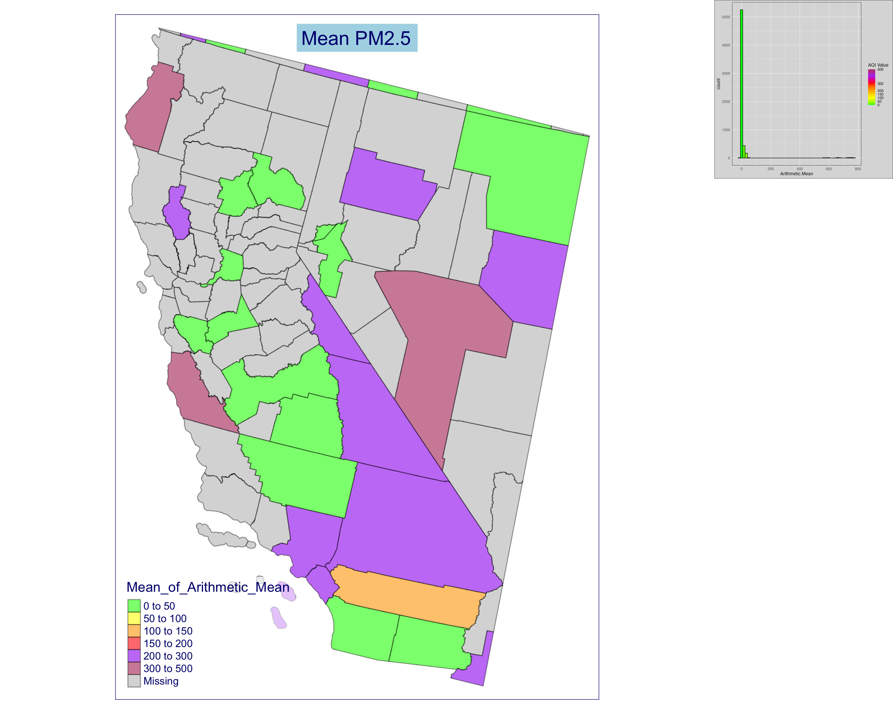

```{r}
knitr::opts_chunk$set(echo = TRUE)
```
### PM 2.5 TM_map:

### Check and install the libraries
```{r, eval = FALSE}
if (!"cowplot" %in% install.packages()) {
  install.packages("cowplot")
}
if (!"ggplot2" %in% install.packages()) {
  install.packages("ggplot2")
}
```

```{r}
if (!require("ggplot2")) {
  install.packages("ggplot2")
  install.packages(c("maps", "ggmap"))
}

if (!require("tmap")) {
  install.packages("tmap")
}
if (!require("sf")) {
  install.packages("sf")
}
if (!"magick" %in% installed.packages()) {
  install.packages("magick")
}

if (!"dplyr" %in% installed.packages()) {
  install.packages("dplyr")
}
```
### load library
```{R}
# Load the dplyr package
library(dplyr)
library(tmap)
library(sf)
library(ggplot2)
library(cowplot)
library(magick)
```

### Load data:

```{r}
# https://aqs.epa.gov/aqsweb/airdata/download_files.html
# https://cran.r-project.org/web/packages/RAQSAPI/vignettes/RAQSAPIvignette.html
# https://www.airnow.gov/
us_epa_daily_2022 <- read.csv("dataset/daily_SPEC_2022.csv")
dim(us_epa_daily_2022)
colnames(us_epa_daily_2022)
```

### Filter by state name or ID California
```{r}
us_epa_daily_2022_ca <-
  us_epa_daily_2022[us_epa_daily_2022$State.Name == "California", ]
dim(us_epa_daily_2022_ca)

# Check for missing values
sum(is.na(us_epa_daily_2022_ca))
# If there are missing values, you can drop or fill them as per your requirement
ca_null <- na.omit(us_epa_daily_2022_ca) # Drop rows with missing values
ca_pm <- us_epa_daily_2022_ca
```
### calculate the mean value for the year
```{r}
us_epa_daily_2022_ca <- us_epa_daily_2022_ca %>%
  group_by(`County.Code`) %>%
  summarise(Mean_of_Arithmetic_Mean = mean(`Arithmetic.Mean`, na.rm = TRUE))
colnames(us_epa_daily_2022_ca)
```

```{R}
# Sum the months for counties with the same Arithmetic.Mean
summed_data <- ca_pm %>%
  group_by(Arithmetic.Mean) %>%
  summarise(Total_Months = n())
colnames(summed_data)
dim(summed_data)
```

### Download U.S. counties map files
```{r}
# Go to the TIGER/Line Shapefiles page on the Census Bureau's website:
# https://www.census.gov/geographies/mapping-files/time-series/geo/
# tiger-line-file.html
# make sure there is no null in the dataset
# Read in the shapefile (replace 'counties' with the path to your actual
# shapefile)
counties <- st_read("dataset/tl_2022_us_county.shp")
```

### Join the dataset with U.S. country code
```{R}
# Convert integer to character
us_epa_daily_2022_ca$County.Code <- as.character(us_epa_daily_2022_ca$County.Code)
# format conuty.code to 3chartes
us_epa_daily_2022_ca$County.Code <- sprintf("%03s", us_epa_daily_2022_ca$County.Code)

# Merge the data and the shapefile
merged <- counties %>%
  left_join(us_epa_daily_2022_ca, by = c("COUNTYFP" = "County.Code"))
```


### Draw Histogram plot

```{R}
# library(ggplot2)

# Define AQI breaks and colors
aqi_breaks <- c(0, 50, 100, 150, 200, 300, 500)
aqi_colors <- c("green", "yellow", "orange", "red", "purple", "maroon")

histogram <-
  ggplot(data = summed_data, aes(x = Arithmetic.Mean)) +
  geom_histogram(aes(fill = ..x..), bins = 50, color = "black") +
  scale_fill_gradientn(
    colors = aqi_colors,
    breaks = aqi_breaks,
    limits = c(0, 500),
    guide = "colorbar",
    name = "AQI Value"
  ) +
  theme_minimal() +
  theme(
    plot.background = element_rect(fill = "lightgray"),
    panel.background = element_rect(fill = "lightgray")
  )

print(histogram)
```
### Draw T-map 

```{R}
# library(tmap)
# Set tmap option to check and fix geometries
tmap_options(check.and.fix = TRUE)
# Convert the data to spatial data frame
merged_data_sf <- st_as_sf(merged)

# Set geographical limits for California
bb <- st_bbox(c(xmin = -124.482003, ymin = 32.528832, xmax = -114.131211, ymax = 42.009518), crs = st_crs(merged_data_sf))

# Subset the data for California
merged_data_sf_ca <- st_crop(merged_data_sf, bb)

# Set the current map mode to plot
tmap_mode("plot")
```
```{R}
tm_shape(merged_data_sf_ca, projection = 5070) +
  tm_borders(col = "black", alpha = 0.4) +
  tm_fill(
    col = "Mean_of_Arithmetic_Mean",
    breaks = aqi_breaks,
    palette = aqi_colors,
    alpha = 0.6
  ) +
  tm_legend(bg.color = "white", bg.alpha = 0.6) +
  tm_layout(
    title = "Mean PM2.5",
    attr.color = "navy",
    title.position = c("center", "top"),
    title.bg.color = "lightblue"
  )
```


###  T-map Combined
```{R}
# Define AQI breaks and colors
aqi_breaks <- c(0, 50, 100, 150, 200, 300, 500)
aqi_colors <- c("green", "yellow", "orange", "red", "purple", "maroon")

tm <-
  tm_shape(merged_data_sf_ca, projection = 5070) +
  tm_borders(col = "black", alpha = 0.4) +
  tm_fill(
    col = "Mean_of_Arithmetic_Mean",
    breaks = aqi_breaks,
    palette = aqi_colors,
    alpha = 0.6
  ) +
  tm_legend(bg.color = "white", bg.alpha = 0.6) +
  tm_layout(
    title = "Mean PM2.5",
    attr.color = "navy",
    title.position = c("center", "top"),
    title.bg.color = "lightblue"
  )
```
```{r}
# Save tmap to a file
tmap_save(tm, filename = "map.png", width = 2400, height = 2400)
# Save ggplot histogram to a file
ggsave("histogram.png", histogram, width = 6, height = 6)
```
```{r}
# Use the magick package to combine the images
map_img <- image_read("map.png")
hist_img <- image_read("histogram.png")
# Resize the histogram image
hist_width <- 600 # Adjust this value as needed
hist_height <- 1000 # Adjust this value as needed
resized_hist_img <- image_resize(hist_img, paste0(hist_width, "x", hist_height))

combined_img <- image_append(c(map_img, resized_hist_img), stack = FALSE)
image_write(combined_img, "combined.png")
```




