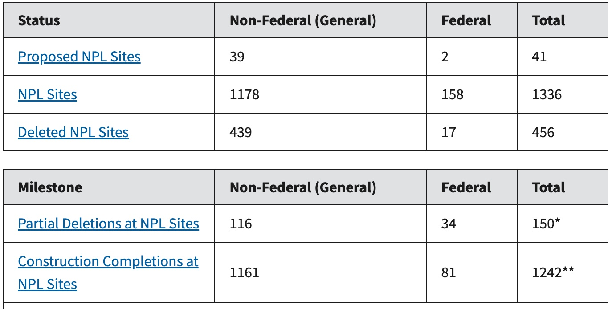

# **NPL proximit for point** {.unnumbered}

|                                    |
|------------------------------------|
| title: "10-NPL_proximit_for_point" |
| subtitle: "Tutorial"               |
| date: "October 05, 2023"           |
| author: "Sue Nolte"                |
| format: html                       |

------------------------------------------------------------------------

## NPL proximity metrics

A tool for calculate proximity-based exposure metrics for NPL (National Priorities List)

This tool is based on Lara Clark's work "exposure metrics for aircraft facilities"

### Superfund: National Priorities List

### Purpose:

The script calculates proximity-based (i.e., distance-based) exposure metrics for a specified list of receptor point locations (e.g., geocoded home addresses) to US NPL. This tool can be used to calculate the following proximity-based metrics within the US:

-   distance to nearest NPL facilities location from receptor

-   count of NPL facilities within a specified buffer distance of receptor

-   summary metrics of distances to all NPL facilities within a specified buffer distance of receptor (i.e., mean distance, mean of logarithm distance, and 25^th^, 50^th^, and 75^th^ percentile distances)

### NPL Data set:

[NPL](https://www.epa.gov/superfund/superfund-national-priorities-list-npl) is the list of sites of national priority among the known releases or threatened releases of hazardous substances, pollutants, or contaminants throughout the United States and its territories.

{width="353"}
