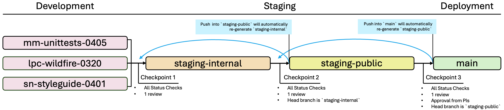

# The CHORDS Toolkit for Health and Geospatial Exposures Research 

[](https://github.com/NIEHS/PCOR_bookdown_tools/actions/workflows/superlint.yml/badge.svg)
[](https://github.com/NIEHS/PCOR_bookdown_tools/actions/workflows/test-render.yml/badge.svg)

This repository hosts data analysis tools and examples from the CHORDS Toolkit for Health and Geospatial Exposures Research. Toolkit chapters are written using [R Markdown](https://rmarkdown.rstudio.com/) files and the book is created using the [`bookdown`](https://bookdown.org/) package for R. The web version of this toolkit is available at <https://niehs.github.io/PCOR_bookdown_tools/>.

## Users

The following packages are required to run all of the code examples within the book.

```{r}
install.packages(
  c(
    "plotly", "shiny", "tidycensus", "tidyverse", "viridis", "ggmap",
    "ggplot2", "maps", "dplyr", "knitr", "latticeExtra", "pals",
    "classInt", "sf", "udunits2", "tmap", "lubridate", "gifski",
    "magick", "cowplot", "BiocManager"
    ),
  dependencies = TRUE
  )
BiocManager::install("Biobase")
```

## Contributors Guide

The GitHub repository consists of several workflow rules and branch protections to ensure proper development, revision, review, and publication.



### Development Branches

Contributors create, edit, and revise new and existing chapters in development branches. Development branches should be named according to contributor initials, a one to two word description, and four digit month/day code (MMDD) based on the date of branch creation. For example, a development branch created by Mitchell Manware on April 5, 2024 to develop a unit testing chapter would be named `mm-unittests-0405`.

A pull request must be opened to merge a development branch into the `staging-internal` branch. The pull request must pass all [status checks](#status-checks) and be reviewed by at least one other contributor.

### Branch \`staging-internal\` [protected]

The first review branch is named `staging-internal`. This branch is used for the CHORDS team's internal review of the incoming additions and changes. The `staging-internal` branch must be rendered locally to review as it is not hosted on a URL.

Contributors can make significant edits directly to the `staging-internal` branch based on reviewer feedback.

A pull request must be opened to merge the `staging-internal` branch into the `staging-public` branch. **Pull requests into the `staging-public` branch are only accepted from the `staging-internal` branch.** Pull requests attempting to merge development branches into `staging-public` will fail. This branch protection is enforced by the "Protect Branch \`staging public\`" status check.

When a pull request passes all [status checks](#status-checks), is reviewed, and is merged into the `staging-public` branch, a new version of `staging-internal` will automatically be created (see .github/workflows/update-staging-internal.yml). Do not manually create a new `staging-internal` branch.

### Branch \`staging-public\` [protected]

The second review branch is named `staging-public`. This branch is also used for the CHORDS team's internal review of the incoming additions and changes. The `staging-public` branch will be available on the R Studio Connect Posit Server (link incoming) to facilitate web version review and feedback.

Contributors **should not** make significant edits directly to the `staging-public` branch. Minor revisions (ie. punctuation, word choice) are acceptable, but changes to code, images, datasets, or style files should be addressed in the `staging-internal` review process, or implemented on a new development branch.

A pull request must be opened to merge the `staging-public` branch into the `main` branch. **Pull requests into the `main` branch are only accepted from the `staging-public` branch.** Pull requests attempting to merge development branches or the `staging-internal` branch into `main` will fail. This branch protection is enforced by the "Protect Branch \`main\`" status check.

When a pull request passes all [status checks](#status-checks), is reviewed, and is merged into the `main` branch, a new version of `staging-public` will automatically be created (see .github/workflows/update-staging-public.yml). Do not manually create a new `staging-public` branch.

### Branch \`main\` [protected]

A push (closed and merged pull request) to the `main` branch will automatically build and deploy the public facing version of the toolkit web page.

The `main` branch can not be edited directly. All file edits must follow the outlined workflow to ensure the quality and reliability of the final web page.

## Status Checks

**Check Super Linter**<br>
Checks that `.Rmd` chapters and style files have valid source code and adhere to consistent formatting (see .github/workflows/check-super-linter.yml). Utilizes [super-linter/super-linter](https://github.com/super-linter/super-linter).

**Check Render Bookdown**<br>
Checks that new chapters, file edits, and images and data do not cause errors in rendering the book (see .github/workflows/check-render-bookdown.yml).

**Protect Branch \`staging-public\`**<br>
Checks that a pull request into the `staging-public` branch is from `staging-internal` (see .github/workflows/protect-staging-public.yml).

**Protect Branch \`main\`**<br>
Checks that a pull request into the `main` branch is from `staging-public` (see .github/workflows/protect-main.yml).

## Questions

Utilize the [Issues](https://github.com/NIEHS/PCOR_bookdown_tools/issues) page to ask questions regarding workflow.
