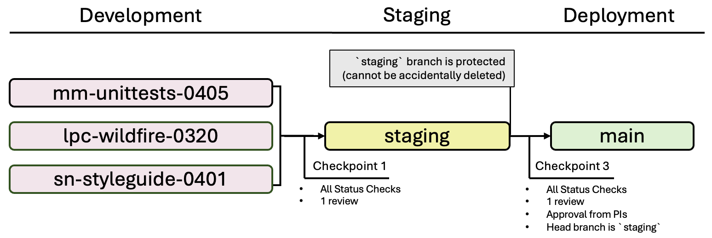

# The CHORDS Training and Uses Cases Toolkit 

[](https://github.com/NIEHS/PCOR_bookdown_tools/actions/workflows/check-super-linter.yml)
[](https://github.com/NIEHS/PCOR_bookdown_tools/actions/workflows/check-render-bookdown.yml)

This repository provides the underlying code and data for the [Climate and Health Outcomes Research Data Systems (CHORDS)](https://www.niehs.nih.gov/research/programs/chords) Training and Use Cases Toolkit.
The CHORDS Toolkit seeks to aid researchers in accessing, processing, and integrating geospatial data-based exposures into their health research by providing guides, tutorials, and example code. The CHORDS Toolkit is available at <https://niehs.github.io/PCOR_bookdown_tools/>.

The CHORDS Toolkit chapters are written using [R Markdown](https://rmarkdown.rstudio.com/) files and the book is created using the [`bookdown`](https://bookdown.org/) `R` package.

Please note that the CHORDS Toolkit is a work in progress. The following chapters are currently in development:

|Title             |Unit    |Description                                     |
|------------------|--------|------------------------------------------------|
|Calculating Geographic Covariates |Geospatial Data Foundations |A tutorial introducing concepts and methods used to calculate common geographic covariates with public environmental data in R. |
|Comparison of Spatial Regression Methods |Advanced Methods |A comparison of spatial regression methods used to develop exposure models for geospatial exposure assessment. |
|Linkage to Exposures |Health Data Integration |A tutorial with code in R for linking geocoded addresses to environmental exposure data. |

## Contact Us

This is a BETA Release. Please let us know of any improvements we can make.

You can contact us by [email](mailto:chordshelp@nih.gov) or by opening an [issue](https://github.com/NIEHS/PCOR_bookdown_tools/issues). Please open an issue to suggest edits or to ask questions relating to the code in this repository.

## Set Up

The following code installs the `R` packages used in the example code:

```{r}
install.packages(
  c(
    "bookdown", "plotly", "shiny", "tidycensus", "tidyverse", "viridis",
    "ggmap", "ggplot2", "maps", "dplyr", "knitr", "latticeExtra", "pals",
    "classInt", "sf", "udunits2", "tmap", "lubridate", "gifski",
    "magick", "cowplot", "BiocManager"
  ),
  dependencies = TRUE
)
BiocManager::install("Biobase")
```

The following code creates a local HTML version of the book:

```{r}
bookdown::render_book("index.Rmd", "bookdown::gitbook")
```

## Contributing Guide

This guide describes the workflow, file organization, and status checks used for contributing to the CHORDS Toolkit.

### Workflow

The following figure illustrates the workflow rules and branch protections.



#### Development Branches

Development branches are used to create new chapters and to revise existing chapters. Development branches should be named with the contributor's initials, a short description, and the branch creation date (MMDD), as in the following exammple: `mm-unittests-0405`.

A pull request must be opened to merge a development branch into the `staging` branch. The pull request must pass all [status checks](#status-checks).

#### Staging Branch [Protected]

The branch `staging` is used to review changes before publication.

Only minor edits, such as fixing a broken link or typo, should be made directly to `staging`. Contributors should use a development branch for any substantial edits, such as adding a new chapter.

A pull request must be opened to merge the `staging` branch into the `main` branch. **Pull requests into `main` are only accepted from `staging`.** This branch protection is enforced by the **Protect Branch `main`** [status check](#status-checks). Pull requests from `staging` into `main` require at least one review.

When a pull request passes all [status checks](#status-checks), is reviewed, and is merged into the `main` branch, a new version of `staging` will automatically be created (see .github/workflows/update-staging-public.yml). Do not manually create a new `staging` branch.

#### Main Branch [Protected]

The branch `main` is used to display the public CHORDS Toolkit web page. A push (closed and merged pull request) to the `main` branch will automatically build and deploy the public CHORDS Toolkit web page.

The `main` branch can not be edited directly and can only be edited using the workflow outlined above.

### Templates and File Organization

Please use the chapter template file in the `templates` folder to create a new chapter `RMD` file in the `chapters` folder of your development branch. You can then add any images, datasets, and bibliography entries in the `images`, `dataset`, and `bibliography` folders, respectively.

### Status Checks

**Check Super Linter**<br>
Checks that `RMD` and style files have valid source code and consistent formatting (.github/workflows/check-super-linter.yml) using [super-linter/super-linter](https://github.com/super-linter/super-linter).

**Check Render Bookdown**<br>
Checks for errors in rendering the book (.github/workflows/check-render-bookdown.yml).

**Protect Branch `main`**<br>
Checks that a pull request into `main` is from `staging` (.github/workflows/protect-main.yml).
