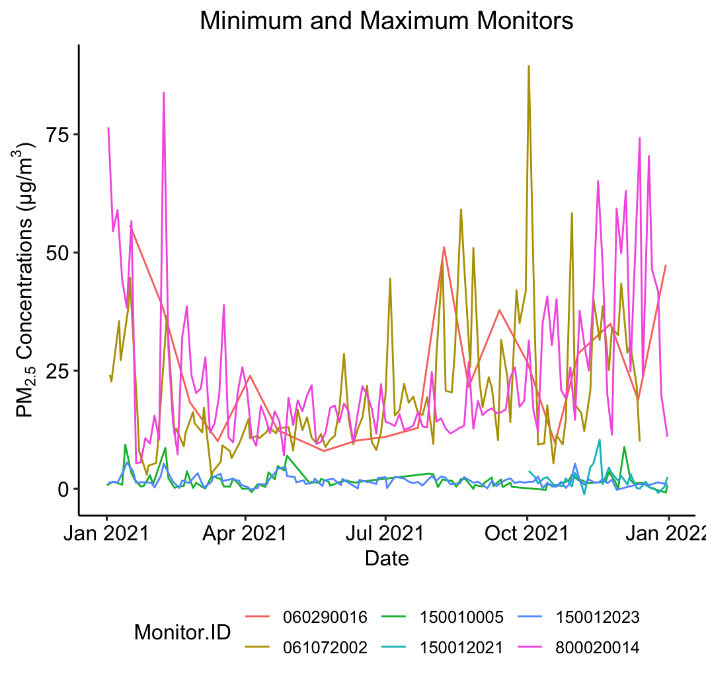
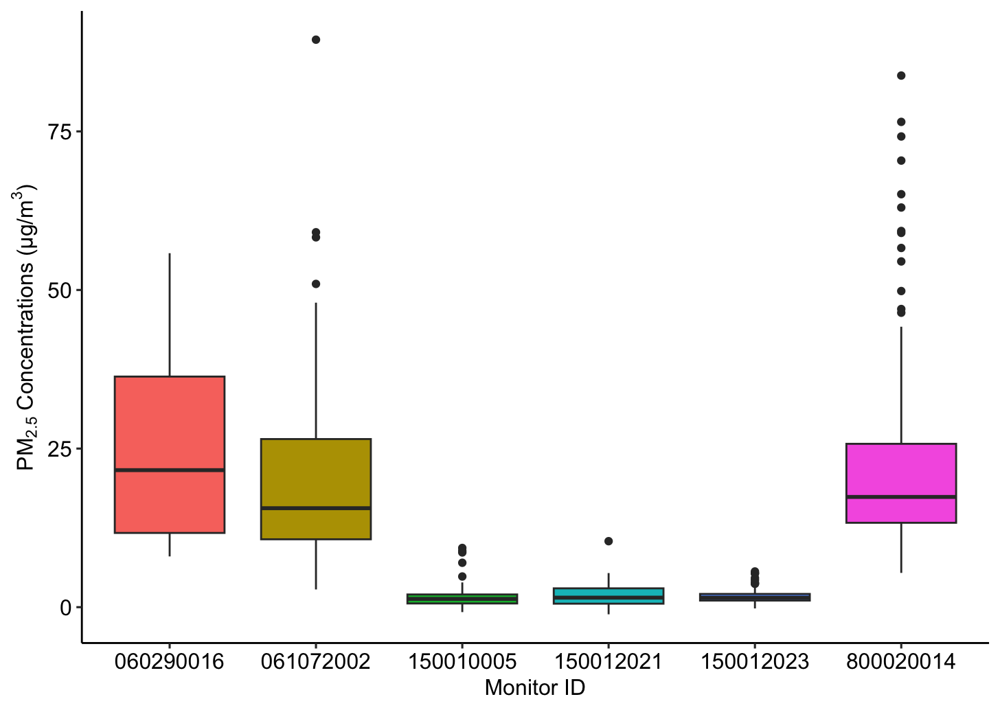
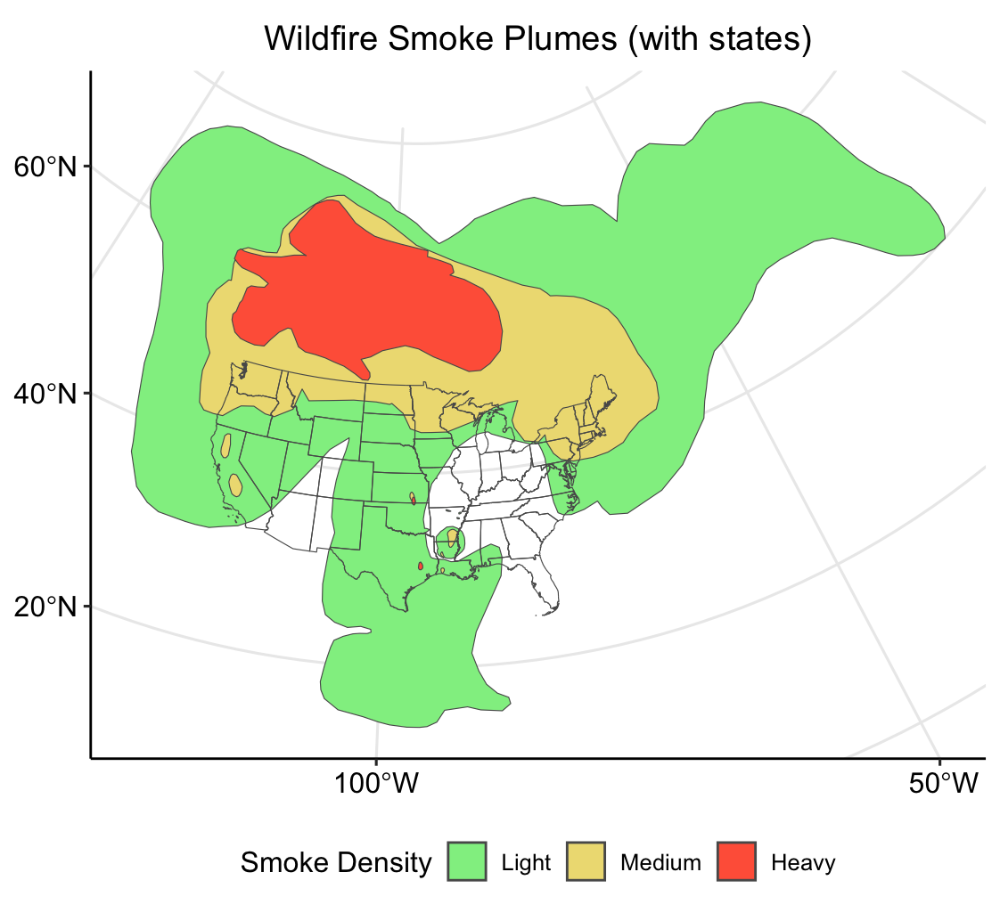
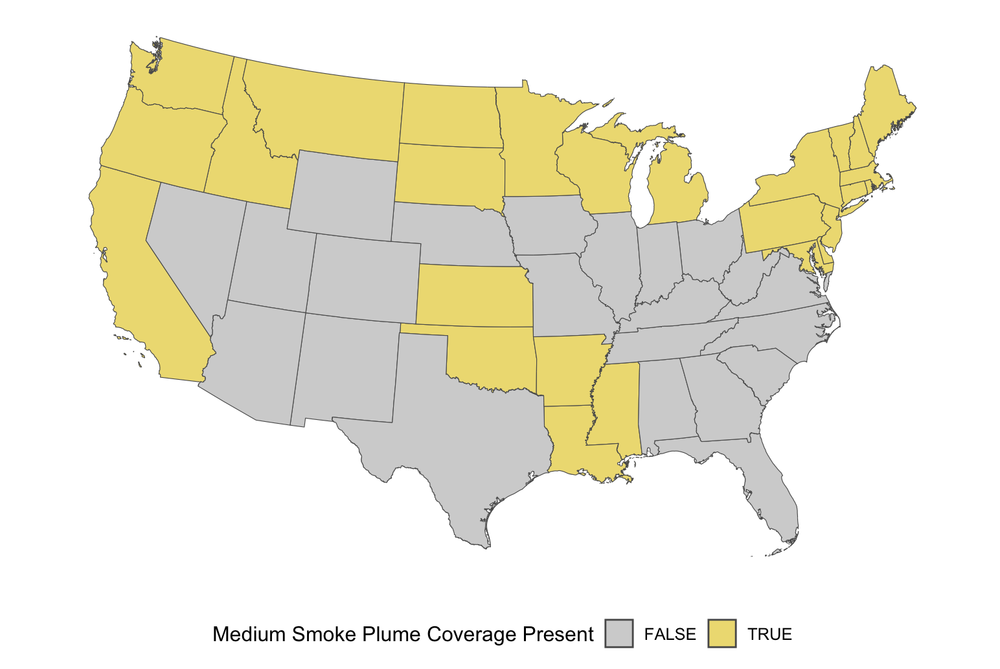
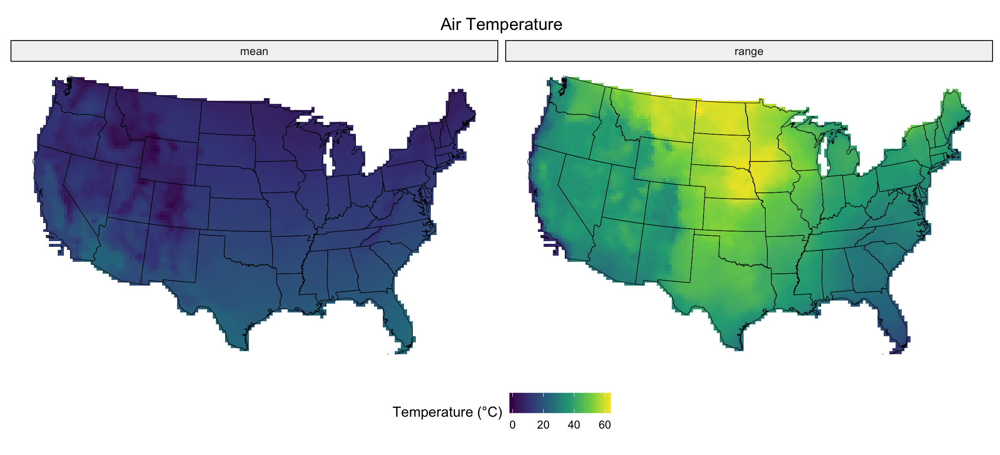
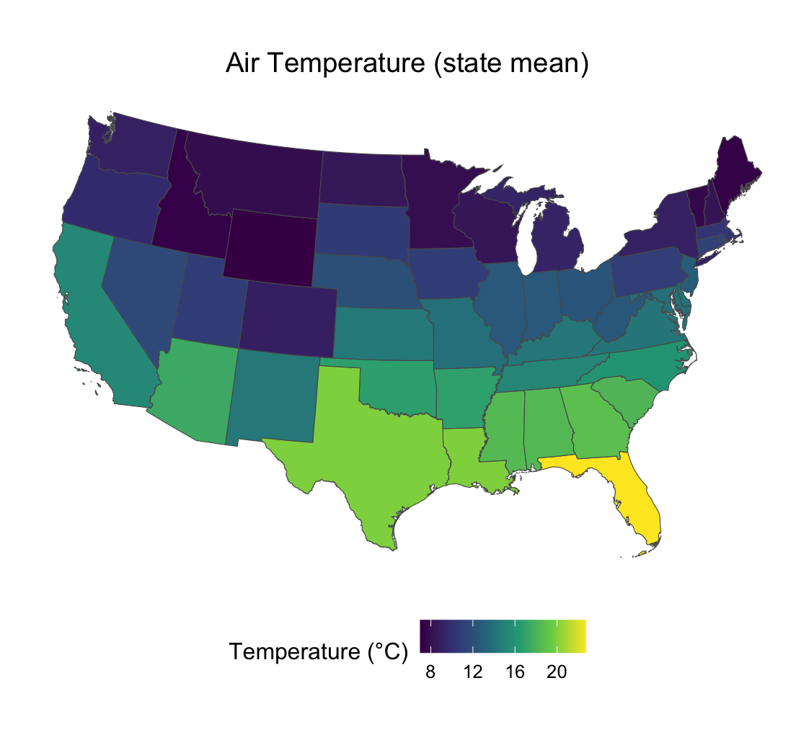
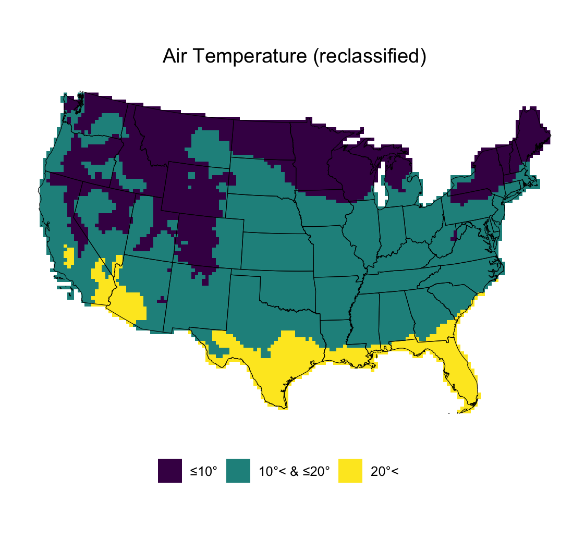
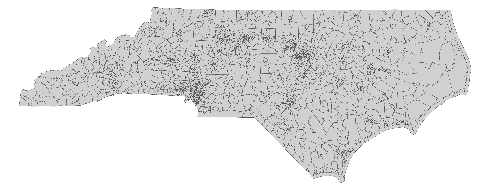

 
*[Page Note:  add authors and affiliations.  Check about correct funding attributions]*

# **Introduction** {-}

Research into the effects of the environment on human health at the level of  
individuals and populations  entails 
pulling together a combination of health data and data on environmental exposures. 

One approach to gathering exposure information is to compute estimated exposure levels based on the location 
of individuals at different time points.  For instance, based on location and time one can 
estimate the level of noise around a person, the level of pollutants present in the air, and the presence of
parks and other green spaces.

Estimating these exposures can be challenging, especially if one is not familiar with the
sources of data used to make these estimations or the analysis methods needed to compute the estimated
exposures.  This can be especially challenging for time varying exposures, exposures that depend on
complex models such as the composition and dispersion of chemicals in the air, and for researchers seeking to
study exposure effects at the individual level.

This resource seeks to aid researcher in adopting geospatial-based exposures into their research
by providing guides for tools to use and example software code to work off of.


## Getting Started {-}

This resource does assume a familiarity with the R programming language and the use of
R for working with, visualizing, and analyzing scientific data.

The TAME Toolkit (https://uncsrp.github.io/Data-Analysis-Training-Modules/) provides a good resource for gaining familiarity with R for use in
environmental health research methods, in particular Chapter 1 on Introductory
Data Science and Chapter 3.3 on Database Integration.  

## Funding {-}

This resource was supported by the National Institutes of Health (NIH) from the National Institute of Environmental Health Sciences, by the NIH Office of Data Science Strategy Data Scholar's Program, by the Patient Centered Outcomes Research Trust Fund and the Department of Health and Human Services (DHHS) Office of Assistant Secretary for Planning and Evaluation.


<!--chapter:end:index.Rmd-->


```{r setup, include=FALSE}
knitr::opts_chunk$set(echo = TRUE)
```

# **Data Dictionary** {-}

*[Page Note:  add links to catalog for sources, add links to tools for tools]*

## Geospatial-based Exposures {-}

The following table provides a list of geospatial-based exposure measures used in
the NIEHS Personalized Environment and Genes Study, including their sources and links
to tools to use to compute these measures.  

The sources include:

* TRI = EPA Toxic Release Inventory
* ACAG = Atmospheric Composition Analysis Group
* CACES = Center for Air, Climate, & Energy Solutions 
* FAA = Federal Aviation Administration
* NCDEQ = North Carolina Department of Environmental Quality
* FCC = Federal Communications Commission
* NRC = Nuclear Regulatory Commission
* DOT = Department of Transportation
* EJI = Environmental Justice Index
* Merra2 = NASA Global Modeling and Assimilation Office


|variable_name     |description      | variable_source  |  
|-------|------------------------------|----------------|  
|gis_latitude  |Latitude coordinate   |Geocoding of subject data   |  
|hazards_pm25_ammonium_ugm3  |ACAG estimated PM2.5 conponent: ammonium ion concentration (micrograms per cubic meter)   |ACAG   |  
|hazards_benzene_1km  |Estimated xylene mass in kg using an isotropic sum of exponentially decaying mass equation with an exponential decay range of 1km (see Eq 1).   |TRI   |  


<!--chapter:end:07-Data-Dictionary.Rmd-->

# **User Profiles (PLACEHOLDER)** {-}

The educational materials and tutorials in this book have been designed to for various types of users.

## Clinical/Medical Professional {#profilecmp}


Description

Chapters...

## Social & Behavioral Scientist {#profilesbs}


Description

Chapters...

## Student {#profilestu}


Description

Chapters...

<!--chapter:end:14-user-profiles.Rmd-->

# **Spatial Analysis with Environmental Data in R** {-}

[](#profilecmp)
[](#profilesbs)
[](#profilestu)

<font size ="5"> **Access, Import, and Primary Analyses** </font>

**Date Modified:** February 1, 2024

**Author(s):** Mitchell Manware, Kyle P Messier

**Key Terms:** spatial analysis; geospatial analysis

**Programming Language(s):** R

## Introduction

### Motivation

Environmental health research relies on various types of data to accurately measure, model, and predict exposures. Environmental data are often spatial (related to the surface of the Earth), temporal (related to specific time/period of time), or spatio-temporal (related to the surface of the Earth for a specific time/period of time). These data are at the core of environmental health research, but the steps between identifying a spatial data set or variable and using it to help answer a research question can be challenging.

This vignette is designed to introduce the necessary steps for conducting analyses with spatial data in R. It will introduce R packages that are equipped to handle spatial data, and will demonstrate how to access, import, and analyze three different types of spatial data. The vignette will focus primarily on spatial data, but some aspects of temporal and spatio-temporal data will also be discussed.

### Objectives

Users will learn about the following topics related to spatial data in R:

-   Point, polygon, and raster data types

-   Downloading data from a URL

-   Importing data

-   Checking data type, structure, and class

-   Reclassifying data

-   Computing summary and zonal statistics

-   Plotting individual and multiple data sets

### Data Types

This vignette will cover how to access, import, and analyze point, polygon, and raster spatial data types. The details of what constitutes each unique spatial data type, however, will not be covered.

For detailed descriptions of each type of spatial data, please see [Simple Features for R](https://r-spatial.github.io/sf/articles/sf1.html) for point and polygon data types, and [Introduction to Raster Data](https://datacarpentry.org/organization-geospatial/01-intro-raster-data) for raster data.

### Data Sources

The exploratory analyses performed in this vignette utilize free and publicly available environmental data. The code chunks are designed to access each specific file used for the exploratory analyses, but a description of each data source and data set is available below.

| Data                                | Data Type | Producer                                               | Link                                                                                        |
|------------------|------------------|------------------|------------------|
| PM~2.5~ Daily Observations          | Point     | Environmental Protection Agency (EPA)                  | <https://aqs.epa.gov/aqsweb/airdata/download_files.html>                                    |
| Wildfire Smoke Plumes               | Polygon   | National Oceanic and Atmospheric Administration (NOAA) | <https://www.ospo.noaa.gov/Products/land/hms.html>                                          |
| United States Cartographic Boundary | Polygon   | United States Census Bureau                            | <https://www.census.gov/geographies/mapping-files/time-series/geo/carto-boundary-file.html> |
| Land Surface Temperature            | Raster    | National Oceanic and Atmospheric Administration (NOAA) | <https://psl.noaa.gov/data/gridded/data.narr.html>                                          |

: Exploratory analyses data sources

### Packages

Various R packages can be used to create, import, analyze, and export spatial data. If you have not used these packages previously, they may not be installed on your machine. The following chunk of code installs and imports the packages required to conduct the exploratory analyses in this vignette.

::: {.note}
**Note**  
Installing and importing new packages may required R to restart.
:::
  
```{r, eval = FALSE}
vignette_packages <- c(
  "dplyr", "ggplot2", "ggpubr", "sf",
  "terra", "tidyterra", "utils"
)

for (v in seq_along(vignette_packages)) {
  if (vignette_packages[v] %in% installed.packages() == FALSE) {
    install.packages(vignette_packages[v])
  }
}

library(dplyr)
library(ggplot2)
library(ggpubr)
library(sf)
library(terra)
library(tidyterra)
library(utils)
```

#### `ggplot2` and `ggpubr`

The `ggplot2` and `ggpubr` packages will be used throughout the vignette for creating publication quality plots. Please see [ggplot2: Elegant Graphics for Data Analysis (3e)](https://ggplot2-book.org/introduction) and [ggpubr: 'ggplot2' Based Publication Ready Plots](https://rpkgs.datanovia.com/ggpubr/) for in depth descriptions of the syntax and functionality utilized by these packages.

::: {.important}
**Important**  
The exploratory analyses performed in this vignette are designed for educational purposes only. The results of the following analyses are not peer-reviewed findings, nor are they based on any hypotheses.
:::

## Point Data with `sf`

Air pollution monitoring data from the United States Environmental Protection Agency (EPA) will be used to demonstrate using point data with the `sf` package.

### Access, download, and unzip

To download data with the `utils::download.file()` function, define two variables. One variable to store the website URL where the data exists and a second to store the file path for where the file should be saved.

::: {.note}
**Note**  
Multiple chunks of code in this vignette will contain `/   YOUR FILE PATH   /`. To run the code on your machine, substitute `/   YOUR FILE PATH   /` with the file path where you would like to store the vignette data.
:::

```{r, eval = FALSE}
url_epa <- "https://aqs.epa.gov/aqsweb/airdata/daily_88101_2021.zip"

destination_epa <- "/   YOUR FILE PATH   /epa_data.zip"

download.file(
  url_epa,
  destination_epa
)
```

The file downloaded from the EPA website is a zip file. Zip files need to be unzipped (decompressed) in order to access the data within. Unzip the EPA air pollution file with `utils::unzip()`.

::: {.warning}
**Warning**  
Unzipping a `.zip` file will decompress the contents within. Spatial data sets can be very large (ie. \> 1GB ), so check the size of the data before unzipping on your machine.
:::

The numeric value size of the file is listed under `Length`.

```{r, eval = FALSE}
unzip("/   YOUR FILE PATH   /epa_data.zip",
  list = TRUE
)
```

After inspecting the file size, unzip `epa_data.zip`.

```{r, eval = FALSE}
unzip("/   YOUR FILE PATH   /epa_data.zip")
```

Inspecting the file with `utils::unzip(list = TRUE)` returned the size of the file, but also the name of the data file of interest. The desired data file can also be identified with `list.files()`.

::: {.note}
**Note**  
Other file names may be returned if `/   YOUR FILE PATH   /` is a directory with other contents (ie. Desktop or Documents).
:::

```{r, eval = FALSE}
list.files("/   YOUR FILE PATH   /")
```

### Import

Now that the contents of the zip file have been saved on your machine and the data file of interest has been identified, import the data with `sf::st_read()`.

```{r, eval = FALSE}
pm <- st_read("/   YOUR FILE PATH   /daily_88101_2021.csv")
```

The previous chunk of code returned a `Warning:` message. This warning informs the user that the imported data does not have native spatial features, so the data was imported as a `data.frame`.

### Inspect structure

Inspect the structure of `pm` to see its class, column names, column classes, and the first two (specified by `vec.len = 2`) data points from each column.

```{r, eval = FALSE}
str(pm,
  vec.len = 2
)
```

### Subset

Checking the data's structure shows that `pm` is a very large data set. Each of the variables convey important information related to air pollution monitoring, but not all will be utilized in these exploratory analyses.

The data set can be reduced to include only the variables of interest with the `subset()` function. The `select =` argument indicates which variables to be retained in the new data set.

Re-running `str(pm)` after running the `subset` shows that all observations (n = 590208) of the desired variables (n = 8) have been retained.

```{r, eval = FALSE}
pm <- subset(pm, select = c(
  State.Code,
  County.Code,
  Site.Num,
  Latitude,
  Longitude,
  State.Name,
  Date.Local,
  Arithmetic.Mean
))
```

Re-running `str(pm)` after subsetting the data set shows that all all observations (n = 590208) of the variables of interest (n = 8) have been retained.

```{r, eval = FALSE}
str(pm,
  vec.len = 2
)
```

### Reclassify

The `str()` function showed the class of each variable within the data set. All of the retained variables are of class character, indicated by `: chr` and the quotations around each observation (`"01" "01" ...`).

The class of a variable depends on the information conveyed by the data stored within that variable. For example, character is an appropriate class for the `pm$State.Name` variable because each observation is a character string labeling in which state the monitor was located. Alternatively, character is not appropriate for the `pm$Arithmetic.Mean` or `pm$Date.Local` variables because each observation is a numeric decimal or time-referenced date, respectively.

The `as.` functions can be used for reclassifying data. Reclassify `pm$Arithmetic.Mean` as a number, and `pm$Date.Local` as a date.

```{r, eval = FALSE}
pm$Arithmetic.Mean <- as.numeric(pm$Arithmetic.Mean)
pm$Date.Local <- as.Date(pm$Date.Local)
```

After running the `as.` functions, ensure that the two variables have been reclassified to the desired classes.

```{r, eval = FALSE}
class(pm$Arithmetic.Mean)
class(pm$Date.Local)
```

### Convert to `sf` object

With the variables of interest selected and reclassified, `pm` can be converted to spatially defined `sf` object. The `sf::st_as_sf()` function creates a `$geometry` field based on the latitude and longitude coordinates contained within `pm`. The `coords = c()` argument specifies the column names which contain the coordinate values.

::: {.note}
**Note**  
The columns containing coordinate values will not always be "Latitude" and "Longitude". Use `str()` to see column names and identify which contain the coordinate values.
:::

```{r, eval = FALSE}
pm_sf <- st_as_sf(pm,
  coords = c("Longitude", "Latitude")
)
```

Inspect the classes of `pm_sf` and `pm_sf$geometry` to see their differences, and how each are different than `class(pm)`.

```{r, eval = FALSE}
class(pm_sf)
class(pm_sf$geometry)
```

`class(pm_sf)` returned both `"sf"` and `"data.frame"`, indicating that it contains both spatial and non-spatial data.

### Coordinate reference system and projection

The coordinate reference system of an `sf` object can be checked with `sf::st_crs()`.

```{r, eval = FALSE}
st_crs(pm_sf)
```

The previous chunk of code shows that `pm_sf` does not have a native coordinate reference system. The same function, `sf::st_crs()`, can be used to assign a coordinate reference system to an `sf` object. For this example, the World Geodesic System 1984 (WGS 84) will be used (EPSG code: 4326).

```{r, eval = FALSE}
st_crs(pm_sf) <- 4326
st_crs(pm_sf)
```

An `sf` object with a coordinate reference system can be transformed (projected) into a different coordinate reference system with `sf::st_transform()`. The area of interest for these exploratory analyses is the coterminous United States, so the Albers Equal Area projected coordinate system will be used (EPSG code: 5070).

::: {.note}
**Note**  
An `sf` object without an assigned coordinate reference system cannot be transformed. `sf::st_crs()` must be used to assign a coordinate reference system to an `sf` object that does not have one.
:::

```{r, eval = FALSE}
pm_sf <- st_transform(
  pm_sf,
  5070
)
```

### Plot

Plotting spatial data is important for visualizing and analyzing patterns in the data. Initialize a plot for the locations of each air pollution monitoring station with `ggplot2::ggplot()`. Identifying the data set to be plotted within the `geom_sf()` argument informs the function that the data is an `sf` object.

```{r, eval = FALSE}
ggplot() +
  geom_sf(data = pm_sf) +
  ggtitle("Air Pollution Monitor Locations") +
  theme_pubr() +
  theme(plot.title = element_text(hjust = 0.5)) +
  grids()
```


The plot shows the distribution of monitoring locations, and roughly depicts the outline of the United States due to the large number of monitors. The plot does not, however, convey any information about the concentration of PM~2.5~ measured by each monitor. Inspect the summary statistics of the PM~2.5~ measurements before creating any plots to visualize the data.

```{r, eval = FALSE}
summary(pm_sf$Arithmetic.Mean)
sd(pm_sf$Arithmetic.Mean)
```

After inspecting the summary statistics, create a histogram of the PM~2.5~ concentration measurements to visualize the distribution of the data.

::: {.note}
**Note**  
The histogram is not a spatially defined plot, so the data set to be plotted is identified within `ggplot()`.
:::

```{r, eval = FALSE}
ggplot(
  data = pm_sf,
  aes(Arithmetic.Mean)
) +
  geom_histogram(
    fill = "blue",
    binwidth = 5
  ) +
  ggtitle(
    expression("PM"[2.5] * " Concentration Measurements")
  ) +
  xlab(expression("PM"[2.5] * " Concentration (µg/m"^3 * ")")) +
  ylab("Number of Measurements") +
  theme_pubr() +
  theme(plot.title = element_text(hjust = 0.5)) +
  grids()
```


### Calculate annual mean

A common summary statistic of interest to researchers is the mean over a certain period of time. For this example, we will calculate the mean PM~2.5~ concentration for each monitoring location for the year 2021. To do this, a unique identification code must be created for each monitoring location.

The `pm_sf$Monitor.ID` variable can be created by concatenating each monitor's state code, county code, and site number together into a single character string.

```{r, eval = FALSE}
pm_sf$Monitor.ID <- paste0(
  pm_sf$State.Code,
  pm_sf$County.Code,
  pm_sf$Site.Num
)
```

Each unique monitor identification code should be matched with a unique monitor location geometry. To ensure that each monitor location has a unique identification code, check that there are an equal number of unique geometries and identification codes.

```{r, eval = FALSE}
length(unique(pm_sf$Monitor.ID)) == length(unique(pm_sf$geometry))
```

Now that each monitor location as a unique identification code, we can calculate the mean PM~2.5~ concentration measured at each monitoring location. Functions and syntax from the `dplyr` package will be used to do this. For more on the `dplyr` package, please see [Introduction to dplyr](https://dplyr.tidyverse.org/articles/dplyr.html).

The `group_by(Monitor.ID, )` argument specifies that an annual mean should be calculated for each unique `Monitor.ID`. Including `State.Name` in this argument retains the column in the new `pm_mean` data set, but does not influence the calculation of the annual mean.

```{r, eval = FALSE}
pm_mean <-
  pm_sf %>%
  group_by(Monitor.ID, State.Name) %>%
  summarise(Annual.Mean = mean(Arithmetic.Mean))
```

Inspect the summary statistics of `pm_mean`.

```{r, eval = FALSE}
summary(pm_mean$Annual.Mean)
sd(pm_mean$Annual.Mean)
```

Create a plot which shows the distribution of monitoring locations, and color each point according to the monitor's annual mean concentration of PM~2.5~.

```{r, eval = FALSE}
ggplot() +
  geom_sf(
    data = pm_mean,
    aes(color = Annual.Mean)
  ) +
  scale_color_viridis_b(
    expression("PM"[2.5] * " Concentration (µg/m"^3 * ")")
  ) +
  ggtitle(
    expression("Annual Mean PM"[2.5] * " Concentration")
  ) +
  theme_pubr(legend = "bottom") +
  theme(plot.title = element_text(hjust = 0.5)) +
  grids()
```


Now the plot depicts both spatial and non-spatial data.

### Compare highest annual means

A close visual inspection of the previous plot shows a few monitoring locations in the southwestern region of the United States with very high (\> 20 µm/m^3^) annual mean concentrations of PM~2.5~. To investigate the differences between the monitors with the highest and lowest annual mean concentrations, create a subset of `pm_sf` with only the three highest and lowest monitors.

To do this, first identify the monitors with the highest and lowest annual mean concentrations.

```{r, eval = FALSE}
min_monitors <-
  pm_mean %>%
  arrange(Annual.Mean) %>%
  head(n = 3)

max_monitors <-
  pm_mean %>%
  arrange(Annual.Mean) %>%
  tail(n = 3)
```

Next, create a variable storing only the unique identification codes of these six monitors.

```{r, eval = FALSE}
min_max_monitors_id <- c(
  min_monitors$Monitor.ID,
  max_monitors$Monitor.ID
)
```

Finally, subset the `pm_sf` data set according to the monitor identification codes stored in `min_max_monitors_id`.

```{r, eval = FALSE}
pm_min_max <- subset(pm_sf,
  subset = Monitor.ID == min_max_monitors_id
)
```

The resulting `pm_min_max` data set contains data for only six monitoring locations. Check the unique monitor identification codes that constitute the new data set.

```{r, eval = FALSE}
unique(pm_min_max$Monitor.ID)
```

The temporal trend of PM~2.5~ concentrations measured at each of these locations in 2021 can be depicted with `ggplot::geom_line()`.

```{r, eval = FALSE}
ggplot(
  data = pm_min_max,
  aes(
    x = Date.Local,
    y = Arithmetic.Mean,
    group = Monitor.ID,
    color = Monitor.ID
  )
) +
  geom_line() +
  ggtitle("Minimum and Maximum Monitors") +
  xlab("Date") +
  ylab(expression("PM"[2.5] * " Concentrations (µg/m"^3 * ")")) +
  theme_pubr(legend = "bottom") +
  theme(plot.title = element_text(hjust = 0.5))
```



Alternatively, the `ggplot2::geom_boxplot()` function compares the median, interquartile range, and outliers of the monitors' measurements.

```{r, eval = FALSE}
ggplot(
  data = pm_min_max,
  aes(
    x = Monitor.ID,
    y = Arithmetic.Mean,
    fill = Monitor.ID
  )
) +
  geom_boxplot() +
  xlab("Monitor ID") +
  ylab(expression("PM"[2.5] * " Concentrations (µg/m"^3 * ")")) +
  theme_pubr(legend = "none")
```



## Polygon Data

Wildfire smoke plume coverage data from the United States National Oceanic and Atmospheric Administration (NOAA) will be used to demonstrate using polygon data. This section will cover polygon data with both the `sf` and `terra` packages separately, but the steps for accessing, downloading, and unzipping the data is the same for both packages.

### Access, download, and unzip

The website URL where the NOAA wildfire smoke plume data exists is date-specific, meaning there is a unique URL for each daily data set. For the purpose of these exploratory analyses, wildfire smoke plume data from September 1, 2023 will be used.

Define three variables for `day`, `month`, and `year` according to the date of interest.

```{r, eval = FALSE}
day <- "01"
month <- "09"
year <- "2023"
```

The `utils::download.file()` function downloads the file according to the defined URL and destination file.

```{r, eval = FALSE}
url_noaa <- paste0(
  "https://satepsanone.nesdis.noaa.gov/pub/FIRE/web/HMS/Smoke_Polygons",
  "/Shapefile/",
  year,
  "/",
  month,
  "/hms_smoke",
  year,
  month,
  day,
  ".zip"
)

destination_noaa <- paste0(
  "/   YOUR FILE PATH   /noaa_smoke",
  year,
  month,
  day,
  ".zip"
)

download.file(
  url_noaa,
  destination_noaa
)
```

The file downloaded from the NOAA website is a `.zip` file. Zip files need to be unzipped (decompressed) in order to access the data within. Unzip the NOAA wildfire smoke plume coverage file with `utils::unzip()`.

::: {.warning}
**Warning**  
Unzipping a `.zip` file will decompress the contents within. Spatial data sets can be very large (ie. \> 1GB), so check the size of the data before unzipping on your machine.
:::

The numeric value size of each file is listed under `Length`.

```{r, eval = FALSE}
unzip("/   YOUR FILE PATH   /noaa_smoke20230901.zip",
  list = TRUE
)
```

After inspecting the file sizes, unzip `noaa_smoke20230901.zip`.

```{r, eval = FALSE}
unzip("/   YOUR FILE PATH   /noaa_smoke20230901.zip")
```

Inspecting the file with `utils::unzip(list = TRUE)` returned the size of the file, but also the name of the data file of interest. The desired data file can also be identified with `list.files()`.

```{r, eval = FALSE}
list.files("/   YOUR FILE PATH   /")
```

Listing the contents of the unzipped file reveals four individual files. The data to be imported is stored in the `hms_smoke20230901.shp`, but the other files contain important information for the `.shp` file.

::: {.warning}
**Warning**  
Deleting any of the supporting files (ie. `*.dbf`, `*.prj`, or `*.shx`) will disrupt the data import.
:::

### Polygon Data with `sf`

This section will focus on exploratory analyses with polygon data using the `sf` package.

#### Import

Now that the contents of the zip file have been saved on your machine and the data file of interest has been identified, import the data with `sf::st_read()`.

::: {.note}
**Note**  
Although the supporting files are required to import a shapefile, only the file ending in `.shp` needs to be imported
:::

```{r, eval = FALSE}
smoke_sf <- st_read("/   YOUR FILE PATH   /hms_smoke20230901.shp")
```

Importing `hms_smoke20230901.shp` does not return a `Warning:` message because the data set has native spatial features, and is therefore imported as an `sf` object.

#### Inspect structure

Inspect the structure of `smoke_sf` to see its class, column names, column classes, and the first two (specified by `vec.len = 2`) data points.

```{r, eval = FALSE}
str(smoke_sf,
  vec.len = 2
)
```

As mentioned previously, the `smoke_sf` data set has native spatial features. These are reflected by the data set having classes of `sf` and `data.frame`, and the `$geometry` feature.

```{r, eval = FALSE}
class(smoke_sf)
```

#### Reclassify

The main parameter of interest in this data set is `$Density`, which discretely categorizes each wildfire smoke plume as "Light", "Medium", or "Heavy". Checking its class shows that `$Density` is class character.

```{r, eval = FALSE}
class(smoke_sf$Density)
```

Nominal data, data without fixed order or rank system, can be stored as class character (ie. State names). However, it is best to store ordinal data as class factor for conducting analyses in R.

Converting data from class character to class factor can be done with `factor()`. The `levels = c()` argument in the function specifies both the level names and the ranked order of the levels.

```{r, eval = FALSE}
smoke_sf$Density <- factor(smoke_sf$Density,
  levels = c("Light", "Medium", "Heavy")
)
```

Check the class of `$Density` again to ensure proper reclassification.

```{r, eval = FALSE}
class(smoke_sf$Density)
```

#### Coordinate reference system and projection

Check the coordinate reference system of an `sf` object with `sf::st_crs()`.

```{r, eval = FALSE}
st_crs(smoke_sf)
```

`smoke_sf` has a native coordinate reference system which was imported during the `sf::st_read()` step. The area of interest for these exploratory analyses is the coterminous United States, so we can transform `smoke_sf` to the Albers Equal Area projected coordinate system (EPSG code: 5070).

```{r, eval = FALSE}
smoke_sf <- st_transform(
  smoke_sf,
  5070
)
```

#### Plot (single)

With the data prepared, plot the wildfire smoke plume polygons with `ggplot2::ggplot()`.

Now that the parameters of interest and coordinate reference system have been prepared, create a plot with `ggplot2::ggplot()`. Identifying the data set to be plotted within the `geom_sf()` arguement informs the function that the data is an `sf` object.

```{r, eval = FALSE}
ggplot() +
  geom_sf(
    data = smoke_sf,
    aes(fill = Density)
  ) +
  scale_fill_manual("Smoke Density",
    values = c("lightgreen", "lightgoldenrod", "tomato")
  ) +
  ggtitle("Wildfire Smoke Plumes") +
  theme_pubr(legend = "bottom") +
  theme(plot.title = element_text(hjust = 0.5)) +
  grids()
```


The wildfire smoke plume polygons are clearly visible and colored according to their individual smoke density classification. This plot, however, is difficult to interpret for two reasons. First, there are multiple polygons for each smoke density classification. Multiple borders and overlapping polygons with the same smoke density type can be confusing. To make the polygons more clear, individual polygons for each smoke density classification can be combined.

::: {.warning}
**Warning**  
For the purposes of these exploratory analyses, the satellite travelling direction and time of collection will be ignored.
:::

#### Union

Individual polygons can be unioned (combined) into one multi-part polygon with `sf::st_union`. The `group_by(Density)` argument specifies that the polygons should be combined based on the value stored in `$Density`. Adding the `Date = paste0(...` argument within the `dplyr::summarise()` function creates a parameter to store the date based on the year, month, and day of the data (defined in 2.0 Access, download, and unzip).

```{r, eval = FALSE}
smoke_sf_density <-
  smoke_sf %>%
  group_by(Density) %>%
  summarise(
    geometry = st_union(geometry),
    Date = paste0(
      year,
      month,
      day
    )
  )
```

The resulting data set contains three multi-polygons, a column for the smoke plume classification, and a column for the date.

```{r, eval = FALSE}
smoke_sf_density
```

Creating a new plot with `smoke_sf_density`.

```{r, eval = FALSE}
ggplot() +
  geom_sf(
    data = smoke_sf_density,
    aes(fill = Density)
  ) +
  scale_fill_manual("Smoke Density",
    values = c("lightgreen", "lightgoldenrod", "tomato")
  ) +
  ggtitle("Wildfire Smoke Plumes (unioned)") +
  theme_pubr(legend = "bottom") +
  theme(plot.title = element_text(hjust = 0.5)) +
  grids()
```


The plot is still difficult to interpret because it lacks geospatial context. The grid lines provide latitude and longitude references, but physical or geopolitical boundaries can help show where the wildfire smoke plumes are relative to the study area of interest. To provide geospatial context to the wildfire smoke plume polygons, we can add the United States' state boundary polygons to the plot.

#### Plot (multiple)

The steps taken to access, download, unzip, and import the United States' state boundary data are the same as those taken for the wildfire smoke plume coverage data. Refer to sections 2.0 Access, download, and unzip, and 2.1.1 Import for detailed descriptions.

```{r, eval = FALSE}
url_states <-
  "https://www2.census.gov/geo/tiger/GENZ2018/shp/cb_2018_us_state_500k.zip"

destination_states <- "/   YOUR FILE PATH   /states.zip"

download.file(
  url_states,
  destination_states
)
```

```{r, eval = FALSE}
unzip("/   YOUR FILE PATH   /states.zip",
  list = TRUE
)
```

```{r, eval = FALSE}
unzip("/   YOUR FILE PATH   /states.zip")
```

```{r, eval = FALSE}
list.files("/   YOUR FILE PATH   /")
```

```{r, eval = FALSE}
states <- st_read("/   YOUR FILE PATH   /cb_2018_us_state.shp")
```

Inspect the structure of `states_sf`.

```{r, eval = FALSE}
str(states_sf,
  vec.len = 2
)
```

For the purpose of these exploratory analyses, only the coterminous (CONUS) United States will be used. Subset `states_sf` to remove Alaska, Hawaii, and the United States' territories.

```{r, eval = FALSE}
remove <- c(
  "Alaska",
  "Hawaii",
  "Puerto Rico",
  "United States Virgin Islands",
  "Commonwealth of the Northern Mariana Islands",
  "Guam",
  "American Samoa"
)

conus_sf <- subset(
  states_sf,
  !NAME %in% remove
)
```

Check the coordinate reference system.

```{r, eval = FALSE}
st_crs(conus_sf)
```

::: {.important}
**Important**  
When analyzing multiple spatial data sets together, all data sets must have the same coordinate reference system or projected coordinate system.
:::

Transform `conus_sf` to match the projected coordinate system of the `smoke_sf_density` data set.

```{r, eval = FALSE}
conus_sf <- st_transform(
  conus_sf,
  st_crs(smoke_sf_density)
)
```

Plot the coterminous United States's state boundaries.

```{r, eval = FALSE}
ggplot() +
  geom_sf(data = conus_sf) +
  ggtitle("Coterminous United States' State Boundaries") +
  theme_pubr() +
  theme(plot.title = element_text(hjust = 0.5)) +
  grids()
```


With the wildfire smoke plume and coterminous United States polygons imported and prepared, ensure that they have the same coordinate reference system.

```{r, eval = FALSE}
st_crs(smoke_sf_density) == st_crs(conus_sf)
```

Create a plot which shows the distribution of wildfire smoke plumes over the coterminous United States' state boundaries.

```{r, eval = FALSE}
ggplot() +
  geom_sf(
    data = smoke_sf_density,
    aes(fill = Density)
  ) +
  scale_fill_manual("Smoke Density",
    values = c("lightgreen", "lightgoldenrod", "tomato")
  ) +
  geom_sf(
    data = conus_sf,
    fill = "transparent"
  ) +
  ggtitle("Wildfire Smoke Plumes (with states)") +
  theme_pubr(legend = "bottom") +
  theme(plot.title = element_text(hjust = 0.5)) +
  grids()
```



This plot provides important geospatial context for understanding where the wildfire smoke plumes are in relation to the study area of interest.

#### Crop

The `sf::st_crop()` function can be used to reduce the extent of a set of polygons to a specific rectangle, typically the bounding box of another spatial data set. In this example we can crop the `smoke_sf_density` polygons to the bounding box surrounding the coterminous United States.

```{r, eval = FALSE}
smoke_sf_crop <- st_crop(
  smoke_sf_density,
  conus_sf
)
```

Plot the cropped wildfire smoke plume polygons and the coterminous United States' state boundaries.

```{r, eval = FALSE}
ggplot() +
  geom_sf(
    data = smoke_sf_crop,
    aes(fill = Density)
  ) +
  scale_fill_manual("Smoke Density",
    values = c("lightgreen", "lightgoldenrod", "tomato")
  ) +
  geom_sf(
    data = conus_sf,
    fill = "transparent"
  ) +
  ggtitle("Wildfire Smoke Plumes (cropped)") +
  theme_pubr(legend = "bottom") +
  theme(plot.title = element_text(hjust = 0.5)) +
  grids()
```


### Polygon Data with `terra`

This section will focus on exploratory analyses with polygon data using the `terra` package.

#### Import

Now that the contents of the zip files have been saved on your machine and the data files of interest have been identified, import both the wildfire smoke plume coverage data and the United States' state boundary data with `terra::vect()`.

::: {.note}
**Note**  
See sections 2.0 Access, download, and unzip and 2.1.7 Plot (multiple) for obtaining the wildfire smoke plume coverage and United States' state boundary data sets, respectively.
:::

```{r, eval = FALSE}
smoke_t <- vect("/   YOUR FILE PATH   /hms_smoke20230901.shp")
states_t <- vect("/   YOUR FILE PATH   /cb_2018_us_state_500k.shp")
```

#### Inspect structure

Inspect the structures of `smoke_t` and `states_t` to see their classes, column names, column classes.

```{r, eval = FALSE}
smoke_t
states_t
```

Both `smoke_t` and `states_t` have native spatial features. These are reflected by the type of spatial data in `geometry:`, and the spatial attributes `extent:` and `coord. ref.:`

#### Reclassify

The main parameter of interest in this data set is `$Density`, which discretely categorizes each wildfire smoke plume as "Light", "Medium", or "Heavy". Checking its class shows that `$Density` is class character.

```{r, eval = FALSE}
class(smoke_t$Density)
```

Nominal data, data without fixed order or rank system, can be stored as class character (ie. State names). However, it is best to store ordinal data as class factor for conducting analyses in R.

Converting data from class character to class factor can be done with `factor()`. The `levels = c()` argument in the function specifies both the level names and the ranked order of the levels.

```{r, eval = FALSE}
smoke_t$Density <- factor(smoke_t$Density,
  levels = c("Light", "Medium", "Heavy")
)
```

Check the class of `$Density` again to ensure proper reclassification.

```{r, eval = FALSE}
class(smoke_t$Density)
```

For the purpose of these exploratory analyses, only the coterminous (CONUS) United States will be used. Subset `states_t` to remove Alaska, Hawaii, and the United States' territories.

```{r, eval = FALSE}
remove <- c(
  "Alaska",
  "Hawaii",
  "Puerto Rico",
  "United States Virgin Islands",
  "Commonwealth of the Northern Mariana Islands",
  "Guam",
  "American Samoa"
)

conus_t <- subset(
  states_t,
  !states_t$NAME %in% remove
)
```

#### Coordinate reference system and projection

Check the coordinate reference systems of `SpatVector` objects with `terra::crs()`.

```{r, eval = FALSE}
crs(smoke_t,
  describe = TRUE
)
crs(conus_t,
  describe = TRUE
)
```

Both data sets have native coordinate reference systems which were imported during the `terra::vect()` step. The two data sets, however, have different coordinate reference systems from each other. The area of interest for these exploratory analyses is the coterminous United States, so we can project `smoke_t` and `conus_t` to the Albers Equal Area projected coordinate system (EPSG code: 5070).

```{r, eval = FALSE}
smoke_t <- project(
  smoke_t,
  "EPSG:5070"
)
conus_t <- project(
  conus_t,
  "EPSG:5070"
)
```

Although both data sets were transformed to the same projected coordinate system, it is important to ensure that all data sets have the same coordinate reference system or projected coordinate system.

```{r, eval = FALSE}
crs(smoke_t) == crs(conus_t)
```

#### Plot (multiple)

Plot both data sets together in one plot with `ggplot2::ggplot()`.

Now that the parameters of interest and coordinate reference systems have been prepared, create a plot with `ggplot2::ggplot()`. Identifying the data sets to be plotted within the `geom_spatvector()` arguments informs the function that the data are `SpatVector` objects.

```{r, eval = FALSE}
ggplot() +
  geom_spatvector(
    data = smoke_t,
    aes(fill = Density)
  ) +
  scale_fill_manual("Smoke Density",
    values = c("lightgreen", "lightgoldenrod", "tomato")
  ) +
  geom_spatvector(
    data = conus_t,
    fill = "transparent"
  ) +
  ggtitle("Wildfire Smoke Plumes (with states)") +
  theme_pubr(legend = "bottom") +
  theme(plot.title = element_text(hjust = 0.5)) +
  grids()
```


The wildfire smoke plume polygons are clearly visible and colored according to their individual smoke density classification. The plot, however, is difficult to interpret because there are multiple polygons for each smoke density classification. Multiple borders and overlapping polygons with the same smoke density type can be confusing. To make the polygons more clear, individual polygons for each smoke density classification can be combined.

::: calloout-warning
For the purposes of these exploratory analyses, the satellite travelling direction and time of collection will be ignored.
:::

#### Aggregate

Individual polygons an be aggregated (combined) into one multi-part polygon with `terra::aggregate()`. The `by = "Density"` argument specifies that the polygons should be combined based on the value stored in `$Density`.

```{r, eval = FALSE}
smoke_t_density <- terra::aggregate(smoke_t,
  by = "Density",
  dissolve = TRUE
)
```

Aggregating the polygons based on the values stored in the `$Density` column can result in the other columns containing `NA` values. To remove these columns, subset `smoke_t_density` to remove `$Satellite`, `$Start`, and `$End`.

```{r, eval = FALSE}
smoke_t_density <- smoke_t_density[
  seq_len(nrow(smoke_t_density)),
  c("Density", "agg_n")
]
```

The resulting data set contains three multi-polygons, a column for the smoke plume classification, and a count of the number of individual polygons that were aggregated to create the multi-polygon. This last column, `$agg_n` is automatically calculated by the `terra::aggregate()` function.

```{r, eval = FALSE}
smoke_t_density
```

Create a new plot with `smoke_t_density`.

```{r, eval = FALSE}
ggplot() +
  geom_spatvector(
    data = smoke_t_density,
    aes(fill = Density)
  ) +
  scale_fill_manual("Smoke Density",
    values = c("lightgreen", "lightgoldenrod", "tomato")
  ) +
  geom_spatvector(
    data = conus_t,
    fill = "transparent"
  ) +
  ggtitle("Wildfire Smoke Plumes (aggregated)") +
  theme_pubr(legend = "bottom") +
  theme(plot.title = element_text(hjust = 0.5)) +
  grids()
```


#### Crop

The `terra::crop()` function can be used to reduce `SpatVector` to an area determined by another `SpatVector`. In this example, we can crop the `smoke_t_density` polygons to the coterminous United States' state boundaries.

```{r, eval = FALSE}
smoke_t_crop <- terra::crop(
  smoke_t_density,
  conus_t
)
```

Plot the cropped wildfire smoke plume polygons and the coterminous United States' state boundaries.

```{r, eval = FALSE}
ggplot() +
  geom_spatvector(
    data = smoke_t_crop,
    aes(fill = Density)
  ) +
  scale_fill_manual("Smoke Density",
    values = c("lightgreen", "lightgoldenrod", "tomato")
  ) +
  geom_spatvector(
    data = conus_t,
    fill = "transparent"
  ) +
  ggtitle("Wildfire Smoke Plumes (cropped)") +
  theme_pubr(legend = "bottom") +
  theme(
    plot.title = element_text(hjust = 0.5),
    axis.line = element_blank(),
    axis.ticks = element_blank(),
    axis.text = element_blank()
  )
```


#### Zonal statistics

Looking closely at the previous plot, it is clear that wildfire smoke plumes cover each state differently. The `terra` package can be used to identify which states are covered by each classification of wildfire smoke plumes.

The `terra::relate()` function can be used to identify spatial relationships between two `SpatVector` objects. The `relation = "intersects"` argument logically identifies if any portion of each state is or is not covered by each of the three wildfire smoke plume classification multi-polygons.

The output of `terra::relate()` is a wide matrix. The nested `data.frame()` and `t()` wrappers convert the output from a wide matrix to a long data frame, which is required to combine the results with the `conus_t` data set.

```{r, eval = FALSE}
conus_smoke <- data.frame(
  t(
    relate(smoke_t_density,
      conus_t,
      relation = "intersects"
    )
  )
)
```

Set the column names of `conus_smoke` to match the smoke density classifications.

::: {.note}
**Note**  
The order of the columns in `conus_smoke` are based on the ordered factor levels in `smoke_t_density$Density` (see 2.2.3 Reclassify).
:::

```{r, eval = FALSE}
colnames(conus_smoke) <- c("Light", "Medium", "Heavy")
```

Combine the wildfire smoke plume indicator data frame with the the coterminous United States' state boundaries data.

```{r, eval = FALSE}
conus_t <- cbind(
  conus_t,
  conus_smoke
)
```

The `conus_t` data set now contains separate columns indicating the presence or absence of "Light", "Medium", and "Heavy" wildfire smoke plumes for each coterminous state.

```{r, eval = FALSE}
names(conus_t)
```

#### Plot (`for` Loop)

A `for` loop can be used to create indicator plots for each wildfire smoke plume classification. The layout of a `for` loop can look complicated, but it simply applies the same set of functions to a given list of inputs.

The list of inputs must first be created. As the goal is to plot each of the wildfire smoke plume density classifications, create a character vector of the three classification names.

This "list of inputs" must first be created. Store the three wildfire smoke plume classifications in a vector of class character.

```{r, eval = FALSE}
dens_c <- c("Light", "Medium", "Heavy")
```

Create a `for` loop that creates a plot for each wildfire smoke plume density stored within `dens_c`.

Code line 1 tells the `for` loop to apply the following functions to each observation in `dens_c`.

Code lines 3 through 9 define the plotting colors based on the wildfire smoke plume classification (`dens_c[d]`). As in previous plots, "Light" smoke plumes will be colored green, "Medium" smoke plumes will be covered yellow, and "Heavy" smoke plumes will be colored red.

Code lines 12 through 32 create the plot based on the wildfire smoke plume classification (`dens_c[d]`), and previously defined plotting colors (`color_values`).

```{r, eval = FALSE}
for (d in seq_along(dens_c)) {
  # define color palette based on smoke density
  if (dens_c[d] == "Light") {
    color_values <- c("lightgrey", "lightgreen")
  } else if (dens_c[d] == "Medium") {
    color_values <- c("lightgrey", "lightgoldenrod")
  } else if (dens_c[d] == "Heavy") {
    color_values <- c("lightgrey", "tomato")
  }

  # create plot
  print(
    ggplot() +
      geom_spatvector(
        data = conus_t,
        aes_string(fill = dens_c[d])
      ) +
      scale_fill_manual(
        paste0(
          dens_c[d],
          " Smoke Plume Coverage Present"
        ),
        values = color_values
      ) +
      theme_pubr(legend = "bottom") +
      theme(
        plot.title = element_text(hjust = 0.5),
        axis.line = element_blank(),
        axis.ticks = element_blank(),
        axis.text = element_blank()
      )
  )
}
```





## Raster Data with `terra`

Air temperature data from the United States National Oceanic and Atmospheric Administration's (NOAA) North American Regional Reanalysis (NARR) data set will be used to demonstrate using raster data with the `terra` package.

### Access and download

The website URL where the NOAA NARR exists is year-specific, meaning there is a unique URL for each annual data set. For the purpose of these exploratory analyses, air temperature data from the year 2021 will be used

Define the variable `year` according to the year of interest.

```{r, eval = FALSE}
year <- "2021"
```

The `utils::download.file()` function downloads the file according to the defined URL and destination file.

```{r, eval = FALSE}
# specify the URL where data is stored based on year variable of interest
url_narr <- paste0(
  "https://downloads.psl.noaa.gov//Datasets/NARR/Dailies/monolevel/air.2m.",
  year,
  ".nc"
)

# specify where to save downloaded data
destination_narr <- paste0(
  "/   YOUR FILE PATH   /narr_air2m_",
  year,
  ".nc"
)

# download the data
download.file(
  url_narr,
  destination_narr
)
```

Identify the desired data file with `utils::list.files()`

```{r, eval = FALSE}
list.files("/   YOUR FILE PATH   /")
```

The file downloaded from NOAA's NARR data set is an `.nc`, or netCDF, file. NetCDF files are common for raster data, and do not need to be unzipped.

### Import

Now that the data file of interest has been downloaded and identified, import the data with `terra::rast()`.

```{r, eval = FALSE}
narr <- rast(paste0(
  "/   YOUR FILE PATH   /narr_air2m_",
  year,
  ".nc"
))
```

### Inspect structure

Inspect the structure of `narr` to see its class, dimensions, variables, and layer names.

```{r, eval = FALSE}
narr
```

When working with raster data, the dimensions of the raster refer to the number of rows (`nrow`) and columns (`ncol`) of grid cells that make up the raster. Similarly, the number of layers in the raster object (`nlyr`) represents the number of observations of the data. These can also be inspected individually with `nrow()`, `ncol()`, and `nlyr()`, respectively.

```{r, eval = FALSE}
nrow(narr)
ncol(narr)
nlyr(narr)
```

### Rename

The `narr` data set contains 365 layers, one for each daily observation of air temperature in 2021. When working with raster data that contains multiple layers, it is important to know and recognize the naming structure of each layer. In this case, the layer names are `air_` followed by the day of the year (ie. January 1 = `air_1`).

```{r, eval = FALSE}
names(narr)[1:5]
```

Renaming raster layers can be useful for calculating summary statistics or when combining rasters with potentially identical layer names. Using the `time()` and `gsub()` functions, the layers can be renamed according to their date.

```{r, eval = FALSE}
names(narr) <- paste0(
  "air_",
  gsub(
    "-",
    "",
    as.character(time(narr))
  )
)
```

Check the layer names again to ensure proper renaming.

```{r, eval = FALSE}
names(narr)[1:5]
```

### Coordinate reference system and projection

Check the coordinate reference system of a `SpatRaster` object with `terra::crs()`.

```{r, eval = FALSE}
crs(narr,
  describe = TRUE
)
```

`narr` has a native coordinate reference system, but it is unnamed and was not identifiable by `terra::rast()`. The area of interest for these exploratory analyses is the coterminous United States, so we can project `narr` to the Albers Equal Area projected coordinate system (EPSG code: 5070).

```{r, eval = FALSE}
narr <- project(
  narr,
  "EPSG:5070"
)
```

We want to create plots with and analyze the air temperature data as it relates to the coterminous United States' state boundaries. Subset `states_t` to remove Alaska, Hawaii, and the United States' territories.

::: {.note}
**Note**  
See sections 2.0 Access, download, and unzip and 2.2.1 Import for obtaining the `states_t` data set.
:::

```{r, eval = FALSE}
remove <- c(
  "Alaska",
  "Hawaii",
  "Puerto Rico",
  "United States Virgin Islands",
  "Commonwealth of the Northern Mariana Islands",
  "Guam",
  "American Samoa"
)

conus_t <- subset(
  states_t,
  !states_t$NAME %in% remove
)
```

Project `conus_t` to the Albers Equal Area projected coordinate system (EPSG code: 5070).

```{r, eval = FALSE}
conus_t <- project(
  conus_t,
  "EPSG:5070"
)
```

Ensure that both data sets have the same coordinate reference system.

```{r, eval = FALSE}
crs(conus_t) == crs(narr)
```

### Plot (multiple)

Now that the data sets and coordinate reference systems have been prepared, create a plot with `ggplot2::gglot()`. Identifying the data sets to be plotted within the `geom_spatraster()` and `geom_spatvector()` argument informs the function that the `narr` and `conus_t` data sets are `SpatRaster` and `SpatVector` objects, respectively.

Only the first layer of the `narr` data set will be plotted.

```{r, eval = FALSE}
ggplot() +
  geom_spatraster(data = narr$air_20210101) +
  scale_fill_continuous(
    type = "viridis",
    na.value = NA,
    "Temperature (°K)"
  ) +
  ggtitle("Air Temperature") +
  geom_spatvector(
    data = conus_t,
    fill = "transparent",
    color = "black"
  ) +
  theme_pubr(legend = "bottom") +
  theme(plot.title = element_text(hjust = 0.5)) +
  grids()
```


### Crop

The `terra::crop()` function can be used to reduce a `SpatRaster` to an area determined by `SpatVector` polygons. The `mask = TRUE` argument crops to the border of the polygons, whereas `mask = FALSE` crops to the bounding box surrounding the polygons. In this example, crop the `narr` data to the coterminous United States' state boundaries.

```{r, eval = FALSE}
narr_crop <- crop(narr,
  conus_t,
  mask = TRUE
)
```

Plot the cropped temperature data and the coterminous United States' state boundaries.

Only the first layer of the `narr` data set will be plotted.

```{r, eval = FALSE}
ggplot() +
  geom_spatraster(data = narr_crop$air_20210101) +
  scale_fill_continuous(
    type = "viridis",
    na.value = NA,
    "Temperature (°K)"
  ) +
  ggtitle("Air Temperature (cropped)") +
  geom_spatvector(
    data = conus_t,
    fill = "transparent",
    color = "black"
  ) +
  theme_pubr(legend = "bottom") +
  theme(
    plot.title = element_text(hjust = 0.5),
    axis.line = element_blank(),
    axis.ticks = element_blank(),
    axis.text = element_blank()
  )
```


### Units

The previous plot depicts the 2m air temperature data in Kelvin. To convert the units to degrees Celsius, simply subtract the values in `narr_crop` by 273.15. This subtraction will be applied to every grid cell within every layer of `narr_crop`.

```{r, eval = FALSE}
narr_crop_c <- narr_crop - 273.15
```

### Summary statistics

Similar to mathematical operations, calculating summary statistics is very straight forward with raster data. For this example, calculate the annual mean 2m air temperature and range of 2m air temperatures at each grid cell, and save these as a new layer in `narr_crop_c`

```{r, eval = FALSE}
narr_crop_c$mean <- mean(narr_crop_c)
narr_crop_c$range <- max(narr_crop_c) - min(narr_crop_c)
```

Inspect the results of the mean and range calculations.

```{r, eval = FALSE}
summary(narr_crop_c$mean)
summary(narr_crop_c$range)
```

With the summary statistic layers prepared, create a plot with `ggplot2::ggplot()`. Identifying the data sets to be plotted within the `geom_spatraster()` and `geom_spatvector()` argument informs the function that the `narr_crop_c` and `conus_t` data sets are `SpatRaster` and `SpatVector` objects, respectively. Additionally, the `facet_wrap(~lyr)` argument creates a plot for each layer specified in `geom_spatraster(data = narr_crop_c[[c("mean", "range")]])`.

```{r, eval = FALSE}
ggplot() +
  geom_spatraster(data = narr_crop_c[[c("mean", "range")]]) +
  scale_fill_continuous(
    type = "viridis",
    na.value = NA,
    "Temperature (°C)"
  ) +
  facet_wrap(~lyr) +
  ggtitle("Air Temperature") +
  geom_spatvector(
    data = conus_t,
    fill = "transparent",
    color = "black"
  ) +
  theme_pubr(legend = "bottom") +
  theme(
    plot.title = element_text(hjust = 0.5),
    axis.line = element_blank(),
    axis.ticks = element_blank(),
    axis.text = element_blank()
  )
```



### Zonal statistics

Looking closely at the previous plot, it is clear that the annual mean and range of temperatures differ between states. The `terra` package can be used to calculate zonal statistics of a `SpatRaster` object based on `SpatVector` polygons.

The `terra::zonal()` function can be used to calculate the average annual temperature in each state based on the annual grid cell temperatures stored in `narr_crop_c$mean`.

```{r, eval = FALSE}
conus_t$MEAN <- zonal(narr_crop_c$mean,
  conus_t,
  fun = "mean"
)
```

Plot the state-specific annual mean temperatures with `ggplot2::ggplot()`. Identifying the data set to be plotted within `geom_spatvector()` argument informs the function that the data is a `SpatVector` object.

```{r, eval = FALSE}
ggplot() +
  geom_spatvector(
    data = conus_t,
    aes(fill = MEAN)
  ) +
  scale_fill_continuous(
    type = "viridis",
    na.value = NA,
    "Temperature (°C)"
  ) +
  ggtitle("Air Temperature (state mean)") +
  theme_pubr(legend = "bottom") +
  theme(
    plot.title = element_text(hjust = 0.5),
    axis.line = element_blank(),
    axis.ticks = element_blank(),
    axis.text = element_blank()
  )
```



### Reclassify

Raster data is most often continuous numeric data. Sometimes, however, it is important to classify the continuous numeric raster data into discrete classes. For this example, we will reclassify the annual mean temperature data into three discrete classes: \<10°C, 10°C - 20°C, \>20°C.

The first step in the reclassification process is to create a matrix storing the "from", "to", and "becomes" values. As the names imply, the "from" and "to" values identify the discrete ranges to be reclassified, and "becomes" is the new value that data within this range will take (ie. "from" 0 "to" 5 "becomes" 1 means that values ranging from 0 to 5 will be reclassified as 1).

Create the reclassification matrix.

```{r, eval = FALSE}
from <- c(
  -Inf,
  10,
  20
)
to <- c(
  10,
  20,
  Inf
)
becomes <- 1:3
reclass <- matrix(
  c(
    from,
    to,
    becomes
  ),
  ncol = 3
)
```

Now that the reclassification matrix has been prepared, reclassify the annual mean temperatures. The `right = TRUE` argument indicates that intervals are open on the left and closed on the right (ie. (0,10] becomes 1).

```{r, eval = FALSE}
narr_reclass <- classify(narr_crop_c$mean,
  rcl = reclass,
  right = TRUE
)
```

Although `narr_reclass` contains the reclassified mean air temperature data, the data is still continuously numeric. The following chunk of code converts the `narr_reclass$mean` layer from numeric to character based on the defined levels.

`narr_reclass` contains the reclassified mean air temperature data, but the data is still numeric. The `terra::set.cats()` function assigns categories to numeric data based on values stored in a data frame.

```{r, eval = FALSE}
level_values <- data.frame(
  c(1:3),
  c("1", "2", "3")
)
colnames(level_values) <- c("mean_continuous", "mean_discrete")
set.cats(narr_reclass,
  layer = "mean",
  value = level_values
)
```

Plot the discretely reclassified mean temperature data.

```{r, eval = FALSE}
ggplot() +
  geom_spatraster(data = narr_reclass$mean_discrete) +
  scale_fill_viridis_d("",
    labels = c(
      "≤10°",
      "10°< & ≤20°",
      "20°<",
      ""
    ),
    na.value = NA
  ) +
  ggtitle("Air Temperature (reclassified)") +
  geom_spatvector(
    data = conus_t,
    fill = "transparent",
    color = "black"
  ) +
  theme_pubr(legend = "bottom") +
  theme(
    plot.title = element_text(hjust = 0.5),
    axis.line = element_blank(),
    axis.ticks = element_blank(),
    axis.text = element_blank()
  )
```



## Additional Resources

For additional resources pertaining to the packages used in this vignette, please see the following:

-   [Package 'sf'](https://cran.r-project.org/web/packages/sf/sf.pdf)

-   [Package 'terra'](https://cran.r-project.org/web/packages/terra/terra.pdf)

-   [Description of the methods in the terra package](https://search.r-project.org/CRAN/refmans/terra/html/terra-package.html)

-   [Package 'dplyr'](https://cran.r-project.org/web/packages/dplyr/dplyr.pdf)

-   [Package 'ggplot2'](https://cran.r-project.org/web/packages/ggplot2/ggplot2.pdf)

-   [Package 'ggpubr'](https://cran.r-project.org/web/packages/ggpubr/ggpubr.pdf)

## References

H. Wickham. ggplot2: Elegant Graphics for Data Analysis. Springer-Verlag New York, 2016.

Hernangomez D (2023). tidyterra: tidyverse Methods and ggplot2 Helpers for terra Objects. <https://doi.org/10.5281/zenodo.6572471>, <https://dieghernan.github.io/tidyterra/>

Hijmans R (2023). *terra: Spatial Data Analysis*. R package version 1.7-39, <https://CRAN.R-project.org/package=terra>.

Kassambara A (2023). *ggpubr: 'ggplot2' Based Publication Ready Plots*. R package version 0.6.0, <https://CRAN.R-project.org/package=ggpubr>.

Pebesma, E., & Bivand, R. (2023). Spatial Data Science: With Applications in R. Chapman and Hall/CRC. <https://doi.org/10.1201/9780429459016>

Pebesma, E., 2018. Simple Features for R: Standardized Support for Spatial Vector Data. The R Journal 10 (1), 439-446, <https://doi.org/10.32614/RJ-2018-009>

R Core Team (2023). *R: A Language and Environment for Statistical Computing*. R Foundation for Statistical Computing, Vienna, Austria. <https://www.R-project.org/>.

Wickham H, François R, Henry L, Müller K, Vaughan D (2023). *dplyr: A Grammar of Data Manipulation*. R package version 1.1.2, <https://CRAN.R-project.org/package=dplyr>.

<!--chapter:end:11-intro_spatial_analysis.Rmd-->

#```{r setup, include=FALSE}
#knitr::opts_chunk$set(echo = TRUE)
#```

# **PCOR T-map** {-}

## PM 2.5 Tmap{-}
```{r}
if (!require("tmap")) {
  install.packages("tmap")
}
library(tmap)
help <- FALSE
if (help == TRUE) {
  help(tmap_animation)
}

if (!require("gifski")) {
  install.packages("gifski")
}

if (!require("ffmpeg")) {
  install.packages("ffmpeg")
}
```

### Samples:

```{r}
data("World")
tm_shape(World) +
  tm_polygons("HPI")
```

### Dianamic T-map

```{r}
tmap_mode("view")

tm_shape(World) +
  tm_polygons("HPI")
```

### Sample tmap_animation:
```{R}
# library(ffmpeg)
# This version cannot install ffmpeg
# data(NLD_prov)
#
# m1 <- tm_shape(NLD_prov) +
# 	      tm_polygons("yellow") +
# 	  tm_facets(along = "name")
#
# tmap_animation(m1, delay=40)
#
# data(World, metro)
#
# m2 <- tm_shape(World, projection = "+proj=eck4", simplify = 0.5) +
#           tm_fill() +
#       tm_shape(metro) +
#           tm_bubbles(size = paste0("pop", seq(1970, 2030, by=10)),
#           		   col = "purple",
#           		   border.col = "black", border.alpha = .5,
#           		   scale = 2) +
#       tm_facets(free.scales.symbol.size = FALSE, nrow=1,ncol=1) +
#       tm_format("World")
#
# tmap_animation(m2, delay=100, outer.margins = 0)
#
# m3 <- lapply(seq(50, 85, by = 5), function(age) {
# 	World$at_most <- World$life_exp <= age
# 	World_sel <- World[which((World$life_exp <= age) & (World$life_exp > (age - 5))), ]
# 	tm_shape(World) +
# 		tm_polygons("at_most", palette = c("gray95", "gold"), legend.show = FALSE) +
# 		tm_shape(World_sel) +
# 		tm_text("name", size = "AREA", root = 5, remove.overlap = TRUE) +
# 		tm_layout(main.title = paste0("Life expectency at most ", age), frame = FALSE)
# })
#
# tmap_animation(m3, width = 1200, height = 600, delay = 100)
#
# m4 <- tm_shape(World) +
# 	tm_polygons() +
# tm_shape(metro) +
# 	tm_bubbles(col = "red") +
# 	tm_text("name", ymod = -1) +
# tm_facets(by = "name", free.coords = F, nrow = 1, ncol = 1) +
# 	tm_layout(panel.show = FALSE, frame = FALSE)
#
# tmap_animation(m4, filename = "World_cities.mp4",
#     width=1200, height = 600, fps = 2, outer.margins = 0)
#
```
```{R}
data(World, metro, rivers, land)

tmap_mode("plot")
tm_shape(land) +
  tm_raster("elevation", palette = terrain.colors(10)) +
  tm_shape(World) +
  tm_borders("white", lwd = .5) +
  tm_text("iso_a3", size = "AREA") +
  tm_shape(metro) +
  tm_symbols(col = "red", size = "pop2020", scale = .5) +
  tm_legend(show = FALSE)
```
```{r child="08-PCOR-Tmap_c.Rmd", echo=TRUE}
```
```{r child="08-PCOR-Tmap_d.Rmd", echo=TRUE}
```

<!--chapter:end:08-PCOR-Tmap.Rmd-->


#```{r setup, include=FALSE}
#knitr::opts_chunk$set(echo = TRUE)
#```

# **Exposure Models** {-}

## Major road proximity metrics 

The following are step-by-step instructions to calculate proximity-based exposure metrics to  major roadways in the United States (US) using US NASA (National Aeronautics and Space Administration) Socioeconomic Data and Applications Center (SEDAC) [Global Roads Open Access Data Set (Version 1)](https://doi.org/10.7927/H4VD6WCT). 

**NASA SEDAC roads data**  
The NASA SEDAC global data includes the locations of major roads (i.e., lines indicating roadway center lines) for the US in 2005. Major roads are categorized based on social and economic importance as follows:

| Major road classification   | Description                                              | 
|-----------------------------|----------------------------------------------------------|  
| Highways                    | Limited access divided highways connecting major cities. |   
| Primary roads               | Other primary major roads between and into major cities as well as primary arterial roads. |   
| Secondary roads             | Other secondary roads between and into cities as well as secondary arterial roads.           |  
  

Other types of roads, such as tertiary roads, local roads, trails, and private roads, are not included.

The following figure illustrates the spatial coverage (all US states and territories) and spatial scale (lines) of the SEDAC roads data:

<center>


</center>  


**Exposure metrics**  
This tool calculates proximity-based (i.e., distance-based) exposure metrics for a specified list of receptor point locations (e.g., geocoded home addresses) to major roads in year 2005. This tool can be used to calculate the following proximity-based metrics within the US:  

* distance to nearest major road and classification of nearest major road
* length of road within a specified buffer distance of receptor

These proximity-based metrics can be calculated for all available major road classifications (i.e., highways, primary roads, and secondary roads) or any subset of them. Output includes information about data missingness (e.g., whether a receptor location is near a US border) as well as an optional log file.

**Recommended uses**  
This tool is recommended for the following uses:  

* applications for which a proximity-based metric is appropriate. *Note: This tool does __not__ provide other relevant exposure information associated with roads, such as traffic, noise levels, or air pollution levels.*  
* analyses focused on exposures related specifically to major roads. *Note: This tool does __not__ include data for other road classifications, such as local street networks or trails.*  
* applications for which most receptor point locations are *not* located in communities with sections of tunneled or elevated highways. *Note: This tool does __not__ provide information about whether roads are at surface level (e.g., elevated, tunneled, etc.). Exposure implications of roadway proximity may differ depending on whether road is at surface level. Some urban highways have varying tunneled, surface-level, or elevated sections (e.g., tunneled sections of US Interstate 90 in Boston, Massachusetts, and in Seattle, Washington).*  
* applications for which most receptor point locations are *not* located near to a US border with Mexico or Canada. *Note: Because this tool does not include roadway data for Mexico or Canada, the tool may __under predict__ proximity to major roads for receptor point locations in the US near a border with Mexico or Canada with nearby major roads across the border. This tool provides optional output information indicating whether a receptor point is located within a specified distance of a border.*  


**Outline of steps**  

[Step 1. Install R and required packages](#step-1.-install-r-and-required-packages)  

[Step 2. Download tool](#step-2.-download-tool)  

[Step 3. Prepare receptor point data](#step-3.-prepare-receptor-point-data)  

[Step 4. Run script in R](#step-4.-run-script-in-r)  

[Step 5. Review output](#step-5.-review-output)  

&nbsp; 
&nbsp; 

### Step 1. Install R and required packages
***
[Install R](https://cran.r-project.org/). Optionally, [install RStudio](https://www.rstudio.com/products/rstudio/download/).

Then, install the following R packages: ````logr````, ````tidyverse````, ````sf````.
Follow [R package installation instructions](https://cran.r-project.org/doc/manuals/r-release/R-admin.html#Installing-packages), or run the following code in R:
```{r eval = FALSE}
install.packages(c("logr", "tidyverse", "sf"))
```
&nbsp; 
&nbsp;  
    
### Step 2. Download tool 
***
Download and save the folder containing input data (````input_source_major_roads.rds```` and ````input_us_borders.rds````) and script (````script_major_road_proximity_for_points.R````). To directly run the example scripts provided with these instructions in [Step 4](#step-4.-run-script-in-r), do not change the file names within the folder.   
&nbsp;  
&nbsp;  

### Step 3. Prepare receptor point data  
***  
Prepare a comma-separated values (CSV) file that contains a table of the receptor 
point locations (e.g., geocoded addresses, coordinates). Include each receptor as 
a separate row in the table, and include the following **required** columns:  

* ````id````: a unique and anonymous identifying code for each receptor. This can be in character (string) or numeric (double) format  
* ````latitude````: the latitude of the receptor point location in decimal degrees 
format (range: -90 to 90) 
* ````longitude````: the longitude of the receptor point location in decimal 
degrees format (range: -180 to 180)    

The following table provides an example of the receptor point data format:    

|id     |latitude      | longitude      |
|-------|--------------|----------------|
|1011A  |39.00205369   |-77.105578716   |
|1012C  |35.88480215   |-78.877942573   |  
|1013E  |39.43560788   |-77.434847823   |  

To directly run the example scripts provided with these instructions, save the receptor point data as ````input_receptor.csv```` in the folder.  
&nbsp;   
&nbsp;  

### Step 4. Run script in R  
***
Run the script ````script_major_road_proximity_for_points.R```` to load the required functions in R. You can then use the function ````get_major_road_proximity_for_points()```` to calculate proximity-based exposure metrics for each receptor point location. 
&nbsp;   
&nbsp; 

##### Description of function ````get_major_road_proximity_for_points()````   

This function takes the receptor point data above and returns a data frame with the receptor identifying code linked to the selected major road facility proximity metrics for selected raod class(es) as well as information about data missingness. Optionally, the function also writes a log file in the current R working directory. The function has the following arguments:

**Required arguments**  

* ````receptor_filepath````: specifies the file path to a CSV file containing the receptor point locations (described in [Step 3](#step-3.-prepare-receptor-point-data)). *Note: The format for file paths in R can vary by operating system.*  
* ````source_major_roads_filepath````: specifies the file path to a RDS file containing a simple features object with the line locations of NASA SEDAC major roads in the US. This is the file ````input_source_major_roads.rds````.  
* ````us_borders_filepath````: specifies the file path to a RDS file containing a simple features object with the US borders with Mexico and Canada. This is the file ````input_us_borders.rds````. 

**Optional arguments**  

* ````buffer_distance_km````: a numeric argument that specifies the buffer distance (units: kilometers [km]) to use in calculation of buffer-based proximity metrics. Default is ````1```` km. Must be between 0.001 km and 1000 km. *Note: Larger buffer distance values may result in longer run-times for buffer-based proximity metrics.* 
* ````receptor_crs````: a coordinate reference system object (i.e., [class is ````crs```` object in R](https://www.nceas.ucsb.edu/sites/default/files/2020-04/OverviewCoordinateReferenceSystems.pdf)) for the receptor point locations. Default is ````"EPSG:4269"```` (i.e., NAD83).  
* ````projection_crs````: a projected coordinate reference system object (i.e., [class is ````crs```` object in R](https://www.nceas.ucsb.edu/sites/default/files/2020-04/OverviewCoordinateReferenceSystems.pdf)) for use in exposure assessment. Default is ````"ESRI:102008"```` (i.e., North America Albers Equal Area Conic projection). 
* ````road_class_selection````: list that specifies the subset of major road types to include in the exposure assessment. Default is all types: ````"highway", "primary road", "secondary road", "unspecified"````.  
* ````proximity_metrics````: list that specifies the subset of proximity-based exposure metrics to calculate. Default is all metrics: ````"distance_to_nearest,  "length_in_buffer"````.  
    + ````"distance_to_nearest"````: returns output with distance to nearest major road (units: km) and classification of nearest major road (e.g., highway) for each receptor   
    + ````"length_in_buffer"````: returns output with the length (units: km) of all major roads of the selected class(es) within the specified buffer distance of receptor  
* ````check_near_us_border````: logical argument that specifies whether the function should identify receptor points that are within the buffer distance (i.e., specified by argument ````buffer_distance_km````) of a US border with Canada or Mexico. ````TRUE```` returns a column with output (````within_border_buffer````) with a binary variable indicating receptor points within the buffer distance of a border. Default is ````TRUE````. *Note: This tool includes only road data for US states and territories. Thus, this tool may under predict proximity to major roads for receptor locations near a US border with Canada or Mexico.*  
* ````add_all_input_to_output````: logical argument that specifies whether the output of the function should include all columns included with the input receptor data frame or not. ````TRUE```` returns all columns (i.e., including latitude and longitude) with output. ````FALSE```` returns only the anonymous receptor identifying code, proximity-based metrics, and data missingness information with output. ````FALSE```` may be useful for meeting data de-identification requirements. Default is ````TRUE````.  
* ````write_log_to_file````: logical argument that specifies whether a log should be written to file. ````TRUE```` will create a log file in the current working directory. Default is ````TRUE````.  
* ````print_log_to_console````: logical argument that specifies whether a log should be printed to the console. ````TRUE```` will print a log to console. Default is ````TRUE````.  
&nbsp;   
&nbsp; 

#### Example use 

Below are two example scripts for using the function above to produce a CSV file with the proximity-based exposure estimates for each receptor to highways (using default options for all other optional arguments). The first example uses only R but requires editing the file paths. The second example requires RStudio and the ````here```` package but does not require editing file paths.  

**Example 1: Base R**  

```{r eval = FALSE}
# Load packages
library(tidyverse)
library(logr)
library(sf)

# Load functions
source("/set/file/path/to/script_major_road_proximity_for_points.R")

# Get proximity-based exposures
major_road_proximity_metrics <-
  get_major_road_proximity_for_points(
    receptor_filepath = "/set/file/path/to/input_receptor.csv",
    source_major_roads_filepath =
    "/set/file/path/to/input_source_major_roads.rds",
    us_borders_filepath =
    "/set/file/path/to/input_us_borders.rds",
    road_class_selection = "highway"
  )

# Write exposures to CSV
readr::write_csv(major_road_proximity_metrics,
  file = "/set/file/path/to/output_major_road_proximity_metrics.csv"
)
```

**Example 2: RStudio with ````here```` package**  

```{r eval = FALSE}
# Install here package (if needed)
install.packages("here")

# Load packages
library(here)
library(tidyverse)
library(logr)
library(sf)

# Set location
here::i_am("script_major_road_proximity_for_points.R")

# Load functions
source(here::here("script_major_road_proximity_for_points.R"))

# Get exposures
major_road_proximity_metrics <-
  get_major_road_proximity_for_points(
    receptor_filepath = here("input_receptor.csv"),
    source_major_roads_filepath = here("input_source_major_roads.rds"),
    us_borders_filepath = here("input_us_borders.rds"),
    road_class_selection = "highway"
  )

# Write exposures to CSV
readr::write_csv(major_road_proximity_metrics,
  file = here("output_major_road_proximity_metrics.csv")
)
```

&nbsp;   
&nbsp;  

### Step 5. Review output  
***
#### Log file  
After running the example script above, with the log file option selected, the log
file will be available in the folder ````log```` in the current R working directory.  
&nbsp;   
&nbsp;  

#### Output data  
After running the example script above, calculated proximity-based exposure metrics for receptor locations will be available in the file ````output_major_road_proximity_metrics.csv```` within the folder. This CSV file includes a row for each receptor with the following columns (as applicable):  

**Identifiers**  

* ````id````: the unique and anonymous identifying code for each receptor  

**Calculated proximity-based exposure metrics**  

**_Nearest distance metrics_**

* ````major_road_nearest_distance_km````: distance (units: km) to the nearest major road      
* ````major_road_nearest_road_class````: the classification of the nearest major road segment.   

**_Length in buffer metrics_**  

* ````major_road_length_in_buffer_km````: length (units: km) of all major roads of the specified class(es) within the specified buffer distance of receptor. ````0```` indicates that no major roads are within the specified buffer distance of the receptor. 

**Information on data missingness**  

* ````within_border_buffer````: binary variable indicating whether receptor point is located within the buffer distance (i.e., specified by argument ````buffer_distance_km````) of a US border with Canada or  Mexico:  
    + ````1```` indicates that receptor point is located within the buffer distance of a US border with Canada or Mexico. This indicates that the proximity-based metrics calculated by this tool may represent under predictions of the true proximity-based metrics (i.e., the nearest major road may be located in Canada or Mexico, outside the coverage of the major road data included in this tool).  
    + ````0```` indicates that receptor point is **not** located within the buffer distance of a US border with Canada or Mexico. 
&nbsp;   
&nbsp;  


### Step 6. Cite data and tool   
***
Please cite the following in any publications based on this tool:  

**Major roads data:**  

Center for International Earth Science Information Network - CIESIN - Columbia University, and Information Technology Outreach Services - ITOS - University of Georgia. (2013). Global Roads Open Access Data Set, Version 1 (gROADSv1). Palisades, New York: NASA Socioeconomic Data and Applications Center (SEDAC). [Available: https://doi.org/10.7927/H4VD6WCT.] Accessed October 24, 2022.  

**US borders:**  

Homeland Infrastructure Foundation-Level Data (HIFLD) Geoplatform. *Canada and US border geospatial data*. [Available: https://hifld-geoplatform.opendata.arcgis.com/datasets/geoplatform::canada-and-us-border/about]. Accessed: June 23, 2022.  

Homeland Infrastructure Foundation-Level Data (HIFLD) Geoplatform. *Mexico and US border geospatial data*. [Available: https://hifld-geoplatform.opendata.arcgis.com/datasets/geoplatform::mexico-and-us-border/about]. Accessed: June 23, 2022.  

**NIEHS geospatial toolbox:**  

*Citation to be determined.*  
&nbsp;   
&nbsp; 


```{r child="06-geo-exposure-b.Rmd", echo=FALSE}
```
```{r child="06-geo-exposure-c.Rmd", echo=FALSE}
```
 

<!--chapter:end:06-geo-exposure.Rmd-->

# **NPL Proximit for Point** {.unnumbered}

|                                    |
|------------------------------------|
| title: "10-NPL_proximit_for_point" |
| subtitle: "Tutorial"               |
| date: "October 05, 2023"           |
| author: "Sue Nolte , Lara Clark"   |
| format: html                       |

------------------------------------------------------------------------

# NPL Proximity Metrics

A tool for calculating proximity-based exposure metrics for NPL (National Priorities List)

This tool is based on Lara Clark's work, "Exposure Metrics for Aircraft Facilities"

## Superfund: National Priorities List

## Purpose:

The tool's primary function is to calculate proximity-based metrics for receptor point locations in relation to the NPL sites.

-   distance to nearest NPL facilities location from receptor

-   count of NPL facilities within a specified buffer distance of receptor

-   summary metrics of distances to all NPL facilities within a specified buffer distance of receptor (i.e., mean distance, mean of logarithm distance, and 25^th^, 50^th^, and 75^th^ percentile distances)

## NPL Data set:

[NPL](https://www.epa.gov/superfund/superfund-national-priorities-list-npl) is the list of sites of national priority among the known releases or threatened releases of hazardous substances, pollutants, or contaminants throughout the United States and its territories.


{width="353" high="400"}

### Download

The NPL data set can be download at [here](https://sedac.ciesin.columbia.edu/data/set/superfund-epa-national-priorities-list-ciesin-mod-v2).

### NPL Data format

| Data                   | Image                           | Map                             | Web              |
|------------------|------------------|------------------|------------------|
| Microsoft Excel (.xls) | Portable Network Graphics (PNG) | Maps in Portable Document (PDF) | Web map services |

### Data sample

Data set including Unique ID Name of site Street Address City Name County Name State Name Postal Code EPA Region Status on NPL Date of Status Geographic Latitude Geographic Longitude Additional Info URL to Site Profile Federal Ownership Status Date Data Last Updated

| EPA Site ID  | Site Name     | Address              | City     | State    | County | Postal Code | EPA Region | Status on NPL    | NPL Status Date | Latitude | Longitude  |
|------|------|------|------|------|------|------|------|------|------|------|------|
| MTN000802850 | SMURFIT-STONE | 14377 PULP MILL ROAD | MISSOULA | MISSOULA | MT     | 59808       | 8          | Proposed for NPL | 2013-05-24      | 46.96488 | -114.19782 |

## Bound Spatial Domain:

Bounding Coordinates:

-   West Bounding Coordinate: -176.652500

-   East Bounding Coordinate: 151.783720

-   North Bounding Coordinate: 64.823000

-   South Bounding Coordinate: -14.360100

## Receptor Data set

### Data format : CSV

### Columns :

| id       | number | street  | unit | city    | district | region | postcode | longitude | latitude | time_start | time_end |
|------|------|------|------|------|------|------|------|------|------|------|------|
| 11356887 | 5402   | 66TH ST |      | LUBBOCK |          | TX     | 79424    | -97.99003 | 30.36718 | 1976       | 1988     |

| id     | latitude | longitude |
|--------|----------|-----------|
| Unique | Number   | Number    |

## US_borders Data set

A simple feature collection with 6 features and 1 field

### US_borders Data format : rds

### Required columns :

| border                    | geometry       |
|---------------------------|----------------|
| us-canada MULTILINESTRING | ((2131787 8... |

**Resources**

------------------------------------------------------------------------

**Originator: United States Environmental Protection Agency - US EPA, National Institute for Environmental Health Sciences Columbia University Superfund Research Program - NIEHS CU SRP, and Center for International Earth Science Information Network - CIESIN - Columbia University**

## Parameters

### required

receptor_filepath : path to the receptor file.

source_npl_facilities_filepath : path to npl file.

us_borders_filepath: path to us border file.

start_year : format YYYY ex:1985 start_year \< end_year.

end_year : format YYYY ex: 2020 start_year \< end_year.

npl_year: must be %Y-%m-%d format ex:'2017-10-01' , start_year \< npl_year \< end_year

### Optional:

NPL_Status : Indicates the status of NPL sites. Possible values include : ["Proposed for NPL", "Currently on the Final NPL", "Deleted from the Final NPL"]

time_option : ["single_year_only", "variable_year_only", "either_single_or_variable_year"]

> ***NOTE:*** Currently only "single_year_only" been implemented.

### Output

The output consists of calculated metrics based on the specified parameters.

| Column Name                     | Note                                                                            |
|---------------------------------|---------------------------------------|
| NPL_nearest_distance            | The nearest NPL to this receptor point                                          |
| NPL_nearest_EPA_SITEID          | EPA Site ID                                                                     |
| NPL_nearest_SITE_NAME           |                                                                                 |
| NPL_nearest_ADDRESS.            |                                                                                 |
| NPL_nearest_CITY                | .                                                                               |
| NPL_nearest_COUNTY.             | .                                                                               |
| NPL_nearest_STATE.              | .                                                                               |
| NPL_nearest_ZIP_CODE            |                                                                                 |
| NPL_nearest_REGION.             |                                                                                 |
| NPL_nearest_NPL_STATUS          | 1 .Proposed for NPL 2. Currently on the Final NPL 3. Deleted from the Final NPL |
| NPL_nearest_NPL_STATUS_DATE     | The date give the status of the NPL                                             |
| NPL_nearest_NOTES               |                                                                                 |
| NPL_nearest_SITE_PROFILE_URL    |                                                                                 |
| NPL_nearest_FEDERAL_STATUS      |                                                                                 |
| NPL_nearest_LAST_UPDATED        | The last update date                                                            |
| NPL_count_in_buffer.            | The total of the NPL in the buffer distance                                     |
| NPL_mean_distance_in_buffer     | The mean of the distance in the buffer                                          |
| NPL_log_mean_distance_in_buffer |                                                                                 |
| NPL_p25_distance_in_buffer      | The 25% of the distance in the buffer                                           |
| NPL_p50_distance_in_buffer      | The 50% of the distance in the buffer                                           |
| NPL_p75_distance_in_buffer      | The 75% of the distance in the buffer                                           |

```{r, child=c("10-NPL_proximit_point_b.Rmd", "10-NPL_proximit_point_c.Rmd", "12-tool_for_all_proximity-based_calculation.Rmd"), echo=TRUE}
```

<!--chapter:end:10-NPL_proximit_point.Rmd-->

# **Preparing Date**  {-} 

## PM(2.5) vs Patient {-}

### Data Preparation {-}

Data set is from Synthetic patient and population health data from the state of Massachusetts


1.  Download complete patients FHIR file from <https://synthea.mitre.org/downloads> 22G zip tar

2.  Developed python [fhir_dataset.py](https://github.com/NIEHS/pcor_climate_tools/blob/main/geospatial_analysis/data_wrangling/fhir_dataset.py "File github location") to pull the patients information : patientid, lat, lon, birthdate, gender , start_date_time, end_date_time, code, code_display, start_date, end_date Total patients: 1 million patients

    sample result: ran synthea_1m_fhir_3\_0_May_24/output_12 code =183478001

    output file : patient_encounts_bycode_v2_12.csv

3.  QC dataset. for instance : start date \> end date ; misplace birth/death date to hospital stay date\

4.  Using the start/end date from patients file run DeGauss pm2.5 model <https://degauss.org/pm/>

    input file for pm2.5 from step 2
    command line:docker run --rm -v $PWD:/tmp ghcr.io/degauss-org/pm:0.2.0 tmp/yourdatafile.csv

5.  The following columns been added for each row:

    pm_pred : predicted PM2.5 (micrograms per cubic meter)

    pm_se : standard error for predicted PM2.5

    Output file: patient_encounts_bycode_v2_12_pm_0.2.0.csv

The output file will contain one row per day between start_date and end_date for everyone. Lat(latitude) and lon (longitude) location. This means that the output file will likely contain many more rows than the input file

6.  Run deGUAUSS census block group : <https://degauss.org/census_block_group/> Produced a file with additional columns:

    • census_block_group_id_2010: identifier for 2010 block group

    • census_tract_id_2010: identifier for 2010 tract

    Output file: patient_encounts_bycode_v2_12_pm_0.2.0_census_block_group_0.6.0_2010.csv
    rename to:ms_patient_pm_census_v2.csv

```{R}
library(readr)
df <- read_csv("./dataset/ms_patient_pm_census_v2.csv", show_col_types = FALSE)
```

```{r}
dim(df)
colnames(df)
```


install packages

```{r}
if (!require("shiny") ||
      !require("tidycensus") ||
      !require("tidyverse") ||
      !require("viridis")) {
  install.packages(c("shiny", "tidycensus", "tidyverse", "viridis"))
}
if (!require("plotly")) {
  install.packages("plotly", type = "source")
}
```

```{r }
if (!require("ggplot2")) {
  install.packages("ggplot2")
}
if (!require("maps") || !require("ggmap")) {
  install.packages(c("maps", "ggmap"))
}
```
Note that the echo = FALSE parameter was added to the code chunk to prevent printing of the R code that generated the plot. 

### Load libraries {#new-session}

```{r include=FALSE}
library(tidycensus)
library(tidyverse)
library(viridis)
library(shiny)
library(plotly)
# Only load the census key at the first time. then we set install=true
first <- FALSE
if (first == TRUE) {
  census_api_key(install = TRUE)
}
options(tigris_use_cache = TRUE)
```

Data wrangling

```{r}
# Check for missing values
sum(is.na(df))

# If there are missing values, you can drop or fill them as per your requirement
df <- na.omit(df) # Drop rows with missing values
```

Change column name for later map

```{r}
colnames(df)[which(names(df) == "lon")] <- "longitude"
colnames(df)[which(names(df) == "lat")] <- "latitude"
dim(df)
```

Filter the rows based on the date range Use the subset() function to filter the rows based on the date range:2010 -2017to match 5 year sensus data

```{r}
filtered_df <-
  subset(df, date >= as.Date("2012-01-01") & date <= as.Date("2017-09-01"))
dim(filtered_df)

write.csv(filtered_df, "./dataset/asthma_small.csv")
```

Combine information for display in tooltip

```{r}
# Combine the required information for hover tooltip into a new column
filtered_df$tooltip <- paste(
  "PM2.5:", filtered_df$pm_pred, "<br>",
  "Hospital Date:", filtered_df$date, "<br>",
  "Patient Info:", filtered_df$code_display, "<br>",
  "gender :", filtered_df$gender
)
```

### Create a Geographical Map

Load the required libraries for plotting maps:

```{r }
library(ggplot2)
library(maps)
library(ggmap)
```

Add map data to the base plot using the map_data() function:

```{R}
# Draw massachusetts map
ma_map <- map_data("state", region = "massachusetts")

# Create a base plot for Massachusetts
p <- ggplot() +
  geom_polygon(
    data = ma_map, aes(x = long, y = lat, group = group),
    fill = "lightgray", color = "black"
  )
```

```{R include=FALSE}
# print(p)
```

### Plotting the Data Points

Plot the data points on the map using the geom_point() function. Specify the longitude and latitude coordinates, and optionally, the color or size of the data points based on the PM2.5 values:

Add PM2.5 data points with hover information

```{r}
p <- p + geom_point(data = filtered_df, aes(
  x = longitude, y = latitude, color = pm_pred,
  text = tooltip
), size = 3)
# you can run this block code on your local to have mouse hover text.
# for Now it cannot
# rander on R-studio connect
# Convert the plot to a plotly object
run <- FALSE
if (run == TRUE) {
  p <- ggplotly(p) %>%
    layout(
      hoverlabel = list(bgcolor = "white"),
      hovertemplate = paste(
        "<b>%{text}</b>"
      )
    )
}
```

Draw the map

```{r}
print(p)
```


<!--chapter:end:01-ma_pm_patient.Rmd-->

# **Census Analysis** {-} 

## Census Income vs Patient{-}

### Data Preparation 

Data set is from Synthetic patient and population health data from the state of Massachusetts

1.  Download complete patients FHIR file from <https://synthea.mitre.org/downloads> 22G zip tar

2.  Developed python [fhir_dataset.py](https://github.com/NIEHS/pcor_climate_tools/blob/main/geospatial_analysis/data_wrangling/fhir_dataset.py "File github location") to pull the patients information : patientid, lat, lon, birthdate, gender , start_date_time, end_date_time, code, code_display, start_date, end_date Total patients: 1 million patients

    sample result: ran synthea_1m_fhir_3\_0_May_24/output_12 code =183478001

    output file : patient_encounts_bycode_v2_12.csv

3.  QC dataset. for instance : start date \> end date ; misplace birth/death date to hospital stay date\

4.  Using the start/end date from patients file run DeGauss pm2.5 model <https://degauss.org/pm/>

    input file for pm2.5 from step 2 command line:docker run --rm -v \$PWD:/tmp ghcr.io/degauss-org/pm:0.2.0 tmp/yourdatafile.csv

5.  The following columns been added for each row:

    pm_pred : predicted PM2.5 (micrograms per cubic meter)

    pm_se : standard error for predicted PM2.5

    Output file: patient_encounts_bycode_v2_12_pm_0.2.0.csv

The output file will contain one row per day between start_date and end_date for everyone. Lat(latitude) and lon (longitude) location. This means that the output file will likely contain many more rows than the input file

6.  Run deGUAUSS census block group : <https://degauss.org/census_block_group/> Produced a file with additional columns:

    • census_block_group_id_2010: identifier for 2010 block group

    • census_tract_id_2010: identifier for 2010 tract

    • command line:docker run --rm -v \$PWD:/tmp ghcr.io/degauss-org/census_block_group:0.5.0 tmp/yourdatafile.csv

    Output file: yourdatafile_census_block_group_0.6.0_2010.csv rename to:ms_patient_pm_census_v2.csv

install packages

```{r}
if (!require("shiny") ||
      !require("tidycensus") ||
      !require("tidyverse") ||
      !require("viridis")) {
  install.packages(c("shiny", "tidycensus", "tidyverse", "viridis"))
}
if (!require("plotly")) {
  install.packages("plotly", type = "source")
}
```

```{r }
if (!require("ggplot2")) {
  install.packages("ggplot2")
  install.packages(c("maps", "ggmap"))
}
if (!require("maps") || !require("ggmap")) {
  install.packages(c("maps", "ggmap"))
}
```

Note that the echo = FALSE parameter was added to the code chunk to prevent printing of the R code that generated the plot. 
### Load libraries

```{r include=FALSE}
library(tidycensus)
library(tidyverse)
library(viridis)
library(shiny)
library(plotly)
# Only load the census key at the first time. then we set install=true
first <- FALSE
if (first == TRUE) {
  census_api_key(install = TRUE)
}
options(tigris_use_cache = TRUE)
```

```{R}
library(readr)
df <- read_csv("./dataset/ms_patient_pm_census_v2.csv", show_col_types = FALSE)
```

```{r}
dim(df)
colnames(df)
```

### use case:

7.  Apply census api key at <https://api.census.gov/data/key_signup.html> and then supply the key to the `census_api_key()` function to use it throughout your tidycensus session.

8.  Run r package tidycensus with the api key and the parameters:

    • income code = "C17002_001","C17002_002","C17002_003","C17002_004",

    "C17002_005","C17002_006","C17002_007", "C17002_008"

    • geography = tract • year = 2012 • state = MA • survey = acs5

Create a character vector named income_code containing eight elements. Each element represents a variable code related to income.

```{R}
income_code <- c(
  "C17002_001", "C17002_002", "C17002_003", "C17002_004", "C17002_005", "C17002_006",
  "C17002_007", "C17002_008"
)
# Assign the result of the get_acs function to the variable tarr. The function retrieves
# American Community Survey (ACS) data for the     specified geography (tract), variables
# (the income_code vector), state (Massachusetts with state code 25), geometry (TRUE to
# include spatial information), survey ("acs5"), and year (2012).

tarr <- get_acs(
  geography = "tract", variables = income_code,
  state = 25, geometry = FALSE, survey = "acs5", year = 2012
)

# Write the census income data into csv file
# modify if (FALSE) to if (TRUE) if you run the first time
if (FALSE) {
  write.csv(tarr, "./dataset/income_MA_mult_incomes.csv")
}
```

9.  tarr column name : • Id -- census track id • geoid, • name, • variable, • estimate, • moe

10. Join the patient's information + degauss pm 2.5 + census block dataset with census income dataset by census track id

11. Data join output file : asthma_patients_pm_2\_census_block_group_0.6.0_2010.csv

```{r}
dim(tarr)
colnames(tarr)
```

### Join the dataframes by the census track id

df column "census_block_group_id_2010" and tarr column "GEOID" are the census track id.

Join these two data frames

```{r}
library(dplyr)
merge <- FALSE
if (merge == TRUE) {
  merged_frame <- df %>%
    mutate(census_tract_id_2010 = as.character(census_tract_id_2010)) %>%
    inner_join(tarr, by = c("GEOID" = "census_tract_id_2010"))
}

# left join produce the same result as inner_join
left_merged_frame <- df %>%
  mutate(census_tract_id_2010 = as.character(census_tract_id_2010)) %>%
  left_join(tarr, by = c("census_tract_id_2010" = "GEOID"))

# Write the merged frame data into csv file
# modify if (FALSE) to if (TRUE) if you run the first time
if (FALSE) {
  write.csv(left_merged_frame, "./dataset/merged_income_MA_mult_incomes.csv")
}
```

```{r}
library(dplyr)
```

## The county with hightest income in MA by sensus data 2020 {-}

```{r}
# Fetch ACS data for Massachusetts counties
ma_counties <- get_acs(
  geography = "county",
  variables = "B19013_001",
  state = "MA",
  year = 2020
)

# Sort the data by median household income in descending order
ma_counties_sorted <- ma_counties %>%
  arrange(desc(estimate))

# Extract the county with the highest income
highest_income_county <- ma_counties_sorted$NAME[1]

# Print the county with the highest income
cat("The county with the highest income in Massachusetts is:",
    highest_income_county)
```
### install packages for the plot

```{r}
if (!require("maps") || !require("ggmap")) {
  install.packages(c("maps", "ggmap"))
  library(maps)
  library(ggmap)
}
library(ggplot2)
```
```{r}
colnames(left_merged_frame)
```
### Draw a map with patients and income in color
```{r}
# Draw Massachusetts map
ma_map <- map_data("state", region = "massachusetts")
# modify column's name
colnames(left_merged_frame)[which(names(left_merged_frame) == "lon")] <-
  "longitude"
colnames(left_merged_frame)[which(names(left_merged_frame) == "lat")] <-
  "latitude"

# Optional Filter the rows based on the date range Use the subset() function to
# filter the rows based on the date range:2012 -2017to match 5 year sensus data

filtered_df <- subset(
  left_merged_frame,
  date >= as.Date("2012-09-01") & date <= as.Date("2017-09-01")
)

# Create a base plot for Massachusetts
p <- ggplot() +
  geom_polygon(
    data = ma_map, aes(x = long, y = lat, group = group),
    fill = "lightgray", color = "black"
  ) +
  # Plot the data points
  geom_point(
    data = filtered_df,
    aes(x = longitude, y = latitude, color = estimate),
    size = 3
  ) +
  labs(title = "Income vs patient Map", x = "Longitude", y = "Latitude") +
  scale_color_gradient(low = "blue", high = "red", name = "estimate") +
  theme_minimal() +
  # Adjust the map boundaries to focus on Massachusetts
  coord_cartesian(xlim = c(-73.5, -69.9), ylim = c(41.2, 42.9))

# Print the map
print(p)
```


<!--chapter:end:02-census-income.Rmd-->

# **A Census tutorial** {.unnumbered}

|                                                                   |
|-------------------------------------------------------------------|
| title: "Linking geocoded addresses to US Census geographic units" |
| subtitle: "Tutorial"                                              |
| date: "September 22, 2023"                                        |
| author: "Lara Clark"                                              |
| format: html                                                      |

*Date*: September 13, 2023

*Author(s)*: Lara Clark

# Linking geocoded addresses to US Census geographic units: A tutorial

**Key Terms**: Data Integration, Social Determinants of Health

**Programming Language(s)**: R

## Introduction

This tutorial provides example code in `R`:

1.  To link geocoded addresses (i.e., geographic coordinates) to the specific US Census geographic units (e.g., tract) in which they are located.

2.  To link data from the [Agency for Healthcare Research and Quality (AHRQ) Social Determinants of Health Database](https://www.ahrq.gov/sdoh/data-analytics/sdoh-data.html) to those geocoded addresses.

### Motivation

Linking geocoded addresses to US Census geographic units is a common step in environmental health data integration workflows. First, using geographic information systems (GIS) software, the geocoded addresses are mapped to the specific Census geographic units (e.g., Census tracts) in which they are located. Second, the Census geographic unit identifying code (or, [geoid](https://www.census.gov/programs-surveys/geography/guidance/geo-identifiers.html)) is matched to each geocoded address. The result is a table of geocoded addresses and their corresponding Census geoids.

The Census geoids can then serve as the basis for linking additional data to each geocoded address. Many types of data with importance for environmental health applications are available by Census geoid. Specifically, the Census collects and provides data by Census geoid for various social determinants of health (SDOH). Such Census SDOH data describe poverty, race/ethnicity, language, housing, and other socioeconomic characteristics. Increasingly, other data providers (e.g., other government agencies, research institutions, community science groups) are making their data available by Census geoid to help facilitate linkages with SDOH data. Such data cover various environment, climate, health, and built environment characteristics.

Example environmental health data sources readily available by Census geoid from US federal agencies include the following:

| Data source                                                                                           | Geographic units        | Example topics                                                                                                   |
|-----------------------|-------------------------|------------------------|
| [AHRQ Social Detrminants of Health Database](https://www.ahrq.gov/sdoh/data-analytics/sdoh-data.html) | County, ZIP code, tract | Demographic characteristics, housing and transportation characteristics, food access, healthcare characteristics |
| [EPA Environmental Justice Screening and Mapping Tool](https://www.epa.gov/ejscreen)                  | Block group             | Air pollution, hazardous waste, flood risk, wildfire risk, environmental justice indices                         |
| [CDC National Environmental Public Health Tracking Network](https://ephtracking.cdc.gov)              | State, county           | Heat, sunlight and ultraviolet exposure, built environment characteristics, asthma, heat-related illnesses       |

### Background {#intro-census-geoids}

The Census defines [geographic boundaries](https://www.census.gov/newsroom/blogs/random-samplings/2014/07/understanding-geographic-relationships-counties-places-tracts-and-more.html) at various spatial scales. Common examples in environmental health workflows include (from coarsest to finest spatial scale): states, counties, tracts, block groups, and blocks. These boundaries are completely non-overlapping, such that block boundaries are nested within block groups, which are nested within tracts, which are nested within counties, which are nested within states.

The Census defines the boundaries of tracts, block groups, and blocks to scale with local population: that is, in areas with higher population density (e.g., urban cores), these geographic units have finer spatial scale (i.e., smaller land area per unit) and in areas with lower population density (e.g., rural areas), the geographic units have coarser spatial scale (i.e., larger land area per unit). As a result, the spatial scale of geographic units varies substantially across the US. The shape of geographic units also varies substantially: the Census defines these boundaries to follow political boundaries (e.g., state boundaries) as well as physical features (e.g., roads, rivers), which often have irregular shapes.

::: {.callout-note appearance="simple"}
The variable shape and spatial scale of Census geographic units is in contrast with spatial grids-- in which each geographic unit (i.e., grid cell) has the same shape and spatial resolution. Such spatial grids are common for environment and climate data.
:::

[ZIP Code Tabulation Areas (ZCTAs)](https://www.census.gov/programs-surveys/geography/guidance/geo-areas/zctas.html), which represent the geographic areas used by the US Postal Service for ZIP codes, are another common boundary used in environmental health workflows. ZCTAs have no spatial relationship with block groups, tracts, counties, or states: that is, ZCTAs can cross or overlap those other geographic boundaries. Like other Census geographic boundaries, ZCTAs vary in spatial resolution and shape across the US. The spatial scale of ZCTAs is, on average, finer than counties but coarser than tracts.

The following figure illustrates the variable spatial scale and shape of each type of geographic boundary:

<center>


</center>

The Census assigns a unique identifying code, or [geoid](https://www.census.gov/programs-surveys/geography/guidance/geo-identifiers.html), to each geographic unit. This Census geoid is also referred to as a FIPS (Federal Information Processing Series) code.

The following table describes common types of Census geographic units and the structure of their geoids:

| Geographic unit                 | Total units[^09-tutorial-link-point-to-census-geoid-1] | Geoid desciption and structure                                                                                                                                                                | Example unit geoid | Example unit name                                     |
|---------------|---------------|---------------|---------------|---------------|
| State                           | 50                                                     | 2-digit state (S) code = SS                                                                                                                                                                   | 09                 | Connecticut (CT)                                      |
| County                          | 3143                                                   | 5-digit code = 2-digit state (S) code + 3-digit county (C) code = SSCCC                                                                                                                       | 09007              | Middlesex County, CT                                  |
| Zip Code Tabulation Area (ZCTA) | 33,642                                                 | 5-digit ZCTA (Z) code = ZZZZZ                                                                                                                                                                 | 06480              | ZCTA for Portland, CT                                 |
| Tract                           | 84,414                                                 | 11-digit code = 2-digit state (S) code + 3 digit county (C) code + 6-digit tract (T) code = SSCCCTTTTTT                                                                                       | 09007560100        | Tract 560100 in Middlesex County, CT                  |
| Block group                     | 239,780                                                | 12-digit code = 2-digit state (S) code + 3 digit county (C) code + 6-digit tract (T) code + 1-digit block group (G) code = SSCCCTTTTTTG                                                       | 090075601001       | Block group 1 in Tract 560100 in Middlesex County, CT |
| Block                           | 8,132,968                                              | 15-digit code = 2-digit state (S) code + 3 digit county (C) code + 6-digit tract (T) code + 4-digit block (B) code (which contains the block group code as its first digit) = SSCCCTTTTTTGBBB | 090075601001004    | Block 1004 in Tract 560100 in Middlesex County, CT    |

[^09-tutorial-link-point-to-census-geoid-1]: Total number of geographic units in the US in 2020 (Source: [Census Bureau](https://www.census.gov/geographies/reference-files/time-series/geo/tallies.html))

::: callout-note
For states, counties, tracts, block groups, and blocks: the geoids for the finer spatial scale units are constructed from the geoids for the coarser spatial scale units in which they are located. This makes it possible to extract, for example, the tract geoid from the block geoid based on digit number.
:::

### Considerations

The following are important considerations for linking geocoded addresses to Census geographic boundaries for environmental health applications.

1.  **Temporal considerations**: The Census [periodically updates its geographic boundaries](https://www.census.gov/content/dam/Census/library/publications/2020/acs/acs_geography_handbook_2020_ch02.pdf), such as tracts, block groups, and blocks. For example, the Census may add, remove, or modify specific geographic units (and associated geoids) as the population changes over time. Thus, it is important to select the correct years (or, [vintages](https://www.census.gov/content/dam/Census/library/publications/2020/acs/acs_geography_handbook_2020_ch02.pdf)) of Census geographic boundaries needed for linking each data source of interest. For example, linking SDOH data provided for year-2010 vintage Census tract boundaries would require the year-2010 vintage of Census tract geoids for each geocoded address.

2.  **Spatial scale considerations**: The spatial scale of tracts, block groups, and blocks varies substantially across the US, with finer spatial scale in urban areas and coarser scale in rural areas. Thus, it is important to select the Census geographic boundary with appropriate spatial resolution for the specific environmental health application.

3.  **Privacy considerations**: Various web-based geocoding tools support look-up of Census geoids by street addresses or geographic coordinates. However, such web-based tools require sending geolocation information over the internet, which can risk exposing private geolocation information. To meet data protection guidelines for environmental health applications, this tutorial instead uses a fully offline approach for handling geolocation information.

### Outline

This tutorial includes the following steps:

-   [Step 0. Install R packages](#step-0)

-   [Step 1. Prepare geocoded addresses](#step-1)

-   [Step 2. Access Census geographic boundaries](#step-2)

-   [Step 3. Link geocoded addresses to Census geographic boundaries](#step-3)

-   [Step 4. Link AHRQ SDOH data to geocoded addresses](#step-4)

## Tutorial

### Step 0. Install R packages {#step-0}

The following code installs and loads the packages used in this tutorial:

```{r eval = FALSE}
# install required packages
install.packages(c("sf", "tidyverse", "tigris", "tmap"))

# load required packages
library(sf)
library(tidyverse)
library(tigris)
library(tmap)
```

### Step 1. Prepare geocoded addresses {#step-1}

The first step is to prepare the geocoded addresses (i.e., geographic coordinates or latitude/longitude) for mapping in `R`.

For this tutorial, we will use sample public data to represent geocoded addresses of, for example, participants in a health cohort study. This sample public data will be the coordinates for the city halls of the five largest cities in North Carolina. The following code reads these coordinates into a table in `R` with columns for `id`, `latitude`, and `longitude`:

```{r eval = FALSE}
# create a table of sample public geocoded addresses
geo_addresses_tbl <- tibble(
  id = c(
    "01-charlotte",
    "02-raleigh",
    "03-greensboro",
    "04-durham",
    "05-winston-salem"
  ),
  latitude = c(
    35.21599030178876,
    35.78019493350421,
    36.07391214865624,
    35.99607916214782,
    36.09512361249636
  ),
  longitude = c(
    -80.80170873958926,
    -78.64278743612566,
    -79.7883534467845,
    -78.89907326845271,
    -80.24283630316438
  )
)

# view the table
print(geo_addresses_tbl)
```

Here is the table produced by the code above:

```{r eval = FALSE}
# A tibble: 5 × 3
#   id               latitude longitude
#   <chr>               <dbl>     <dbl>
# 1 01-charlotte         35.2     -80.8
# 2 02-raleigh           35.8     -78.6
# 3 03-greensboro        36.1     -79.8
# 4 04-durham            36.0     -78.9
# 5 05-winston-salem     36.1     -80.2
```

Next, we'll transform this table to an explicitly spatial data type: [simple features (sf)](https://r-spatial.github.io/sf/articles/sf1.html). This will allow us to use the point locations for spatial analysis using the `sf` package in `R`.

To do this, we will need to specify the [coordinate reference system (CRS)](https://www.nceas.ucsb.edu/sites/default/files/2020-04/OverviewCoordinateReferenceSystems.pdf) used for the city hall coordinates. For this example, we retrieved the city hall coordinates from Google Maps, which uses the [World Geodetic System 1984](https://developers.google.com/maps/documentation/javascript/coordinates) (`WGS84`) CRS.

::: callout-tip
If you need to find the coordinate reference system information for your geolocation data, here are a few places to look:

-   Metadata for geolocation data

-   Documentation for geocoding method (e.g., geocoding software) or geolocation data collection method (e.g., GPS device)

-   General documentation for data provider
:::

There are multiple formats available in `R` for [specifying the CRS](https://www.earthdatascience.org/courses/earth-analytics/spatial-data-r/understand-epsg-wkt-and-other-crs-definition-file-types/) : `proj4`, well known text (`wkt`), and European Petroleum Survey Group (`EPSG`) format. Here, we will specify the `WGS84` CRS using the `EPSG` format, which is a 4-digit numeric identifying code. We can look up the `EPSG` code for `WGS84` by searching a [spatial reference catalog](https://spatialreference.org/ref/epsg/). There, we find that the `EPSG` code is`4326`.

The following code transforms the table of city hall locations to a simple features object:

```{r eval = FALSE}
# transform table to simple features
geo_addresses_sf <- sf::st_as_sf(geo_addresses_tbl,
  coords = c("longitude", "latitude"),
  crs = "EPSG:4326"
)

# view simple features
print(geo_addresses_sf)
```

Here is the description of the simple features object produced by the code above:

```{r eval = FALSE}
# Simple feature collection with 5 features and 1 field
# Geometry type: POINT
# Dimension:     XY
# Bounding box:  xmin: -80.80171 ymin: 35.21599 xmax: -78.64279 ymax: 36.09512
# Geodetic CRS:  WGS 84
# # A tibble: 5 × 2
#   id                           geometry
# * <chr>                     <POINT [°]>
# 1 01-charlotte     (-80.80171 35.21599)
# 2 02-raleigh       (-78.64279 35.78019)
# 3 03-greensboro    (-79.78835 36.07391)
# 4 04-durham        (-78.89907 35.99608)
# 5 05-winston-salem (-80.24284 36.09512)
```

Now, we can see that each city hall has associated `geometry` in point format. We can also confirm that the correct CRS (`WGS84`) is now associated with the city hall locations.

### Step 2. Access Census geographic boundaries {#step-2}

The second step is to prepare the Census geographic boundaries for mapping in `R`. For this tutorial, we'll use the `tigris` package to download the Census tract boundaries for North Carolina in year-2010 (i.e., year-2010 vintage). The following code reads the North Carolina 2010 Census tract boundaries into `R` as simple features:

```{r eval = FALSE}
# download Census tracts in North Carolina in 2010 as simple features
nc_tracts_2010_sf <- tigris::tracts(state = "NC", year = 2010)

# view the first several rows of the Census tracts simple features
head(nc_tracts_2010_sf)
```

Here is the description of the simple features object produced by the code above:

```{r eval = FALSE}
# nolint start
# Simple feature collection with 6 features and 14 fields
# Geometry type: MULTIPOLYGON
# Dimension:     XY
# Bounding box:  xmin: -80.07571 ymin: 34.80499 xmax: -79.45918 ymax: 35.18342
# Geodetic CRS:  NAD83
#   STATEFP10 COUNTYFP10 TRACTCE10     GEOID10 NAME10        NAMELSAD10 MTFCC10 FUNCSTAT10   ALAND10 AWATER10  INTPTLAT10   INTPTLON10
# 1        37        153    970100 37153970100   9701 Census Tract 9701   G5020          S 246281647  2106825 +35.0503203 -079.6180454
# 2        37        153    970200 37153970200   9702 Census Tract 9702   G5020          S 457736198  7835811 +35.0967892 -079.8225512
# 3        37        153    970800 37153970800   9708 Census Tract 9708   G5020          S 139358521  2752112 +34.8508484 -079.8201950
# 4        37        153    970900 37153970900   9709 Census Tract 9709   G5020          S  23311020    78240 +34.8785679 -079.7346295
# 5        37        153    971000 37153971000   9710 Census Tract 9710   G5020          S  49233222   188190 +34.9395795 -079.6628977
# 6        37        153    971100 37153971100   9711 Census Tract 9711   G5020          S 161136716   948938 +34.8751742 -079.6567146
#                         geometry COUNTYFP STATEFP
# 1 MULTIPOLYGON (((-79.56729 3...      153      37
# 2 MULTIPOLYGON (((-79.71753 3...      153      37
# 3 MULTIPOLYGON (((-79.76773 3...      153      37
# 4 MULTIPOLYGON (((-79.76773 3...      153      37
# 5 MULTIPOLYGON (((-79.69038 3...      153      37
# 6 MULTIPOLYGON (((-79.5684 34...      153      37
```

Each tract has associated `geometry` in polygon format plus 14 additional attributes (i.e., variables, columns). Importantly, the Census tract geoid (i.e., [11-digit identifying code](#intro-census-geoids)) for year-2010 is stored in the column `GEOID10`.

We can see that the CRS listed above for the Census tract boundaries (`NAD83`) is different from the CRS for the city hall locations (`WGS84`). This will be important for the [linkage step](#step_4).

Next, we can view the geometry of the tracts by creating a map:

```{r eval = FALSE}
# create a map of the Census tracts
nc_tracts_2010_map <- tmap::tm_shape(nc_tracts_2010_sf) +
  tmap::tm_polygons(lwd = 0.5)

# view the map
print(nc_tracts_2010_map)
```

<center>



</center>

Other [types and vintages of Census geographic boundaries](https://github.com/walkerke/tigris) are available through `tigris` and the related [`tidycensus`](https://walker-data.com/tidycensus/) package. In most cases, these boundaries are available for recent years (i.e., 1990 to present) and are accessed by state (i.e., users can download geographic boundaries for one state at a time, in separate files).

Historic Census geographic boundaries (i.e., 1910 to present) are available through [IPUMS NHGIS](https://www.nhgis.org). Additionally, IPUMS NHGIS provides many boundaries at the national scale (i.e., such that users can download geographic boundaries for the entire US in a single file). Here is an [example workflow](https://walker-data.com/census-r/other-census-and-government-data-resources.html#mapping-historical-geographies-of-new-york-city-with-nhgis) for accessing historic Census geographic boundaries via IPUMS NHGIS in `R`.

### Step 3. Link geocoded addresses to Census geographic boundaries {#step-3}

The third step is to link each geocoded addresses to the geoid of the Census geographic unit that contains it. To do this, we'll first need to prepare the geocoded addresses and Census geographic boundaries in the same CRS. The following code transforms the CRS of the geocoded addresses to match the the CRS of the Census geographic boundaries (`NAD83`) and then maps them together:

```{r eval = FALSE}
# transform city hall locations to match CRS of Census tracts
geo_addresses_crs_sf <- sf::st_transform(geo_addresses_sf,
  crs = sf::st_crs(nc_tracts_2010_sf)
)

# create a map of the Census tracts with the city hall locations
linkage_map <- tmap::tm_shape(nc_tracts_2010_sf) +
  tmap::tm_polygons(lwd = 0.5) +
  tmap::tm_shape(geo_addresses_crs_sf) +
  tmap::tm_dots(
    col = "red",
    size = 0.25
  )

# view the map
print(linkage_map)
```

<center>


</center>

Now that the geocoded addresses and Census tracts are in the same CRS, we can link each geocoded address to the Census tract that contains it using a spatial join. The following code produces a table of geocoded addresses linked to Census tract geoids:

```{r eval = FALSE}
# link geocoded addresses to the Census tracts that contain them
geo_addresses_linkage_sf <- sf::st_join(geo_addresses_sf, nc_tracts_2010_sf, left = TRUE)

# create linked table with geocoded addresses id paired with Census tract geoid
geo_addresses_linkage_tbl <- sf::st_drop_geometry(geo_addresses_linkage_sf) %>%
  dplyr::rename(geoid_tract_2010 = GEOID10) %>%
  dplyr::select(id, geoid_tract_2010)

# write linked table to CSV file
readr::write_csv(geo_addresses_linkage_tbl, "city_hall_census_tract_2010_linkage.csv")

# view the linked table
print(geo_addresses_linkage_tbl)
```

```{r eval = FALSE}
# A tibble: 5 × 2
#   id               geoid_tract_2010
#   <chr>            <chr>
# 1 01-charlotte     37119001100
# 2 02-raleigh       37183050100
# 3 03-greensboro    37081010800
# 4 04-durham        37063002200
# 5 05-winston-salem 37067000100
```

### Step 4. Link AHRQ SDOH data to geocoded addresses {#step-4}

The fourth step is to link the AHRQ SDOH data to each geocoded address based on the Census geoid.

To start, we'll need to prepare the AHRQ SDOH data for Census tracts. This data is available to download as an Excel (XLSX) spreadsheet on the [AHRQ SDOH website](https://www.ahrq.gov/sdoh/data-analytics/sdoh-data.html) as shown in this screenshot:

<center>


</center>

Before linking, we'll need to check the vintage of Census tracts used in the AHRQ SDOH data. To do this, we can review the AHRQ SDOH [Data Source Documentation](https://www.ahrq.gov/sites/default/files/wysiwyg/sdoh/SDOH-Data-Sources-Documentation-v1-Final.pdf) (accessed through the link shown in the website screenshot above). There we find the following information:

> The SDOH Database 2009 file has census tracts based on the 2000 census tract boundaries. The SDOH Database for 2010-2019 SDOH files uses 2010 census tract boundaries, and the 2020 file uses 2020 census tract boundaries.

Based on this information, we can use the geoids for year-2010 vintage Census tracts we prepared for the geocoded addresses in [Step 3](#step-3) to link the AHRQ SDOH data for years 2010-2019. If we would instead prefer to link the AHRQ SDOH data for year 2009 or 2020, we would first need to repeat [Step 3](#step-3) to link the geoids for year-2000 vintage or year-2020 vintage Census tracts, respectively, to the geocoded addresses.

For this example, we will link the AHRQ SDOH data for Census tracts in 2010 to our sample geocoded addresses on the basis of the year-2010 Census tract geoid. The SDOH AHRQ data for Census tracts in 2010 is provided as an Excel file. Because Excel files can contain multiple sheets, we'll need to first download and open the Excel file to understand which sheet(s) to read into `R`:

<center>


</center>

We find that the Excel file has two sheets: `Layout` and `Data`. The `Layout` sheet contains the data dictionary. The `Data` sheet contains \>300 columns of SDOH data by geoid for the \>70,000 Census tracts in the US in 2010.

The following code downloads the Excel file and reads its `Data` sheet into a table in `R`:

```{r eval = FALSE}
# download Excel file using the URL provided in the table of links shown in the screenshot above
sdoh_tracts_2010_url <- "https://www.ahrq.gov/downloads/sdoh/sdoh_2010_tract_1_0.xlsx"
download.file(sdoh_tracts_2010_url, destfile = "sdoh_2010_tract_1_0.xlsx")

# read the "Data" sheet of the Excel file into a table R
# note that you may need to provide a complete filepath for the Excel file in the code below
sdoh_tracts_2010_tbl <- readxl::read_xlsx("sdoh_2010_tract_1_0.xlsx", sheet = "Data")

# view the table
head(sdoh_tracts_2010)
```

```{r eval = FALSE}
# A tibble: 6 × 355
#    YEAR TRACTFIPS   COUNTYFIPS STATEFIPS STATE   COUNTY         REGION TERRITORY ACS_TOT_POP_WT ACS_TOT_POP_US_ABOVE1 ACS_TOT_POP_ABOVE5 ACS_TOT_POP_ABOVE15
#   <dbl> <chr>       <chr>      <chr>     <chr>   <chr>          <chr>      <dbl>          <dbl>                 <dbl>              <dbl>               <dbl>
# 1  2010 01001020100 01001      01        Alabama Autauga County South          0           1809                  1800               1705                1439
# 2  2010 01001020200 01001      01        Alabama Autauga County South          0           2020                  1978               1890                1575
# 3  2010 01001020300 01001      01        Alabama Autauga County South          0           3543                  3505               3365                2710
# 4  2010 01001020400 01001      01        Alabama Autauga County South          0           4840                  4783               4537                3883
# 5  2010 01001020500 01001      01        Alabama Autauga County South          0           9938                  9876               9297                7589
# 6  2010 01001020600 01001      01        Alabama Autauga County South          0           3402                  3368               3254                2724
# ℹ 343 more variables: ACS_TOT_POP_ABOVE16 <dbl>, ACS_TOT_POP_16_19 <dbl>, ACS_TOT_POP_ABOVE25 <dbl>, ACS_TOT_CIVIL_POP_ABOVE18 <dbl>,
#   ACS_TOT_CIVIL_VET_POP_ABOVE25 <dbl>, ACS_TOT_OWN_CHILD_BELOW17 <dbl>, ACS_TOT_CIVILIAN_LABOR <dbl>, ACS_TOT_CIVIL_EMPLOY_POP <dbl>,
#   ACS_TOT_WORKER_HH <dbl>, ACS_TOT_WORKER_NWFH <dbl>, ACS_TOT_POP_POV <dbl>, ACS_TOT_GRANDCHILDREN_GP <dbl>, ACS_TOT_HU <dbl>, ACS_TOT_HH <dbl>,
#   ACS_AVG_HH_SIZE <dbl>, ACS_TOT_CIVIL_VET_POP <dbl>, ACS_PCT_FEMALE <dbl>, ACS_PCT_MALE <dbl>, ACS_PCT_CTZ_NATURALIZED <dbl>,
#   ACS_PCT_CTZ_NONUS_BORN <dbl>, ACS_PCT_CTZ_US_BORN <dbl>, ACS_PCT_FOREIGN_BORN <dbl>, ACS_PCT_NON_CITIZEN <dbl>, ACS_PCT_NONCTN_1990 <dbl>,
#   ACS_PCT_NONCTN_1999 <dbl>, ACS_PCT_NONCTN_2000 <dbl>, ACS_PCT_API_LANG <dbl>, ACS_PCT_ENGL_NOT_ALL <dbl>, ACS_PCT_ENGL_NOT_WELL <dbl>,
#   ACS_PCT_ENGL_VERY_WELL <dbl>, ACS_PCT_ENGL_WELL <dbl>, ACS_PCT_ENGLISH <dbl>, ACS_PCT_HH_LIMIT_ENGLISH <dbl>, ACS_PCT_OTH_EURP <dbl>, …
# ℹ Use `colnames()` to see all variable names
```

We can see that the variable `TRACTFIPS` contains the 11-digit geoid for Census tracts in character format, which matches the geoid format we prepared in [Step 3](#step-3) .

::: callout-note
For linkages based on geoid, it is important to check that the geoid is in the same format across data sources. We recommend using character format (rather than numeric format) for Census geoids. This will preserve padded zeroes in geoids (e.g., state geoid for Alabama is `01` rather than `1`) such that each type of geoid has the expected number of digits (e.g., 2-digits for state geoid).
:::

For this example, we can choose to link the following sample of SDOH variables identified by exploring the `Layout` sheet:

-   `ACS_PCT_INC50`: Percentage of population with income to poverty ratio under 0.50

-   `POS_DIST_ED_TRACT`: Distance in miles to the nearest emergency department, calculated using population weighted tract centroids

-   `ACS_PCT_HU_NO_VEH`: Percentage of housing units with no vehicle available

The following code joins those SDOH data variables to the geocoded addresses based on the Census tract geoid:

```{r eval = FALSE}
# rename geoid in SDOH table to match the geoid in the geocoded addresses table
# select the SDOH variables of interest
sdoh_tracts_2010_tbl <- sdoh_tracts_2010_tbl %>%
  dplyr::rename(geoid_tract_2010 = TRACTFIPS) %>%
  dplyr::select(geoid_tract_2010, ACS_PCT_INC50, POS_DIST_ED_TRACT, ACS_PCT_HU_NO_VEH)

# join the SDOH table to the geocoded addresses based on geoid
geo_addresses_sdoh_tbl <- dplyr::left_join(geo_addresses_linkage_tbl, sdoh_tracts_2010_tbl, by = "geoid_tract_2010")

# view the resulting linked table
print(geo_addresses_sdoh_tbl)
```

```{r eval = FALSE}
# A tibble: 5 × 5
#   id               geoid_tract_2010 ACS_PCT_INC50 POS_DIST_ED_TRACT ACS_PCT_HU_NO_VEH
#   <chr>            <chr>                    <dbl>             <dbl>             <dbl>
# 1 01-charlotte     37119001100               3.68              0.85              7.24
# 2 02-raleigh       37183050100               6.77              2.8              25.5
# 3 03-greensboro    37081010800               6.16              0.99             16.4
# 4 04-durham        37063002200              25.9               2.62              7.63
# 5 05-winston-salem 37067000100               9.01              3.35             16.5
# nolint end
```

Now, we have a linked table of geocoded addresses (by individual id) linked to the SDOH data.

## Concluding Remarks

This tutorial demonstrates how to link geocoded addresses for individuals to Census geographic boundaries and then to SDOH data available for those Census geographic boundaries. Additional tabular data available for Census geographic boundaries can then be readily linked to further develop an integrated dataset for individuals. Such integrated datasets can be used to investigate relationships between SDOH and health outcomes for individuals.

## Resources

R Packages used in this tutorial:

-   `sf`: Pebesma, E. (2018). Simple Features for R: Standardized Support for Spatial Vector Data. *The R Journal*, 10:1, 439-446. <https://github.com/r-spatial/sf/>; Pebesma, E., & Bivand, R. (2023). *Spatial Data Science: With Applications in R*. Chapman and Hall/CRC. <https://doi.org/10.1201/9780429459016>

-   `tidyverse`: Wickham, H., Averick, M., Bryan, J., Chang, W., McGowan, LD., et al. (2019). Welcome to the tidyverse. *Journal of Open Source Software*, 4(43), 1686. <https://doi.org/10.21105/joss.01686>

-   `tigris`: Walker, K., Rudis, B. (2023). tigris: Load Census TIGER/Line Shapefiles. R Package, Version 2.0.4, <https://github.com/walkerke/tigris>

-   `tmap`: Tennekes, M. (2018). tmap: Thematic Maps in R. *Journal of Statistical Software*. 84:6, 1-39. <https://doi.org/10.18637/jss.v084.i06>

Data sources used in this tutorial:

-   Agency for Healthcare Research and Quality (AHRQ). (2020). *Social Determinants of Health Database*. <https://www.ahrq.gov/sdoh/data-analytics/sdoh-data.html>

Resources for accessing and linking Census geographic boundaries:

-   Census Bureau. (2023). *Geography Boundaries by Year*. <https://www.census.gov/programs-surveys/acs/geography-acs/geography-boundaries-by-year.html>

-   IPUMS NHGIS, University of Minnesota, <https://www.nhgis.org>

-   Walker, K., Herman, M. (2023). tidycensus: Load US Census Boundary and Attribute Data as 'tidyverse' and 'sf'-Ready Data Frames. R Package, Version 1.3.2, <https://walker-data.com/tidycensus/>

-   Walker, K. (2023). *Analyzing US Census Data: Methods, Maps and Models in R*. CRC Press. <https://walker-data.com/census-r/index.html>

<!--chapter:end:09-tutorial-link-point-to-census-geoid.Rmd-->

# **Exposure Estimates** {-} 

## bivariate choropleth map {-}

### Make a bivariate choropleth map (Sample)

```{r}
library("knitr")
knitr::opts_chunk$set(fig.align = "center", fig.width = 6, fig.height = 6)
options(width = 90)
```

Single-variate choropleth maps

```{r}
if (!require("latticeExtra")) {
  install.packages("latticeExtra", type = "source")
}
if (!require("pals")) {
  install.packages("pals", type = "source")
}
```

```{r}
require(latticeExtra) # uscancerrates, mapplot
require(maps) # map
require(classInt) # classIntervals, findCols
require(grid) # viewport, pushViewport
require(pals) # brewer.blues, stevens.pinkgreen

uscancerrates <- latticeExtra::USCancerRates

```

```{r, eval = FALSE}
# This block of code Can run at your locally PC/MAC but can not knit to server
suppressWarnings(print(
  mapplot(rownames(uscancerrates) ~ log(rate.male) + log(rate.female),
          data = uscancerrates,
          colramp = brewer.blues,
          map = map("county", plot = FALSE, fill = TRUE,
                    projection = "tetra"),
          breaks = classIntervals(log(uscancerrates$rate.female),
                                  n = 3,
                                  style = "quantile")$brks,
          scales = list(draw = FALSE))
))
```

<!--chapter:end:03-bivariate-choropleth_map.Rmd-->

# **Analysis** {-} 


## Bivariate choropleth color{-}

### Bivariate color classes

Each variate is divided into thirds (based on percentiles) and a joint classification for all 9 combinations is defined.

```{r}
library(classInt)

library("knitr")

knitr::opts_chunk$set(fig.align = "center", fig.width = 6, fig.height = 6)
options(width = 90)
```

```{r}
if (!require("latticeExtra")) {
  install.packages("latticeExtra", type = "source")
}
if (!require("pals")) {
  install.packages("pals", type = "source")
}
```

```{r}
require(latticeExtra) # uscancerrates, mapplot
require(maps) # map
require(classInt) # classIntervals, findCols
require(grid) # viewport, pushViewport
require(pals) # brewer.blues, stevens.pinkgreen
```

```{r}
cols <- stevens.pinkgreen
nbins <- 3

# categorize rates into 3 percentile bins
brksm <- classIntervals(
  log(uscancerrates$rate.male),
  n = nbins,
  style = "quantile"
)
```

```{r}
brksf <- classIntervals(
  log(uscancerrates$rate.female),
  n = nbins,
  style = "quantile"
)
```

```{r}
classm <- findCols(brksm)
classf <- findCols(brksf)
# convert x,y classes into a joint class x+3(y-1)
uscancerrates$class2 <- classm + nbins * (classf - 1)

# scatterplot of two variates showing bins
plot(log(rate.female) ~ log(rate.male),
  data = uscancerrates,
  col = cols()[uscancerrates$class2], pch = 19,
  xlim = c(4.5, 6.5), ylim = c(4.0, 6)
)
```


### Draw US cancer rate male vs female

```{r}
m3 <- mapplot(rownames(uscancerrates) ~ class2,
  data = uscancerrates,
  colramp = cols, breaks = seq(from = 0.5, by = 1, length = nbins * nbins + 1),
  xlab = "",
  colorkey = FALSE,
  map = maps::map("county",
    plot = FALSE, fill = TRUE,
    projection = "tetra"
  ),
  scales = list(draw = FALSE)
)
suppressWarnings(print(m3))
# add the color legend
m3leg <- levelplot(matrix(1:(nbins * nbins), nrow = nbins),
  axes = FALSE, col.regions = cols(),
  xlab = "male  -->", ylab = "female  -->", cuts = 8, colorkey = FALSE,
  scales = list(draw = 0)
)
vp <- viewport(x = .15, y = .25, width = .2, height = .2)
pushViewport(vp)
print(m3leg, newpage = FALSE)
popViewport()
```


<!--chapter:end:04-bivariate_color.Rmd-->

# **Bivariate maps** {.unnumbered}

## PM 2.5 Bivariate map {.unnumbered}

### Set up bivariate color classes

Each variate is divided into thirds (based on percentiles) and a joint classification for all 9 combinations is defined.

```{r}
require(latticeExtra) # uscancerrates, mapplot
require(maps) # map
require(classInt) # classIntervals, findCols
require(grid) # viewport, pushViewport
require(pals) # brewer.blues, stevens.pinkgreen
```

From asthma_patients_pm_2_census_block_group_0.6.0_2010.csv run python biv_cho_map.py call fcc api to get county FIPS and Name for each patient <https://geo.fcc.gov/api/census/#!/block/get_block_find> new data fileasthma_patients_pm_2_census_block_group_0.6.0_2010.csv

```{R}
library(readr)
df_county <- read.csv("./dataset/county.csv")
head(df_county)

df_census_block <- read.csv("./dataset/asthma_patients_pm_2_census_block_group_0.6.0_2010.csv")
head(df_census_block)
```

### Get the boundaries for US MA counties

```{R include=FALSE}
library(sf)
library(ggplot2)
library(dplyr)
library(viridis)
library(tigris)

us_counties <- counties(cb = TRUE, year = 2020, class = "sf")

us_counties_MA <- us_counties %>%
  dplyr::filter(STATEFP == "25") # FIPS code for MA is 25
dim(us_counties_MA)
```

Aggregate the data by county, calculating the total number of patients and the mean pm2.5_pred:

```{R}
df_agg <- df_county %>%
  group_by(county_code) %>%
  reframe(
    patient_count = n(),
    county_name,
    pm2_mean = mean(pm_pred, na.rm = TRUE)
  )
```

### Join Census with Massachusetts map

```{R}
dim(df_agg)
ma_counties_data <- us_counties_MA %>% left_join(df_agg, by = c("NAMELSAD" = "county_name"))
head(ma_counties_data)
```

```{r, eval = FALSE}
ggplot() +
  geom_sf(data = ma_counties_data,
          aes(fill = patient_count),
          color = NA) +
  scale_fill_viridis() +
  theme_void() +
  theme(legend.position = "bottom") +
  labs(fill = "Patient count")
```

### Set color on both varaibles

```{r}
cols <- stevens.pinkgreen
nbins <- 3

# categorize rates into 3 percentile bins
brks_pm <- classIntervals(
  log(ma_counties_data$pm2_mean),
  n = nbins,
  style = "quantile"
)
```

```{r}
brks_patient <- classIntervals(
  log(ma_counties_data$patient_count),
  n = nbins,
  style = "quantile"
)
```

```{r}
class_pm <- findCols(brks_pm)
print(class_pm)
```

```{R}
class_patient <- findCols(brks_patient)
# convert x,y classes into a joint class x+3(y-1)
ma_counties_data$class2 <- class_pm + nbins * (class_patient - 1)

# scatterplot of two variates showing bins
plot(log(pm2_mean) ~ log(patient_count),
  data = ma_counties_data,
  col = cols()[ma_counties_data$class2], pch = 19,
  xlim = c(0, 6), ylim = c(0, 5)
)
```

### Draw a state map with pm-patient

```{r, eval = FALSE}
# Check for missing values
sum(is.na(ma_counties_data))

# If there are missing values, you can drop or fill them as per your requirement
df <- na.omit(ma_counties_data)  # Drop rows with missing values
```

```{r}
m4 <- mapplot(rownames(ma_counties_data) ~ class2,
  data = ma_counties_data,
  colramp = cols, breaks = seq(from = 0.5, by = 1, length = nbins * nbins + 1),
  xlab = "",
  colorkey = FALSE,
  map = map("state", "massachusetts",
    plot = FALSE, fill = TRUE,
    projection = "tetra"
  ),
  scales = list(draw = FALSE)
)
```

```{r, eval = FALSE}
print(nbins)
matrix(1:(nbins * nbins), nrow = nbins)
```

```{r}
m4leg <- levelplot(matrix(1:(nbins * nbins), nrow = nbins),
  axes = FALSE, col.regions = cols(),
  xlab = "patient", ylab = "pm_2.5", cuts = 8, colorkey = FALSE,
  scales = list(draw = 0)
)

vp <- viewport(x = .15, y = .25, width = .3, height = .3)
pushViewport(vp)
print(m4leg, newpage = FALSE)
popViewport()
```

```{r, eval = FALSE}
suppressWarnings(print(m4))

table(apply(data_sample, 1, paste, collapse = ""))
```

```{r}
m4leg <- levelplot(matrix(1:(nbins * nbins), nrow = nbins),
  axes = FALSE, col.regions = cols(),
  xlab = "patient", ylab = "pm_2.5", cuts = 8, colorkey = FALSE,
  scales = list(draw = 0)
)

# add the color legend
m4leg <- levelplot(matrix(1:(nbins * nbins), nrow = nbins),
  axes = FALSE, col.regions = cols(),
  xlab = "patient", ylab = "pm_2.5", cuts = 8, colorkey = FALSE,
  scales = list(draw = 0)
)
vp <- viewport(x = .15, y = .25, width = .3, height = .3)
pushViewport(vp)
print(m4leg, newpage = FALSE)
popViewport()
```

<!--chapter:end:05-bivariate_pm_patient.Rmd-->

# **Test** {.unnumbered}

## Test css {.unnumbered}

###This is a test page

> **Note:** This is how you write a note.
>
> It can have multiple lines.


> **Warning:** This is how you write a warning.
>
> It can have multiple paragraphs.

> **Callout:** **This is how you write a callout.**
>
> It can have multiple paragraphs.


<div class="note">
Typing `search()` gives the list of attached packages. By using `fortunes::fortune()` we avoid adding the fortunes package to that list.
</div>


<!--chapter:end:20-test.Rmd-->

