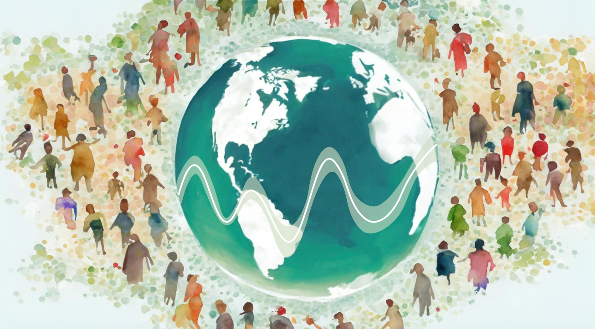

# **Introduction** {-}

---

Research into the effects of the environment on human health at the level of individuals and populations entails pulling together a combination of health data and data on environmental exposures. 

One approach to gathering exposure information is to compute estimated exposure levels based on the location of individuals at different time points. For instance, based on location and time one can estimate the level of noise around a person, the level of pollutants present in the air, and the presence of parks and other green spaces.

Estimating these exposures can be challenging, especially if one is not familiar with the sources of data used to make these estimations or the analysis methods needed to compute the estimated exposures. This can be especially challenging for time varying exposures, exposures that depend on complex models such as the composition and dispersion of chemicals in the air, and for researchers seeking to study exposure effects at the individual level.

This resource seeks to aid researchers in adopting geospatial data-based exposures into their research by providing guides, tools, and example code.

## About CHORDS {-}

The [Climate and Health Outcomes Research Data Systems (CHORDS)](https://www.niehs.nih.gov/research/programs/chords) program provides resources aimed at making it easier for researchers to study the effects of external, place-based environmental exposures on health outcomes. The CHORDS resources include a [web-based data catalog](https://chords.niehs.nih.gov), standardized data sets, and this toolkit.

## About This Toolkit {-}

### Getting Started {-}

This toolkit provides guides, tools, and example code in `R`. The [CHORDS Toolkit GitHub repository](https://github.com/NIEHS/PCOR_bookdown_tools) provides the underlying code and data for this book. 

The CHORDS toolkit has been developed to support different types of users, such as students, clinicians, and data managers. Please see the [User Profile Appendix](#chapter-user-profiles) for descriptions and suggested relevant toolkit chapters for each user profile. 

This toolkit does require familiarity with the `R` programming language and the use of `R` for working with, visualizing, and analyzing scientific data. The [TAME Toolkit Chapter 1](https://uncsrp.github.io/Data-Analysis-Training-Modules/) provides resources for getting started with `R` for environmental health research.

The toolkit consists of a series of chapters organized into the following units:

- **Foundations**: This unit provides background, guidance and example code for working with different types of geospatial data common in environmental health research. This unit is intended as a starting point for users with less familiarity with geospatial data analysis methods in environmental health.

- **Wildfire Data**: This unit provides guidance for working with different types of wildfire-related data in climate change and health research.

- **Other Environmental Data**: This unit provides guidance and code for working with specific sources of environmental data common in environmental health research for characterizing environmental exposures as well as social determinants of health.

- **Health Data Integration**: This unit provides guidance and code for integrating environmental and health data in climate change and health research, both at the individual level and at the population level. 

- **Case Studies**: This unit provides example case studies that analyze integrated wildfire-related data with health outcomes data.

The following toolkit chapters are currently in development:

|Unit              |Chapter Topic                     |Status          |
|------------------|----------------------------------|----------------|  
|Foundations       |Mapping Geospatial Data           |In Development  | 
|Foundations       |Calculating Geospatial Covariates |In Development  |

### Funding {-}

This resource was supported by the National Institutes of Health (NIH) from the National Institute of Environmental Health Sciences (NIEHS), by the NIH Office of Data Science Strategy (ODSS) Data Scholar Program, by the Patient Centered Outcomes Research Trust Fund (PCORTF) and the Department of Health and Human Services (DHHS) Office of Assistant Secretary for Planning and Evaluation.

### Authors {-}

### Suggested Citation {-}

Test Citation [@Sue-Test]

Test Citation [@Hernangomez]

